> 本页面由自动化程序生成于 2022年5月1日 22:10
> 内容可能存在错误，如有bug请提交issue至：https://github.com/Eroleice/doc-pi/issues
{.is-warning}

## 盐和光

*盐和光* 是最终幻想XIV **4.0** 资料片的S级狩猎怪，刷新于**基拉巴尼亚湖区**，详细信息如下：

- 中文名称: 盐和光
- 英文名称: Salt and Light
- 资料片: 4.0
- 等级: Lv. 70
- 所属地图: 基拉巴尼亚湖区
- 刷新冷却: 84 小时（或服务器维护后50 小时）
- 强制刷新冷却: 132 小时（或服务器维护后80 小时）
- 触发条件: 任意地点舍弃任意道具。

## 刷新时间轴统计

### 陆行鸟

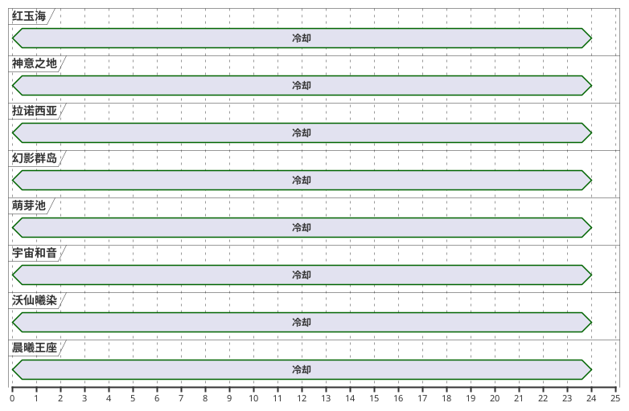

### 莫古力

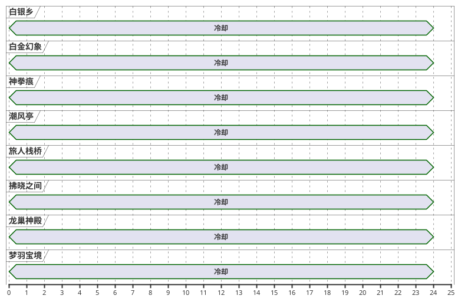

### 猫小胖

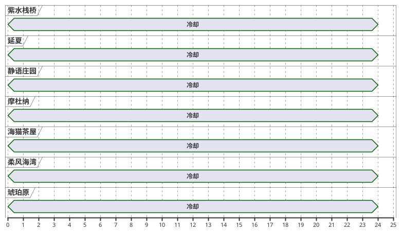

### 豆豆柴

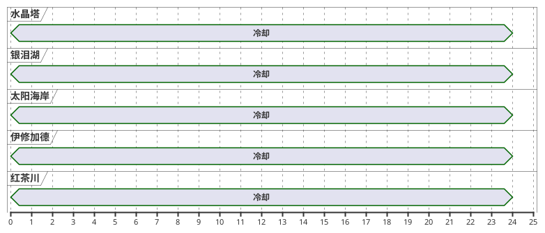

### Elemental

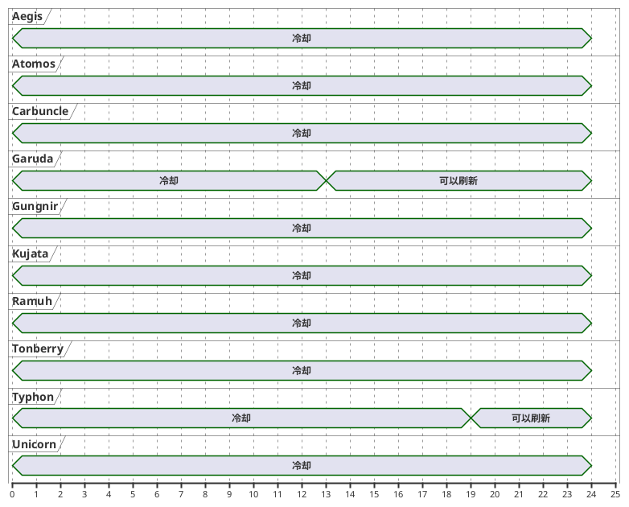

### Gaia

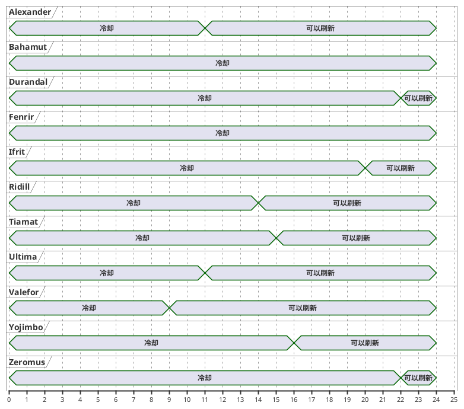

### Mana

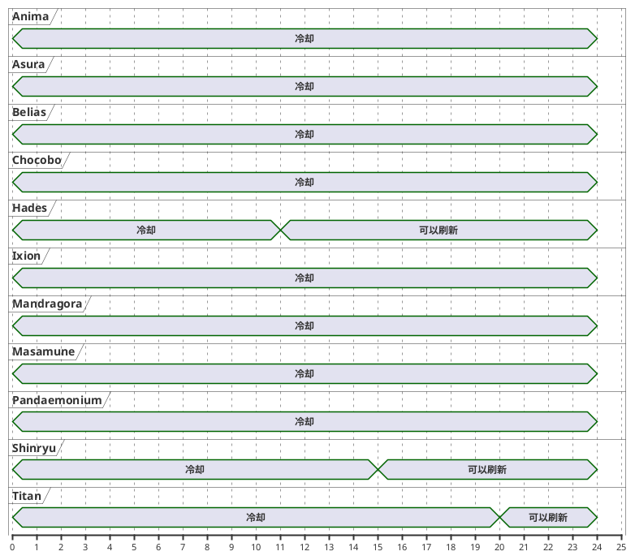

### Aether

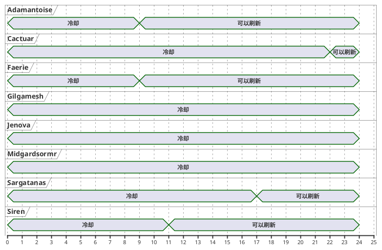

### Primal

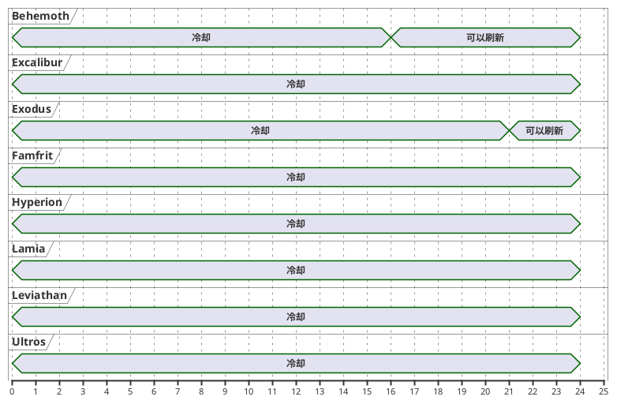

### Crystal

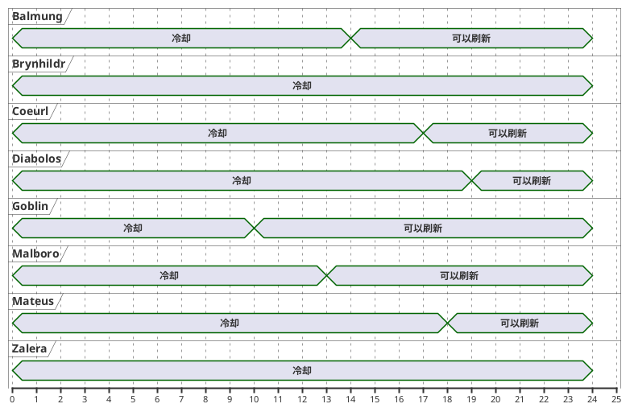

### Chaos

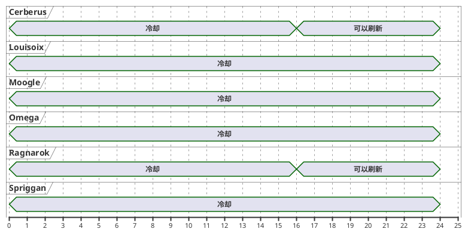

### Light

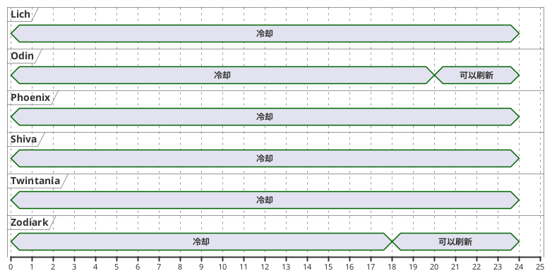

### Materia

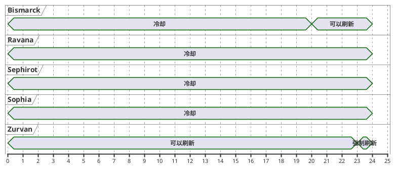

