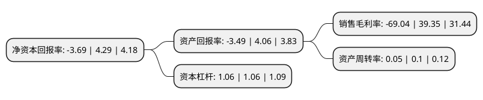

> 本页面由自动化程序生成于 2022年5月20日 01:06
> 内容可能存在错误，如有bug请提交issue至：https://github.com/Eroleice/doc-pi/issues
{.is-warning}

# 上市公司基本情况

## 基本资料

广州御银科技股份有限公司（以下简称“*ST御银”）成立于2001年04月26日，广州市。于2007年11月01日在深交所中小板上市。

*ST御银注册资本76,119.129万元，主营业务:1，ATM制造销售:ATM设备及相关系统软件的研发，制造，销售;2，ATM运营服务:为银行类金融机构提供ATM运营服务。以下是详细信息：

- 公司名称: 广州御银科技股份有限公司
- 股票代码: 002177.SZ
- 所在地: 广东 - 广州市
- 成立日期: 2001年04月26日
- 注册资本: 76,119.129万元
- 法定代表人: 谭骅
- 主营业务: 主营业务:1，ATM制造销售:ATM设备及相关系统软件的研发，制造，销售;2，ATM运营服务:为银行类金融机构提供ATM运营服务
- 公司官网: www.kingteller.com.cn
- 公司介绍: 公司是一家致力于协助各种金融机构建立强大的金融交易网络双软高新技术企业，专业从事金融自助服务设备及软件等研发、生产销售和服务，同时提供各种金融交易专业解决方案。公司的主导产品为自主研发、生产、销售、运营KINGTELLER系列银行存取款机以及提供主机咨询服务。公司拥有丰富的合作运营经验，产能和销售规模在国产ATM制造厂商中位居前列，其研发自主知识产权的产品获得多项国家级、省级奖项。公司同时也是首先在中国导入“ATM合作运营”概念的“中国首席ATM合作运营商”。

## 股东及高管情况

上市公司第一大股东为杨文江，持股122,641,574股，占比16.11%，**疑似为**上市公司实际控制人。

截至2022年03月31日，上市公司的前十大股东中，共有8名自然人股东，1名机构股东，1个海外主体，其中5%以上大股东共有1名。上市公司前十大股东明细如下：

> 未能通过持股比例判定出上市公司实际控制人（持股30%以上）
> 可能存在通过间接持股、联合持股、协议控制等方式拥有实际控制权的主体，具体请参考上市公司定期公告！
{.is-warning}

> 截至2022年03月31日，上市公司前十大股东信息如下：

| 股东名称 | 持股数量（股） | 持股比例 |
| --- | --- | --- |
| 杨文江 | 122,641,574 | 16.11% |
| 中信证券股份有限公司 | 3,172,889 | 0.42% |
| 汤长松 | 2,795,100 | 0.37% |
| 何科 | 2,151,900 | 0.28% |
| 李波 | 2,077,100 | 0.27% |
| UBS   AG | 1,483,158 | 0.19% |
| 张云鹤 | 1,390,000 | 0.18% |
| 黄辉 | 1,350,200 | 0.18% |
| 张一彬 | 1,341,624 | 0.18% |
| 张万清 | 1,319,722 | 0.17% |

## 利润表分析

上市公司2021年总收入为0.89亿元，净利润为-0.62亿元，**未实现盈利**。

## 杜邦分析

> 数据列示周期：2021年 | 2020年 | 2019年
{.is-info}

上市公司的净资产收益率在近一年有所下降，下降幅度为-186.01%，其变化情况分解如下：
- 上市公司的销售毛利率在近一年下降了-275.45%，可能是生产效率的下降、商品原材料价格上涨或商品价格的下跌所致。
- 上市公司的资产周转率在近一年下降了-50%，可能是源自于更慢的销售回款或库存管理效果下降。
- 上市公司的财务杠杆比率在近一年下降了0%，可能是减少负债降低财务费用。

