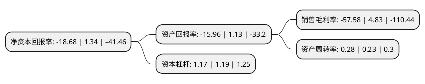

> 本页面由自动化程序生成于 2022年5月20日 01:08
> 内容可能存在错误，如有bug请提交issue至：https://github.com/Eroleice/doc-pi/issues
{.is-warning}

# 上市公司基本情况

## 基本资料

威创集团股份有限公司（以下简称“威创股份”）成立于2002年08月23日，广州市。于2009年11月27日在深交所中小板上市。

威创股份注册资本90,621.465万元，主营业务是超高分辨率数字拼接墙系统和交互数字平台的研发，生产，销售和服务。以下是详细信息：

- 公司名称: 威创集团股份有限公司
- 股票代码: 002308.SZ
- 所在地: 广东 - 广州市
- 成立日期: 2002年08月23日
- 注册资本: 90,621.465万元
- 法定代表人: 顾桂新
- 主营业务: 主营业务是超高分辨率数字拼接墙系统和交互数字平台的研发，生产，销售和服务
- 公司官网: www.vtron.com
- 公司介绍: 公司是国内拼接显示行业的首家上市企业，超高分辨率数字拼接墙系统(DLP、LED、LCD)及解决方案业务在全球处于领先地位。公司目前开展超高分辨率数字拼接墙系统业务(VW业务)和幼儿园运营管理服务业务两项主营业务。公司致力于为客户提供可视化信息沟通的整体解决方案，提升人们信息沟通的效率和质量。公司自成立以来，始终坚持自主研发的产品路线，取得了一系列的研发成果。公司是国家火炬计划重点高新技术企业、全国首批多家“创新型企业”之一、国家规划布局内重点软件企业，威创的产品获得国家科技进步二等奖、中国第十一届专利奖金奖、国家自主创新产品证书等荣誉。

## 股东及高管情况

上市公司第一大股东为台州市中数威科股权投资合伙企业(有限合伙)，持股219,502,109股，占比24.22%，**疑似为**上市公司实际控制人。

截至2022年03月31日，上市公司的前十大股东中，共有3名自然人股东，3名机构股东，4个产品账户，其中5%以上大股东共有2名。上市公司前十大股东明细如下：

> 未能通过持股比例判定出上市公司实际控制人（持股30%以上）
> 可能存在通过间接持股、联合持股、协议控制等方式拥有实际控制权的主体，具体请参考上市公司定期公告！
{.is-warning}

> 截至2022年03月31日，上市公司前十大股东信息如下：

| 股东名称 | 持股数量（股） | 持股比例 |
| --- | --- | --- |
| 台州市中数威科股权投资合伙企业(有限合伙) | 219,502,109 | 24.22% |
| 科学城(广州)投资集团有限公司 | 91,000,000 | 10.04% |
| 华泰瑞联基金管理有限公司-南京华泰瑞联并购基金二号(有限合伙) | 14,508,861 | 1.6% |
| 黄胜 | 8,353,184 | 0.92% |
| 川发(海南)企业管理投资有限公司 | 7,352,942 | 0.81% |
| 重庆和信汇智工业产业股权投资基金合伙企业(有限合伙) | 5,771,724 | 0.64% |
| 招商财富-招商银行-深圳国调招商并购股权投资基金合伙企业(有限合伙) | 5,147,058 | 0.57% |
| 王红兵 | 4,371,274 | 0.48% |
| 陈亚菊 | 3,336,900 | 0.37% |
| 中国银行股份有限公司-博时中证全球中国教育主题交易型开放式指数证券投资基金(QDII) | 3,145,700 | 0.35% |

## 利润表分析

上市公司2021年总收入为6.88亿元，净利润为-3.97亿元，**未实现盈利**。

## 杜邦分析

> 数据列示周期：2021年 | 2020年 | 2019年
{.is-info}

上市公司的净资产收益率在近一年有所下降，下降幅度为-1494.03%，其变化情况分解如下：
- 上市公司的销售毛利率在近一年下降了-1292.13%，可能是生产效率的下降、商品原材料价格上涨或商品价格的下跌所致。
- 上市公司的资产周转率在近一年上升了21.74%，可能是源自于更快的销售回款或库存管理效果提升。
- 上市公司的财务杠杆比率在近一年下降了-1.68%，可能是减少负债降低财务费用。

