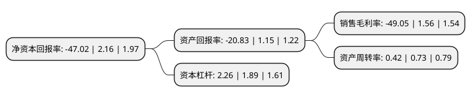

> 本页面由自动化程序生成于 2022年5月20日 01:09
> 内容可能存在错误，如有bug请提交issue至：https://github.com/Eroleice/doc-pi/issues
{.is-warning}

# 上市公司基本情况

## 基本资料

深圳英飞拓科技股份有限公司（以下简称“英飞拓”）成立于2000年10月18日，深圳市。于2010年12月24日在深交所中小板上市。

英飞拓注册资本119,867.508万元，主营业务为电子安防产品的研发，设计，生产和销售。主要产品为快球，摄像机，矩阵和光端机。以下是详细信息：

- 公司名称: 深圳英飞拓科技股份有限公司
- 股票代码: 002528.SZ
- 所在地: 广东 - 深圳市
- 成立日期: 2000年10月18日
- 注册资本: 119,867.508万元
- 法定代表人: 刘肇怀
- 主营业务: 主营业务为电子安防产品的研发，设计，生产和销售主要产品为快球，摄像机，矩阵和光端机
- 公司官网: www.infinova.com.cn
- 公司介绍: 公司是全球领先的电子安防整体解决方案及产品提供商，一直专注于视频监控和智能技术的研发与创新，产品涵盖全系列视频监控设备，包括摄像机、快球、高速云台、视频矩阵、IP视频系统、光端机和门禁控制系统，以及多个行业解决方案，包括智慧城市解决方案，智慧交通解决方案，智慧建筑解决方案和智慧工业解决方案等，产品为全球众多公共设施、交通运输、政府部门、教育机构及其它商业和工业设施提供了至关重要的安全防护。公司作为中国国家高新技术企业，获“中国十大安全防范产品品牌”、“中国安防最有影响力十大品牌”、“中国安防十大国际品牌”、“平安城市建设推荐品牌”等荣誉，还获全球知名“Frost&Sullivan IP视频领域产品创新领袖奖”、美国国际工业安全协会颁发的“ASIS International”年度荣誉奖，并多次荣获“全球安防50强”。

## 股东及高管情况

上市公司第一大股东为深圳市投资控股有限公司，持股315,831,160股，占比26.35%，**疑似为**上市公司实际控制人。

截至2022年03月31日，上市公司的前十大股东中，共有6名自然人股东，1名机构股东，1个产品账户，2个海外主体，其中5%以上大股东共有3名。上市公司前十大股东明细如下：

> 未能通过持股比例判定出上市公司实际控制人（持股30%以上）
> 可能存在通过间接持股、联合持股、协议控制等方式拥有实际控制权的主体，具体请参考上市公司定期公告！
{.is-warning}

> 截至2022年03月31日，上市公司前十大股东信息如下：

| 股东名称 | 持股数量（股） | 持股比例 |
| --- | --- | --- |
| 深圳市投资控股有限公司 | 315,831,160 | 26.35% |
| JEFFREY ZHAOHUAI LIU | 199,488,172 | 16.64% |
| JHL INFINITE LLC | 196,453,123 | 16.39% |
| 深圳英飞拓科技股份有限公司-第三期员工持股计划 | 31,964,200 | 2.67% |
| 刘肇胤 | 20,077,200 | 1.67% |
| 刘恺祥 | 6,304,799 | 0.53% |
| 莫燕玲 | 4,416,200 | 0.37% |
| 夏重阳 | 4,020,000 | 0.34% |
| 张衍锋 | 2,554,500 | 0.21% |
| 崔洋 | 2,288,000 | 0.19% |

## 利润表分析

上市公司2021年总收入为29.35亿元，净利润为-14.41亿元，**未实现盈利**。

## 杜邦分析

> 数据列示周期：2021年 | 2020年 | 2019年
{.is-info}

上市公司的净资产收益率在近一年有所下降，下降幅度为-2276.85%，其变化情况分解如下：
- 上市公司的销售毛利率在近一年下降了-3244.23%，可能是生产效率的下降、商品原材料价格上涨或商品价格的下跌所致。
- 上市公司的资产周转率在近一年下降了-42.47%，可能是源自于更慢的销售回款或库存管理效果下降。
- 上市公司的财务杠杆比率在近一年上升了19.58%，可能是增加负债扩大生产规模。

