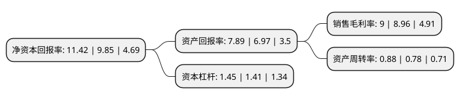

> 本页面由自动化程序生成于 2022年5月20日 01:12
> 内容可能存在错误，如有bug请提交issue至：https://github.com/Eroleice/doc-pi/issues
{.is-warning}

# 上市公司基本情况

## 基本资料

深圳市同为数码科技股份有限公司（以下简称“同为股份”）成立于2004年12月22日，深圳市。于2016年12月28日在深交所中小板上市。

同为股份注册资本21,955.54万元，主营业:专注于安防领域，主营业务为安防视频监控产品的研发，生产，销售，目前公司主要产品包括硬盘录像机，监控摄像机等。以下是详细信息：

- 公司名称: 深圳市同为数码科技股份有限公司
- 股票代码: 002835.SZ
- 所在地: 广东 - 深圳市
- 成立日期: 2004年12月22日
- 注册资本: 21,955.54万元
- 法定代表人: 郭立志
- 主营业务: 主营业:专注于安防领域，主营业务为安防视频监控产品的研发，生产，销售，目前公司主要产品包括硬盘录像机，监控摄像机等
- 公司官网: www.tvt.net.cn
- 公司介绍: 公司是一家集研发、生产、销售、服务于一体的视频安全领域国际一流产品及系统方案提供商，拥有独立的生产制造中心及研发基地。公司主要从事安防视频监控产品硬盘录像机、摄像机及视频监控管理平台的研发、生产与销售。公司长期致力于视频安全领域技术研究开发与推广应用，拥有完整的网络高清摄像机、同轴高清摄像机、网络高清硬盘录像机、同轴高清硬盘录像机等多个系列产品线，并提供系统存储与控制解决方案。产品广泛应用于平安城市、交通、金融、地产、教育、商业连锁、园区等各行各业。公司是“国家级高新技术企业”、“深圳市高新技术企业”、“深圳市软件行业协会会员单位”、“中国安防协会副理事长单位”、“深圳市安防协会副会长单位”，连续被评为“中国安防行业十大民族品牌”、“中国安防100强”、“中国安防知名品牌”、“中国安防最具影响力十大品牌”、“中国100家诚信安防供应商30强”、“平安城市建设推荐品牌”、“中国安防诚信联盟企业”、“中国安防十大新锐产品”、“中国安防产品质量用户信得过企业”、“中国安防口碑50强”等荣誉称号。产品通过ISO9001、ISO14001国际质量体系认证，通过欧盟CE、FCC、ROHS认证。

## 股东及高管情况

上市公司第一大股东为郭立志，持股69,190,848股，占比31.51%，为上市公司实际控制人。

截至2022年03月31日，上市公司的前十大股东中，共有10名自然人股东，其中5%以上大股东共有3名。上市公司前十大股东明细如下：

> 截至2022年03月31日，上市公司前十大股东信息如下：

| 股东名称 | 持股数量（股） | 持股比例 |
| --- | --- | --- |
| 郭立志 | 69,190,848 | 31.51% |
| 刘砥 | 52,861,736 | 24.08% |
| 黄梓泰 | 13,956,824 | 6.36% |
| 王光华 | 4,465,900 | 2.03% |
| 刘华 | 2,857,700 | 1.3% |
| 贺秀燕 | 1,164,100 | 0.53% |
| 刘红英 | 816,600 | 0.37% |
| 朱娜 | 787,399 | 0.36% |
| 朱忠武 | 642,800 | 0.29% |
| 窦晓月 | 629,000 | 0.29% |

## 利润表分析

上市公司2021年总收入为10.03亿元，净利润为0.9亿元，实现盈利。

## 杜邦分析

> 数据列示周期：2021年 | 2020年 | 2019年
{.is-info}

上市公司的净资产收益率在近一年有所上升，上升幅度为15.94%，其变化情况分解如下：
- 上市公司的销售毛利率在近一年上升了0.45%，可能是生产效率的提升、商品原材料价格下跌或商品价格的上涨所致。
- 上市公司的资产周转率在近一年上升了12.82%，可能是源自于更快的销售回款或库存管理效果提升。
- 上市公司的财务杠杆比率在近一年上升了2.84%，可能是增加负债扩大生产规模。

