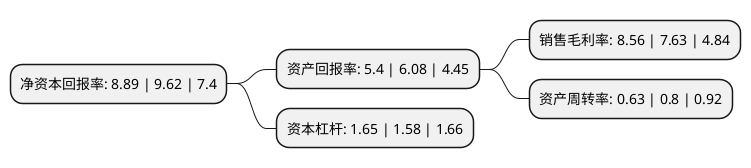

> 本页面由自动化程序生成于 2022年5月20日 01:12
> 内容可能存在错误，如有bug请提交issue至：https://github.com/Eroleice/doc-pi/issues
{.is-warning}

# 上市公司基本情况

## 基本资料

江苏传艺科技股份有限公司（以下简称“传艺科技”）成立于2007年11月05日，扬州市。于2017年04月26日在深交所中小板上市。

传艺科技注册资本28,765.501万元，主营业务:笔记本电脑及其他消费电子产品零组件的研发，生产和销售，主要产品为笔记本电脑键盘薄膜开关线路板(MTS)，笔记本电脑触控板(TouchPad)及按键(Button)，笔记本电脑等消费电子产品所用柔性印刷线路板(FPC)。以下是详细信息：

- 公司名称: 江苏传艺科技股份有限公司
- 股票代码: 002866.SZ
- 所在地: 江苏 - 扬州市
- 成立日期: 2007年11月05日
- 注册资本: 28,765.501万元
- 法定代表人: 邹伟民
- 主营业务: 主营业务:笔记本电脑及其他消费电子产品零组件的研发，生产和销售，主要产品为笔记本电脑键盘薄膜开关线路板(MTS)，笔记本电脑触控板(TouchPad)及按键(Button)，笔记本电脑等消费电子产品所用柔性印刷线路板(FPC)
- 公司官网: www.transimage.cn
- 公司介绍: 公司主营业务为笔记本电脑及其他消费电子产品零组件的研发、生产和销售。主要产品为笔记本电脑键盘薄膜开关线路板(MTS)、笔记本电脑触控板按键(Button)、笔记本电脑等消费电子产品所用柔性印刷线路板(FPC)。公司始终致力于为下游笔记本电脑键盘制造商和笔记本电脑整机制造商提供高质量和定制化的零组件产品。

## 股东及高管情况

上市公司第一大股东为邹伟民，持股143,835,000股，占比50%，为上市公司实际控制人。

截至2022年03月31日，上市公司的前十大股东中，共有7名自然人股东，1名机构股东，2个产品账户，其中5%以上大股东共有1名。上市公司前十大股东明细如下：

> 截至2022年03月31日，上市公司前十大股东信息如下：

| 股东名称 | 持股数量（股） | 持股比例 |
| --- | --- | --- |
| 邹伟民 | 143,835,000 | 50% |
| 首誉光控资管-王潇锋-首誉光控-千将进取单一资产管理计划 | 5,660,400 | 1.97% |
| 扬州承源投资咨询部(有限合伙) | 5,346,500 | 1.86% |
| 门振明 | 3,399,384 | 1.18% |
| 陈敏 | 3,145,000 | 1.09% |
| 吴滨 | 2,000,000 | 0.7% |
| 沙易 | 1,842,751 | 0.64% |
| 许学雷 | 1,842,751 | 0.64% |
| 诺德基金-华章天地传媒投资控股集团有限公司-诺德基金浦江64号单一资产管理计划 | 1,842,751 | 0.64% |
| 赵清 | 1,800,000 | 0.63% |

## 利润表分析

上市公司2021年总收入为19.2亿元，净利润为1.64亿元，实现盈利。

## 杜邦分析

> 数据列示周期：2021年 | 2020年 | 2019年
{.is-info}

上市公司的净资产收益率在近一年有所下降，下降幅度为-7.59%，其变化情况分解如下：
- 上市公司的销售毛利率在近一年上升了12.19%，可能是生产效率的提升、商品原材料价格下跌或商品价格的上涨所致。
- 上市公司的资产周转率在近一年下降了-21.25%，可能是源自于更慢的销售回款或库存管理效果下降。
- 上市公司的财务杠杆比率在近一年上升了4.43%，可能是增加负债扩大生产规模。

