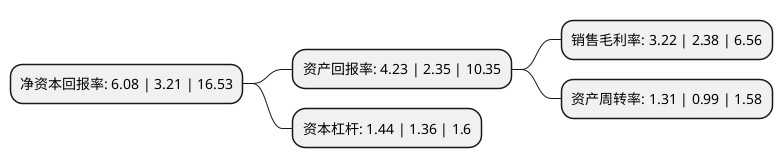

> 本页面由自动化程序生成于 2022年5月20日 01:13
> 内容可能存在错误，如有bug请提交issue至：https://github.com/Eroleice/doc-pi/issues
{.is-warning}

# 上市公司基本情况

## 基本资料

鸿合科技股份有限公司（以下简称“鸿合科技”）成立于2010年05月28日，北京市。于2019年05月23日在深交所中小板上市。

鸿合科技注册资本23,498.569万元，智能交互显示产品及智能视听解决方案的设计，研发，生产与销售。以下是详细信息：

- 公司名称: 鸿合科技股份有限公司
- 股票代码: 002955.SZ
- 所在地: 北京 - 北京市
- 成立日期: 2010年05月28日
- 注册资本: 23,498.569万元
- 法定代表人: 邢修青
- 主营业务: 智能交互显示产品及智能视听解决方案的设计，研发，生产与销售
- 公司官网: www.honghe-tech.com
- 公司介绍: 公司是一家研发设计智能交互显示产品及智能视听的高新技术企业,一直专注于多媒体电子产品文字、图像、音频、视频等信息交流和处理技术的研发与应用，在光电显示和成像、触控、信息传输和处理、电子电路、人机交互、云计算和大数据、智能视听解决方案等软硬件技术领域积累了丰富的成果和经验，形成了以智能交互平板、电子交互白板、投影机、视频展台等智能交互显示产品为基础，以智能视听解决方案为拓展和延伸的多媒体电子产品业务线，是行业的龙头企业之一。公司产品主要面向中小学校和高校、幼教、培训机构等教育市场进行销售，同时向办公、会议会展、传媒等商用市场拓展,公司自设立以来始终聚焦于主业，“创新驱动、合力前行”，植根中国教育信息化，服务全国亿万学生，坚持“自有技术、自有品牌、自主制造、服务教育”的发展思路,先后参与了“大幅面高分辨触控设备”、“自然人机交互工具与应用验证”等国家重点研发计划课题，并参与起草了教育部《交互式电子白板教学功能》、《交互式电子白板教学资源通用文件格式》等行业标准。

## 股东及高管情况

上市公司第一大股东为鸿达成有限公司，持股40,982,799股，占比17.44%，**疑似为**上市公司实际控制人。

截至2022年03月31日，上市公司的前十大股东中，共有5名自然人股东，3名机构股东，1个产品账户，1个海外主体，其中5%以上大股东共有5名。上市公司前十大股东明细如下：

> 未能通过持股比例判定出上市公司实际控制人（持股30%以上）
> 可能存在通过间接持股、联合持股、协议控制等方式拥有实际控制权的主体，具体请参考上市公司定期公告！
{.is-warning}

> 截至2022年03月31日，上市公司前十大股东信息如下：

| 股东名称 | 持股数量（股） | 持股比例 |
| --- | --- | --- |
| 鸿达成有限公司 | 40,982,799 | 17.44% |
| 王京 | 33,282,731 | 14.16% |
| 邢正 | 32,110,693 | 13.66% |
| 张树江 | 28,534,495 | 12.14% |
| EAGLE GROUP BUSINESS LIMITED | 16,999,998 | 7.23% |
| 共青城富视创业投资管理合伙企业(有限合伙) | 3,563,979 | 1.52% |
| 赵红婵 | 2,420,044 | 1.03% |
| 中国建设银行股份有限公司-中欧新蓝筹灵活配置混合型证券投资基金 | 1,141,200 | 0.49% |
| 鸿运(天津)企业管理咨询中心(有限合伙) | 999,925 | 0.43% |
| 梁晓宇 | 788,800 | 0.34% |

## 利润表分析

上市公司2021年总收入为58.11亿元，净利润为1.86亿元，实现盈利。

## 杜邦分析

> 数据列示周期：2021年 | 2020年 | 2019年
{.is-info}

上市公司的净资产收益率在近一年有所上升，上升幅度为89.41%，其变化情况分解如下：
- 上市公司的销售毛利率在近一年上升了35.29%，可能是生产效率的提升、商品原材料价格下跌或商品价格的上涨所致。
- 上市公司的资产周转率在近一年上升了32.32%，可能是源自于更快的销售回款或库存管理效果提升。
- 上市公司的财务杠杆比率在近一年上升了5.88%，可能是增加负债扩大生产规模。

