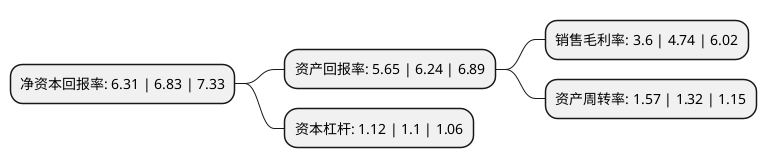

> 本页面由自动化程序生成于 2022年5月20日 01:14
> 内容可能存在错误，如有bug请提交issue至：https://github.com/Eroleice/doc-pi/issues
{.is-warning}

# 上市公司基本情况

## 基本资料

深圳市朗科科技股份有限公司（以下简称“朗科科技”）成立于1999年05月14日，深圳市。于2010年01月08日在深交所创业板上市。

朗科科技注册资本20,040万元，主营业务:公司基于闪存应用及移动存储领域内持续自主创新的全球领先技术及专利，专业从事闪存应用及移动存储产品的研发，生产，销售及相关技术的专利运营业务。公司主要产品包括各类闪存盘，移动硬盘，控制芯片，固态硬盘，闪存模块及解决方案等。以下是详细信息：

- 公司名称: 深圳市朗科科技股份有限公司
- 股票代码: 300042.SZ
- 所在地: 广东 - 深圳市
- 成立日期: 1999年05月14日
- 注册资本: 20,040万元
- 法定代表人: 周福池
- 主营业务: 主营业务:公司基于闪存应用及移动存储领域内持续自主创新的全球领先技术及专利，专业从事闪存应用及移动存储产品的研发，生产，销售及相关技术的专利运营业务公司主要产品包括各类闪存盘，移动硬盘，控制芯片，固态硬盘，闪存模块及解决方案等
- 公司官网: www.netac.com.cn/www.netac.com
- 公司介绍: 公司是一家专业从事闪存应用及移动存储产品的研发、生产、销售的供应商与出口商，国内拥有闪存盘发明专利的厂商，全球闪存盘及闪存应用领域产品与解决方案的领导者。公司主要业务为闪存盘、移动硬盘、固态硬盘、存储卡等的研发、生产和销售，已形成优盘、优卡、优信通三大支柱产品，以“优盘”为商标的闪存盘是基于USB接口、采用闪存介质的新一代存储产品。公司研发实力强大，拥有多项知识产权和专利，在移动存储和无线数据领域居于全球领先地位。公司已与东芝、金士顿、美国PNY、群联等全球知名企业签订专利授权许可协议，产品远销到美国、欧洲、日本、中东、东南亚等数十个国家与地区，客户遍及电信、政府、金融、教育、能源和医药等领域。

## 股东及高管情况

上市公司第一大股东为广东韶龙科技发展有限公司，持股49,968,987股，占比24.93%，**疑似为**上市公司实际控制人。

截至2022年03月31日，上市公司的前十大股东中，共有9名自然人股东，1名机构股东，其中5%以上大股东共有2名。上市公司前十大股东明细如下：

> 未能通过持股比例判定出上市公司实际控制人（持股30%以上）
> 可能存在通过间接持股、联合持股、协议控制等方式拥有实际控制权的主体，具体请参考上市公司定期公告！
{.is-warning}

> 截至2022年03月31日，上市公司前十大股东信息如下：

| 股东名称 | 持股数量（股） | 持股比例 |
| --- | --- | --- |
| 广东韶龙科技发展有限公司 | 49,968,987 | 24.93% |
| 邓国顺 | 26,052,030 | 13% |
| 郭光泉 | 5,501,200 | 2.75% |
| 常鑫民 | 2,639,468 | 1.32% |
| 滕荣松 | 2,255,500 | 1.13% |
| 刘日杰 | 1,348,500 | 0.67% |
| 王成桃 | 1,329,400 | 0.66% |
| 罗耀武 | 1,093,800 | 0.55% |
| 周创世 | 986,600 | 0.49% |
| 肖达文 | 800,000 | 0.4% |

## 利润表分析

上市公司2021年总收入为19.12亿元，净利润为0.68亿元，实现盈利。

## 杜邦分析

> 数据列示周期：2021年 | 2020年 | 2019年
{.is-info}

上市公司的净资产收益率在近一年有所下降，下降幅度为-7.61%，其变化情况分解如下：
- 上市公司的销售毛利率在近一年下降了-24.05%，可能是生产效率的下降、商品原材料价格上涨或商品价格的下跌所致。
- 上市公司的资产周转率在近一年上升了18.94%，可能是源自于更快的销售回款或库存管理效果提升。
- 上市公司的财务杠杆比率在近一年上升了1.82%，可能是增加负债扩大生产规模。

