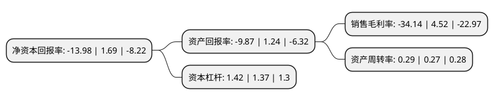

> 本页面由自动化程序生成于 2022年5月20日 01:14
> 内容可能存在错误，如有bug请提交issue至：https://github.com/Eroleice/doc-pi/issues
{.is-warning}

# 上市公司基本情况

## 基本资料

北京华力创通科技股份有限公司（以下简称“华力创通”）成立于2001年06月01日，北京市。于2010年01月20日在深交所创业板上市。

华力创通注册资本61,421.709万元，主要产品和服务包括:机电仿真测试产品，射频仿真测试产品和仿真应用开发服务。主营业务:专注于从事基于计算机技术的仿真测试系统及其相关设备的研发，生产和销售业务，重点服务于中国的国防军工领域，为中国国防及相高校，科研院所高科技装备的研发，生产和应用提供仿真技术产品和服务。以下是详细信息：

- 公司名称: 北京华力创通科技股份有限公司
- 股票代码: 300045.SZ
- 所在地: 北京 - 北京市
- 成立日期: 2001年06月01日
- 注册资本: 61,421.709万元
- 法定代表人: 高小离
- 主营业务: 主要产品和服务包括:机电仿真测试产品，射频仿真测试产品和仿真应用开发服务主营业务:专注于从事基于计算机技术的仿真测试系统及其相关设备的研发，生产和销售业务，重点服务于中国的国防军工领域，为中国国防及相高校，科研院所高科技装备的研发，生产和应用提供仿真技术产品和服务
- 公司官网: www.hwacreate.com.cn
- 公司介绍: 公司是注册于中关村科技园区的高新技术和“双软”认证企业，具备完整的国防军工准入资质，以及北斗用户终端研发和分理服务资质。公司是国内国防、政府及行业信息化技术与创新应用的领先者。经过多年的持续科技创新，已经形成卫星导航、卫星移动通信、雷达信号处理和仿真测试等业务板块。在国防军工市场，依托核心技术，致力于为我军精确制导武器、电子对抗、航空电子、信息化作战、指挥控制及先进武器系统研制等领域，提供先进的器件、终端、系统和解决方案。在政府及行业市场，业务涵盖智慧城市、空间信息、应急通信、变形监测、海洋工程等，为客户提供整套系统及解决方案。未来，公司将继续秉承以市场的为导向，坚持自主创新、合作共赢。同时，以产业经营为主体，以技术研究和资本经营为两翼，形成“产业+技术+资本”相生互动、良性循环的业务生态效应，立足国防军工，引领军民融合，推动卫星应用、无人平台产业化发展。

## 股东及高管情况

上市公司第一大股东为高小离，持股108,866,400股，占比17.72%，**疑似为**上市公司实际控制人。

截至2022年03月31日，上市公司的前十大股东中，共有9名自然人股东，1个海外主体，其中5%以上大股东共有2名。上市公司前十大股东明细如下：

> 未能通过持股比例判定出上市公司实际控制人（持股30%以上）
> 可能存在通过间接持股、联合持股、协议控制等方式拥有实际控制权的主体，具体请参考上市公司定期公告！
{.is-warning}

> 截至2022年03月31日，上市公司前十大股东信息如下：

| 股东名称 | 持股数量（股） | 持股比例 |
| --- | --- | --- |
| 高小离 | 108,866,400 | 17.72% |
| 王琦 | 85,498,664 | 13.92% |
| 熊运鸿 | 28,889,315 | 4.7% |
| 王从起 | 13,849,400 | 2.25% |
| 李宗利 | 2,700,000 | 0.44% |
| 吴梦冰 | 1,960,000 | 0.32% |
| 香港中央结算有限公司(陆股通) | 1,841,157 | 0.3% |
| 娄雷雷 | 1,477,200 | 0.24% |
| 路骏 | 1,307,937 | 0.21% |
| 吴培侠 | 1,202,763 | 0.2% |

## 利润表分析

上市公司2021年总收入为6.65亿元，净利润为-2.28亿元，**未实现盈利**。

## 杜邦分析

> 数据列示周期：2021年 | 2020年 | 2019年
{.is-info}

上市公司的净资产收益率在近一年有所下降，下降幅度为-927.22%，其变化情况分解如下：
- 上市公司的销售毛利率在近一年下降了-855.31%，可能是生产效率的下降、商品原材料价格上涨或商品价格的下跌所致。
- 上市公司的资产周转率在近一年上升了7.41%，可能是源自于更快的销售回款或库存管理效果提升。
- 上市公司的财务杠杆比率在近一年上升了3.65%，可能是增加负债扩大生产规模。

