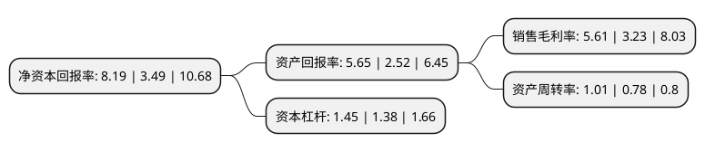

> 本页面由自动化程序生成于 2022年5月20日 01:15
> 内容可能存在错误，如有bug请提交issue至：https://github.com/Eroleice/doc-pi/issues
{.is-warning}

# 上市公司基本情况

## 基本资料

深圳市新国都股份有限公司（以下简称“新国都”）成立于2001年07月31日，深圳市。于2010年10月19日在深交所创业板上市。

新国都注册资本48,919.728万元，以金融POS终端软硬件的设计和研发为核心，从事POS终端的生产，销售和租赁，并以此为基础提供银行卡电子支付技术服务。主要产品POS终端。以下是详细信息：

- 公司名称: 深圳市新国都股份有限公司
- 股票代码: 300130.SZ
- 所在地: 广东 - 深圳市
- 成立日期: 2001年07月31日
- 注册资本: 48,919.728万元
- 法定代表人: 刘祥
- 主营业务: 以金融POS终端软硬件的设计和研发为核心，从事POS终端的生产，销售和租赁，并以此为基础提供银行卡电子支付技术服务主要产品POS终端
- 公司官网: www.xgd.com
- 公司介绍: 公司自成立以来一直深耕于电子支付行业，主要从事为不同规模的客户提供支付收单服务及以金融POS机为主的电子支付受理终端设备软硬件销售及租赁服务，并以此为基础，结合生物识别、大数据、区块链技术及AI技术能力，为客户提供会员管理、智能营销、金融科技等多种商业数字化升级增值服务和一站式电子支付的综合性解决方案，并且积极探索数字资产、人工智能等行业新机遇。

## 股东及高管情况

上市公司第一大股东为刘祥，持股137,946,987股，占比28.2%，**疑似为**上市公司实际控制人。

截至2022年03月31日，上市公司的前十大股东中，共有10名自然人股东，其中5%以上大股东共有2名。上市公司前十大股东明细如下：

> 未能通过持股比例判定出上市公司实际控制人（持股30%以上）
> 可能存在通过间接持股、联合持股、协议控制等方式拥有实际控制权的主体，具体请参考上市公司定期公告！
{.is-warning}

> 截至2022年03月31日，上市公司前十大股东信息如下：

| 股东名称 | 持股数量（股） | 持股比例 |
| --- | --- | --- |
| 刘祥 | 137,946,987 | 28.2% |
| 江汉 | 36,478,805 | 7.46% |
| 李霞 | 23,423,249 | 4.79% |
| 刘亚 | 16,667,394 | 3.41% |
| 杨艳 | 11,050,927 | 2.26% |
| 袁木兰 | 4,808,203 | 0.98% |
| 刘钰洁 | 1,559,678 | 0.32% |
| 韦余红 | 1,511,944 | 0.31% |
| 汪洋 | 1,488,321 | 0.3% |
| 吴俊龙 | 1,472,600 | 0.3% |

## 利润表分析

上市公司2021年总收入为36.11亿元，净利润为2.02亿元，实现盈利。

## 杜邦分析

> 数据列示周期：2021年 | 2020年 | 2019年
{.is-info}

上市公司的净资产收益率在近一年有所上升，上升幅度为134.67%，其变化情况分解如下：
- 上市公司的销售毛利率在近一年上升了73.68%，可能是生产效率的提升、商品原材料价格下跌或商品价格的上涨所致。
- 上市公司的资产周转率在近一年上升了29.49%，可能是源自于更快的销售回款或库存管理效果提升。
- 上市公司的财务杠杆比率在近一年上升了5.07%，可能是增加负债扩大生产规模。

