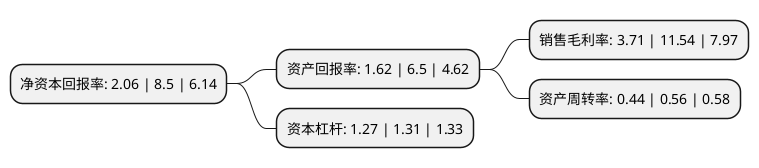

> 本页面由自动化程序生成于 2022年5月20日 01:15
> 内容可能存在错误，如有bug请提交issue至：https://github.com/Eroleice/doc-pi/issues
{.is-warning}

# 上市公司基本情况

## 基本资料

广东安居宝数码科技股份有限公司（以下简称“安居宝”）成立于2004年12月29日，广州市。于2011年01月07日在深交所创业板上市。

安居宝注册资本56,122.774万元，主营业务为公司现有主营产品包括楼宇对讲系统和智能家居系统。公司现有主营产品包括楼宇对讲系统和智能家居系统，并已成功开发出防盗报警系统。以下是详细信息：

- 公司名称: 广东安居宝数码科技股份有限公司
- 股票代码: 300155.SZ
- 所在地: 广东 - 广州市
- 成立日期: 2004年12月29日
- 注册资本: 56,122.774万元
- 法定代表人: 张波
- 主营业务: 主营业务为公司现有主营产品包括楼宇对讲系统和智能家居系统公司现有主营产品包括楼宇对讲系统和智能家居系统，并已成功开发出防盗报警系统
- 公司官网: www.anjubao.com
- 公司介绍: 公司专注于社区安防领域，是一家集研发、系统方案设计、生产、销售、服务为一体的高科技企业，公司主营业务为楼宇对讲、智能家居、防盗报警系统、停车场系统、监控、线缆、液晶显示屏的研发、生产和销售，公司主营产品与房地产行业紧密相关，主要应用于新建住宅小区，市场分布在全国各地。公司在工业设计、音视频传送、总线通讯控制、音视频数字化、通讯网络化等领域拥有核心技术，现已发展成为国内楼宇对讲系统及智能家居系统重要的集成生产商和系统方案解决提供商之一。公司是中国安全防范产品行业协会副理事长单位、中国智能建筑专业委员会常务委员单位、中国智能家居产业联盟理事单位，主笔起草了“联网型可视对讲系统行业标准”和“无线报警控制器国家标准”。连续十四年荣膺“中国十大安防品牌”，“国家火炬计划重点高新技术企业”，对讲产品首个获“德国IF设计奖”等多项殊荣。

## 股东及高管情况

上市公司第一大股东为张波，持股167,777,419股，占比29.89%，**疑似为**上市公司实际控制人。

截至2022年03月31日，上市公司的前十大股东中，共有8名自然人股东，1个产品账户，1个海外主体，其中5%以上大股东共有3名。上市公司前十大股东明细如下：

> 未能通过持股比例判定出上市公司实际控制人（持股30%以上）
> 可能存在通过间接持股、联合持股、协议控制等方式拥有实际控制权的主体，具体请参考上市公司定期公告！
{.is-warning}

> 截至2022年03月31日，上市公司前十大股东信息如下：

| 股东名称 | 持股数量（股） | 持股比例 |
| --- | --- | --- |
| 张波 | 167,777,419 | 29.89% |
| 张频 | 132,091,832 | 23.54% |
| 上海牧鑫资产管理有限公司-牧鑫鼎硕1号私募证券投资基金 | 30,000,000 | 5.35% |
| 周爽 | 17,717,557 | 3.16% |
| 周宇光 | 6,563,555 | 1.17% |
| 吕强 | 5,357,142 | 0.95% |
| 李乐霓 | 5,134,442 | 0.91% |
| 瞿小波 | 1,964,285 | 0.35% |
| UBS AG | 1,884,309 | 0.34% |
| 丁凤梅 | 1,838,900 | 0.33% |

## 利润表分析

上市公司2021年总收入为7.59亿元，净利润为0.28亿元，实现盈利。

## 杜邦分析

> 数据列示周期：2021年 | 2020年 | 2019年
{.is-info}

上市公司的净资产收益率在近一年有所下降，下降幅度为-75.76%，其变化情况分解如下：
- 上市公司的销售毛利率在近一年下降了-67.85%，可能是生产效率的下降、商品原材料价格上涨或商品价格的下跌所致。
- 上市公司的资产周转率在近一年下降了-21.43%，可能是源自于更慢的销售回款或库存管理效果下降。
- 上市公司的财务杠杆比率在近一年下降了-3.05%，可能是减少负债降低财务费用。

