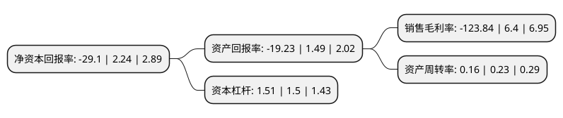

> 本页面由自动化程序生成于 2022年5月20日 01:15
> 内容可能存在错误，如有bug请提交issue至：https://github.com/Eroleice/doc-pi/issues
{.is-warning}

# 上市公司基本情况

## 基本资料

聚龙股份有限公司（以下简称“*ST聚龙”）成立于2004年03月09日，鞍山市。于2011年04月15日在深交所创业板上市。

*ST聚龙注册资本54,950.4万元，专业从事金融机具研发，生产和销售的高新技术企业。公司产品有纸币清分机，捆钞机，点钞机，扎把机和纸币鉴别仪等现金处理类金融机具，主要产品为纸币清分机和捆钞机。以下是详细信息：

- 公司名称: 聚龙股份有限公司
- 股票代码: 300202.SZ
- 所在地: 辽宁 - 鞍山市
- 成立日期: 2004年03月09日
- 注册资本: 54,950.4万元
- 法定代表人: 柳永诠
- 主营业务: 专业从事金融机具研发，生产和销售的高新技术企业公司产品有纸币清分机，捆钞机，点钞机，扎把机和纸币鉴别仪等现金处理类金融机具，主要产品为纸币清分机和捆钞机
- 公司官网: www.julong.cc
- 公司介绍: 公司是国内领先的货币安全运营及数字化管理解决方案供应商，面向国内、外的金融行业提供自助服务设备及系统、金融安全物联网系统、全自动清分流水线、社会化金融服务外包、硬币自动处理设备、金库信息化管理系统、银行业务咨询培训、大数据云计算服务、警银综合便民服务亭、社区银行解决方案等多种产品和服务，是国内首个以自主知识产权产品通过欧洲中央银行测试的高新技术企业。公司拥有由博士、硕士和教授等高技术人才组成精英研发团队，拥有行业内唯一的国家金融安全及系统装备工程技术研究中心和国家级博士后科研工作站，承担了包括“863”计划在内的国家级、省级科研项目20多个。公司通过了ISO9001:2000质量管理体系认证和14000、18000环境及职业安全体系认证，产品通过了CE、FCC、ROHS、CB、CCC、CQC等多项认证。公司参与编制了纸币清分机、全自动捆钞机两项产品的国家强制性标准，是《人民币鉴别仪通用技术条件》国家标准的主要起草单位之一。

## 股东及高管情况

上市公司第一大股东为柳永诠，持股117,730,896股，占比21.42%，**疑似为**上市公司实际控制人。

截至2022年03月31日，上市公司的前十大股东中，共有7名自然人股东，1名机构股东，1个海外主体，1名其他股东，其中5%以上大股东共有3名。上市公司前十大股东明细如下：

> 未能通过持股比例判定出上市公司实际控制人（持股30%以上）
> 可能存在通过间接持股、联合持股、协议控制等方式拥有实际控制权的主体，具体请参考上市公司定期公告！
{.is-warning}

> 截至2022年03月31日，上市公司前十大股东信息如下：

| 股东名称 | 持股数量（股） | 持股比例 |
| --- | --- | --- |
| 柳永诠 | 117,730,896 | 21.42% |
| 安吉聚龙企业管理咨询合伙企业(有限合伙) | 59,002,912 | 10.74% |
| 周素芹 | 28,598,200 | 5.2% |
| 张奈 | 9,720,000 | 1.77% |
| 李清海 | 3,205,000 | 0.58% |
| 陈楠楠 | 2,509,331 | 0.46% |
| UBS AG | 2,394,454 | 0.44% |
| 孙虹 | 2,377,600 | 0.43% |
| 陈荣升 | 2,331,600 | 0.42% |
| 法国兴业银行 | 2,044,600 | 0.37% |

## 利润表分析

上市公司2021年总收入为3.3亿元，净利润为-4.09亿元，**未实现盈利**。

## 杜邦分析

> 数据列示周期：2021年 | 2020年 | 2019年
{.is-info}

上市公司的净资产收益率在近一年有所下降，下降幅度为-1399.11%，其变化情况分解如下：
- 上市公司的销售毛利率在近一年下降了-2035%，可能是生产效率的下降、商品原材料价格上涨或商品价格的下跌所致。
- 上市公司的资产周转率在近一年下降了-30.43%，可能是源自于更慢的销售回款或库存管理效果下降。
- 上市公司的财务杠杆比率在近一年上升了0.67%，可能是增加负债扩大生产规模。

