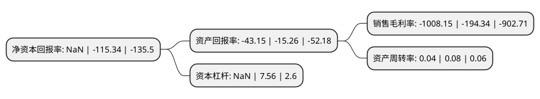

> 本页面由自动化程序生成于 2022年5月20日 01:17
> 内容可能存在错误，如有bug请提交issue至：https://github.com/Eroleice/doc-pi/issues
{.is-warning}

# 上市公司基本情况

## 基本资料

东方网力科技股份有限公司（以下简称“*ST网力”）成立于2000年09月05日，北京市。于2014年01月29日在深交所创业板上市。

*ST网力注册资本119,577.252万元，主要产品:PVG网络视频管理平台，NetPosa NVR网络硬盘录像机，PVG网络视频编解码器及相关技术服务，分别为城市视频监控管理平台的管理控制及应用部分，记录部分，数字化部分提供所需要的各种功能。主要业务:城市视频监控管理平台的研发，制造，销售及提供相关技术服务。以下是详细信息：

- 公司名称: 东方网力科技股份有限公司
- 股票代码: 300367.SZ
- 所在地: 北京 - 北京市
- 成立日期: 2000年09月05日
- 注册资本: 119,577.252万元
- 法定代表人: 江涛
- 主营业务: 主要产品:PVG网络视频管理平台，NetPosa NVR网络硬盘录像机，PVG网络视频编解码器及相关技术服务，分别为城市视频监控管理平台的管理控制及应用部分，记录部分，数字化部分提供所需要的各种功能城市视频监控管理平台的研发，制造，销售及提供相关技术服务
- 公司官网: www.netposa.com
- 公司介绍: 公司专注于安防行业，是国内领先的视频管理平台与安防人工智能平台的提供商。近年来，随着人工智能技术在安防行业的快速落地，公司围绕“软硬一体化、云化大数据、深度人工智能”三大核心技术方向，持续在视频联网、视频结构化、图像综合解析、人脸识别、视频侦查、智能安防社区等核心技术领域和不同应用场景提供具有竞争力的产品。同时，公司在轨道交通的车载PIS领域也具有较强的竞争力。公司产品及解决方案广泛应用于公安、交通、智慧社区、教育、医疗、金融、司法、能源等领域，满足了客户视频深度应用的需求。经过多年的项目运营及实践积累，公司如今已成长为国内为数不多的具有省级以及多个直辖市、省会级城市平安城市项目和大型活动成功案例的公司。公司是北京市科委认证的高新技术企业和软件企业，自主开发的多项软件产品获得国家软件著作权，并被全国安全防范报警系统标准化技术委员会(SAC/TC100)聘为通讯委员单位，并公司成功入选“国家重点软件企业”，通过CMMI5级评估认证，并连续多年荣获a&s《安全自动化》“中国安防十大民族品牌”，是中国平安城市建设推荐品牌和中国安防最具影响力的品牌之一。

## 股东及高管情况

上市公司第一大股东为川投信息产业集团有限公司，持股149,578,637股，占比12.51%，**疑似为**上市公司实际控制人。

截至2022年03月31日，上市公司的前十大股东中，共有8名自然人股东，2名机构股东，其中5%以上大股东共有3名。上市公司前十大股东明细如下：

> 未能通过持股比例判定出上市公司实际控制人（持股30%以上）
> 可能存在通过间接持股、联合持股、协议控制等方式拥有实际控制权的主体，具体请参考上市公司定期公告！
{.is-warning}

> 截至2022年03月31日，上市公司前十大股东信息如下：

| 股东名称 | 持股数量（股） | 持股比例 |
| --- | --- | --- |
| 川投信息产业集团有限公司 | 149,578,637 | 12.51% |
| 刘光 | 95,626,459 | 8% |
| 蒋宗文 | 63,519,346 | 5.31% |
| 北方国际信托股份有限公司-北方信托盛世景新策略9号单一资金信托 | 15,673,890 | 1.31% |
| 高军 | 15,174,854 | 1.27% |
| 宋辉俊 | 9,114,714 | 0.76% |
| 孙东利 | 6,803,031 | 0.57% |
| 郭军 | 6,692,579 | 0.56% |
| 王建军 | 6,400,000 | 0.54% |
| 苗青 | 6,300,000 | 0.53% |

## 利润表分析

上市公司2021年总收入为1.09亿元，净利润为-11.02亿元，**未实现盈利**。

## 杜邦分析

> 数据列示周期：2021年 | 2020年 | 2019年
{.is-info}

上市公司的净资产收益率在近一年有所下降，下降幅度为NaN%，其变化情况分解如下：
- 上市公司的销售毛利率在近一年上升了418.76%，可能是生产效率的提升、商品原材料价格下跌或商品价格的上涨所致。
- 上市公司的资产周转率在近一年下降了-50%，可能是源自于更慢的销售回款或库存管理效果下降。
- 上市公司的财务杠杆比率在近一年下降了NaN%，可能是减少负债降低财务费用。

