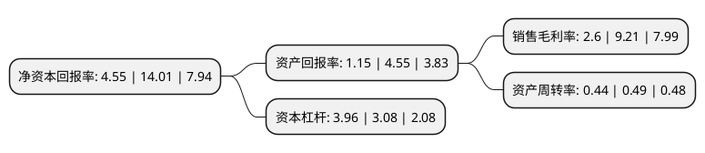

> 本页面由自动化程序生成于 2022年5月20日 01:17
> 内容可能存在错误，如有bug请提交issue至：https://github.com/Eroleice/doc-pi/issues
{.is-warning}

# 上市公司基本情况

## 基本资料

河北汇金集团股份有限公司（以下简称“汇金股份”）成立于2005年03月21日，石家庄市。于2014年01月23日在深交所创业板上市。

汇金股份注册资本53,194.348万元，金融机具的研发，生产，销售及服务。以下是详细信息：

- 公司名称: 河北汇金集团股份有限公司
- 股票代码: 300368.SZ
- 所在地: 河北 - 石家庄市
- 成立日期: 2005年03月21日
- 注册资本: 53,194.348万元
- 法定代表人: 崔仲民
- 主营业务: 金融机具的研发，生产，销售及服务
- 公司官网: www.hjjs.com
- 公司介绍: 公司是国内领先的集金融设备研发、生产、销售、服务于一体的国家高新技术企业。公司以深入挖掘原有银行客户需求，持续拓展非银行政企客户智能化软硬件整体新需求为业务导向，以制造业务与信息化系统集成业务为两翼，形成了涵盖软件开发、信息系统集成、智能硬件加工制造、整套智能设备研发生产等完整产品体系的多行业软硬件整体智能化解决方案供应商的业务体系。公司已通过质量管理体系(ISO9000)、环境管理体系(ISO14000)、职业健康安全管理体系(OHSAS18000)和信息安全管理体系(ISO27000)等认证，并被评为河北省著名商标企业和石家庄市创新型企业。公司顺应工业4.0的时代要求建立了现代化的生产制造中心，拥有机械加工、钣金加工、产品装配及辅助配套的制造车间，从产品设计、制造加工、产品装配全面实现了智慧化、网络化和3D数字化生产，拥有分别处于国际和国内先进水平的钣金加工中心、机械加工制造中心和装配中心，系统掌握了关键环节的工艺、工装、装配等方面的核心技术，具备规模化生产高精度关键零部件和机电一体化产品的能力。

## 股东及高管情况

上市公司第一大股东为邯郸市建设投资集团有限公司，持股153,881,000股，占比28.93%，**疑似为**上市公司实际控制人。

截至2022年03月31日，上市公司的前十大股东中，共有8名自然人股东，1名机构股东，1个海外主体，其中5%以上大股东共有1名。上市公司前十大股东明细如下：

> 未能通过持股比例判定出上市公司实际控制人（持股30%以上）
> 可能存在通过间接持股、联合持股、协议控制等方式拥有实际控制权的主体，具体请参考上市公司定期公告！
{.is-warning}

> 截至2022年03月31日，上市公司前十大股东信息如下：

| 股东名称 | 持股数量（股） | 持股比例 |
| --- | --- | --- |
| 邯郸市建设投资集团有限公司 | 153,881,000 | 28.93% |
| 刘锋 | 12,400,000 | 2.33% |
| 孙景涛 | 12,374,700 | 2.33% |
| 郭耀东 | 2,605,500 | 0.49% |
| 周旻娟 | 1,750,000 | 0.33% |
| 卢冰 | 1,720,000 | 0.32% |
| 林珊 | 1,460,000 | 0.27% |
| 周玉涛 | 1,358,200 | 0.26% |
| 祁恩亦 | 1,310,000 | 0.25% |
| 香港中央结算有限公司(陆股通) | 1,245,117 | 0.23% |

## 利润表分析

上市公司2021年总收入为15.92亿元，净利润为0.41亿元，实现盈利。

## 杜邦分析

> 数据列示周期：2021年 | 2020年 | 2019年
{.is-info}

上市公司的净资产收益率在近一年有所下降，下降幅度为-67.52%，其变化情况分解如下：
- 上市公司的销售毛利率在近一年下降了-71.77%，可能是生产效率的下降、商品原材料价格上涨或商品价格的下跌所致。
- 上市公司的资产周转率在近一年下降了-10.2%，可能是源自于更慢的销售回款或库存管理效果下降。
- 上市公司的财务杠杆比率在近一年上升了28.57%，可能是增加负债扩大生产规模。

