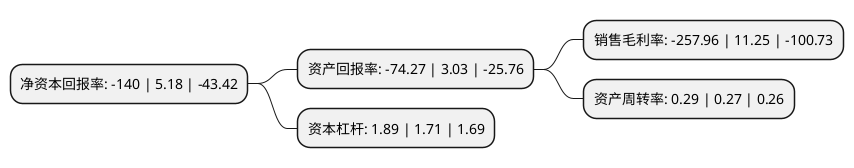

> 本页面由自动化程序生成于 2022年5月20日 01:17
> 内容可能存在错误，如有bug请提交issue至：https://github.com/Eroleice/doc-pi/issues
{.is-warning}

# 上市公司基本情况

## 基本资料

北京汉邦高科数字技术股份有限公司（以下简称“汉邦高科”）成立于2004年10月09日，北京市。于2015年04月22日在深交所创业板上市。

汉邦高科注册资本29,825.89万元，主要产品:安防后端存储设备，前端采集设备监控摄像机，视频监控系统，广电领域内容监测类的产品或服务和数字水印产品。主营业务:安防行业数字视频监控产品和整体解决方案的研发，生产和销售。以下是详细信息：

- 公司名称: 北京汉邦高科数字技术股份有限公司
- 股票代码: 300449.SZ
- 所在地: 北京 - 北京市
- 成立日期: 2004年10月09日
- 注册资本: 29,825.89万元
- 法定代表人: 李柠
- 主营业务: 主要产品:安防后端存储设备，前端采集设备监控摄像机，视频监控系统，广电领域内容监测类的产品或服务和数字水印产品主营业务:安防行业数字视频监控产品和整体解决方案的研发，生产和销售
- 公司官网: www.hbgk.net
- 公司介绍: 公司是国内领先的安防产品及行业解决方案提供商，致力于不断提升视频处理技术和视频分析技术，面向全球提供领先的安防产品、专业的行业解决方案与优质的服务，为客户持续创造更大价值。公司拥有业内领先的自主核心技术和可持续研发能力，经过多年在视频图像处理领域的技术积淀，已成功开发了多个系列数字监控产品，形成音视频压缩卡、嵌入式数字视频录像机、网络视频服务器、模拟摄像机、网络摄像机等多个系列数字监控核心产品，并针对金融、公安、电讯、交通、司法、教育、电力、水利、军队等众多行业提供合适的细分产品与专业的行业解决方案。这些产品和方案面向全国与海外，在各行业重大安保项目中得到广泛应用。公司是国家高新技术企业、北京市高新技术企业协会副会长单位、中国安防协会副理事长单位，通过了ISO-9001质量体系和ISO-14000环境体系认证，产品先后通过了FCC/CE、ROSH、CCC等认证。稳步高速发展的汉邦高科也获得行业内外的普遍认可，连续多年入围“中国安防十大品牌”、“平安城市”推荐品牌等，多次入围福布斯中国潜力企业榜，入围中关村国家自主创新示范区“创新型试点企业”，嵌入式数字硬盘录像机荣获“国家重点新产品”称号。

## 股东及高管情况

上市公司第一大股东为王立群，持股31,168,373股，占比10.45%，**疑似为**上市公司实际控制人。

截至2022年03月31日，上市公司的前十大股东中，共有8名自然人股东，2名机构股东，其中5%以上大股东共有1名。上市公司前十大股东明细如下：

> 未能通过持股比例判定出上市公司实际控制人（持股30%以上）
> 可能存在通过间接持股、联合持股、协议控制等方式拥有实际控制权的主体，具体请参考上市公司定期公告！
{.is-warning}

> 截至2022年03月31日，上市公司前十大股东信息如下：

| 股东名称 | 持股数量（股） | 持股比例 |
| --- | --- | --- |
| 王立群 | 31,168,373 | 10.45% |
| 王西林 | 7,354,500 | 2.47% |
| 天津滨河数据信息技术有限公司 | 3,900,000 | 1.31% |
| 王瑞林 | 2,031,700 | 0.68% |
| 段广志 | 1,997,460 | 0.67% |
| 朱丽荷 | 1,661,700 | 0.56% |
| 祁家俊 | 1,296,500 | 0.43% |
| 宁波汉银投资咨询合伙企业(有限合伙) | 1,250,207 | 0.42% |
| 刘勇 | 1,100,000 | 0.37% |
| 刘运龙 | 1,050,000 | 0.35% |

## 利润表分析

上市公司2021年总收入为2.92亿元，净利润为-7.55亿元，**未实现盈利**。

## 杜邦分析

> 数据列示周期：2021年 | 2020年 | 2019年
{.is-info}

上市公司的净资产收益率在近一年有所下降，下降幅度为-2802.7%，其变化情况分解如下：
- 上市公司的销售毛利率在近一年下降了-2392.98%，可能是生产效率的下降、商品原材料价格上涨或商品价格的下跌所致。
- 上市公司的资产周转率在近一年上升了7.41%，可能是源自于更快的销售回款或库存管理效果提升。
- 上市公司的财务杠杆比率在近一年上升了10.53%，可能是增加负债扩大生产规模。

