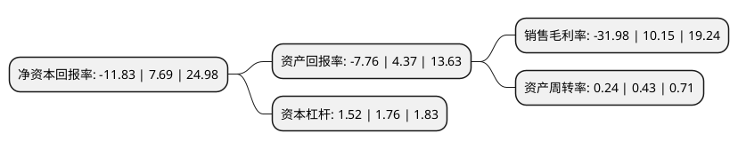

> 本页面由自动化程序生成于 2022年5月20日 01:17
> 内容可能存在错误，如有bug请提交issue至：https://github.com/Eroleice/doc-pi/issues
{.is-warning}

# 上市公司基本情况

## 基本资料

上海华铭智能终端设备股份有限公司（以下简称“华铭智能”）成立于2001年08月09日，上海市。于2015年05月27日在深交所创业板上市。

华铭智能注册资本18,826.503万元，主营业务:自动售检票系统终端设备的研发，生产，销售与维护。以下是详细信息：

- 公司名称: 上海华铭智能终端设备股份有限公司
- 股票代码: 300462.SZ
- 所在地: 上海 - 上海市
- 成立日期: 2001年08月09日
- 注册资本: 18,826.503万元
- 法定代表人: 张亮
- 主营业务: 主营业务:自动售检票系统终端设备的研发，生产，销售与维护
- 公司官网: www.hmmachine.com
- 公司介绍: 公司是上海市高新技术企业，专业从事轨道交通、快速公交(BRT)等各个领域自动售检票系统终端设备的自主研发、制造与销售，以及场馆、景点票务与门禁系统的系统集成、设备供货与技术服务。由公司供货的轨道交通售检票系统设备在上海、北京、广州、天津、西安、沈阳等国内城市已经开通使用。除了轨道交通售检票系统设备的主业以外，还向国内北京大学等上百所大学图书馆供货门禁系统和闸机。向厦门、乌鲁木齐、济南等BRT项目供货售检票设备。向上海世博会、杭州休博园等几十个旅游景点提供票务系统和系统设备。向上海期货交易所、交通银行上海总部等几十幢写字楼提供高档门禁系统闸机等设备。

## 股东及高管情况

上市公司第一大股东为张亮，持股53,410,400股，占比28.37%，**疑似为**上市公司实际控制人。

截至2022年03月31日，上市公司的前十大股东中，共有10名自然人股东，其中5%以上大股东共有1名。上市公司前十大股东明细如下：

> 未能通过持股比例判定出上市公司实际控制人（持股30%以上）
> 可能存在通过间接持股、联合持股、协议控制等方式拥有实际控制权的主体，具体请参考上市公司定期公告！
{.is-warning}

> 截至2022年03月31日，上市公司前十大股东信息如下：

| 股东名称 | 持股数量（股） | 持股比例 |
| --- | --- | --- |
| 张亮 | 53,410,400 | 28.37% |
| 韩智 | 9,413,151 | 5% |
| 谭鑫珣 | 5,532,178 | 2.94% |
| 谢根方 | 4,781,100 | 2.54% |
| 张晓燕 | 4,692,600 | 2.49% |
| 桂杰 | 4,157,842 | 2.21% |
| 王子钢 | 3,741,831 | 1.99% |
| 桂屏 | 1,811,761 | 0.96% |
| 徐剑平 | 1,293,600 | 0.69% |
| 熊伟 | 1,131,100 | 0.6% |

## 利润表分析

上市公司2021年总收入为5.93亿元，净利润为-1.9亿元，**未实现盈利**。

## 杜邦分析

> 数据列示周期：2021年 | 2020年 | 2019年
{.is-info}

上市公司的净资产收益率在近一年有所下降，下降幅度为-253.84%，其变化情况分解如下：
- 上市公司的销售毛利率在近一年下降了-415.07%，可能是生产效率的下降、商品原材料价格上涨或商品价格的下跌所致。
- 上市公司的资产周转率在近一年下降了-44.19%，可能是源自于更慢的销售回款或库存管理效果下降。
- 上市公司的财务杠杆比率在近一年下降了-13.64%，可能是减少负债降低财务费用。

