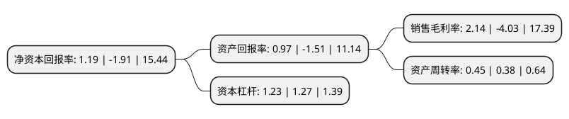

> 本页面由自动化程序生成于 2022年5月20日 01:18
> 内容可能存在错误，如有bug请提交issue至：https://github.com/Eroleice/doc-pi/issues
{.is-warning}

# 上市公司基本情况

## 基本资料

深圳市雄帝科技股份有限公司（以下简称“雄帝科技”）成立于1995年04月03日，深圳市。于2016年09月28日在深交所创业板上市。

雄帝科技注册资本13,581.475万元，主要产品:安全证卡系列，生物识别系列，证(物)联网系列，智慧银行系列，智能支付系列等身份信息产品。主要业务:为客户提供配套软件，技术支持服务和运营维护服务。以下是详细信息：

- 公司名称: 深圳市雄帝科技股份有限公司
- 股票代码: 300546.SZ
- 所在地: 广东 - 深圳市
- 成立日期: 1995年04月03日
- 注册资本: 13,581.475万元
- 法定代表人: 高晶
- 主营业务: 主要产品:安全证卡系列，生物识别系列，证(物)联网系列，智慧银行系列，智能支付系列等身份信息产品为客户提供配套软件，技术支持服务和运营维护服务
- 公司官网: www.xiongdi.cn
- 公司介绍: 公司是领先的身份信息综合服务商，为国内外政府、机构及行业用户提供以身份信息可信技术为核心的多维身份识别、智慧公共服务、智能物联及大数据服务。公司主要产品包括安全证卡系列、生物识别系列、证(物)联网系列、智慧银行系列、智能支付系列等身份信息产品，以上述产品为基础，公司还为客户提供配套软件、技术支持服务和运营维护服务，从而构建起身份信息一体化的整体解决方案，并广泛应用于电子政务、外事管理、智能交通、智慧银行、智慧安防及海外选举等领域。公司为国家级高新技术企业；国家火炬计划重点高新技术企业；深圳市软件企业；联合国ICAO机读旅行证件设备供应商名录企业；国家商用密码产品定点生产及销售企业；公安部二代证生物特征采集设备供应商；是“深圳物联网智能卡应用设备工程技术研究开发中心”依托单位；具有计算机系统集成三级资质；通过ISO9001全面质量管理体系认证。公司多项产品获国家、省、市重点新产品认定，拥有几十项专利技术、软件著作权及科技成果，居行业领先地位。

## 股东及高管情况

上市公司第一大股东为高晶，持股48,387,353股，占比33.91%，为上市公司实际控制人。

截至2022年04月01日，上市公司的前十大股东中，共有7名自然人股东，2个产品账户，1个海外主体，其中5%以上大股东共有3名。上市公司前十大股东明细如下：

> 截至2022年04月01日，上市公司前十大股东信息如下：

| 股东名称 | 持股数量（股） | 持股比例 |
| --- | --- | --- |
| 高晶 | 48,387,353 | 33.91% |
| 高晶 | 48,387,353 | 35.63% |
| 郑嵩 | 8,130,800 | 5.7% |
| 贾力强 | 3,971,953 | 2.92% |
| 杨大炜 | 1,614,800 | 1.19% |
| 诺德基金-华泰证券股份有限公司-诺德基金浦江120号单一资产管理计划 | 1,448,276 | 1.07% |
| 章林娣 | 1,298,750 | 0.96% |
| 财通基金-华泰证券股份有限公司-财通基金君享永熙单一资产管理计划 | 1,068,966 | 0.79% |
| 高华-汇丰-GOLDMAN, SACHS & CO.LLC | 960,000 | 0.71% |
| 周雪钦 | 931,035 | 0.69% |

## 利润表分析

上市公司2021年总收入为4.72亿元，净利润为0.1亿元，实现盈利。

## 杜邦分析

> 数据列示周期：2021年 | 2020年 | 2019年
{.is-info}

上市公司的净资产收益率在近一年有所下降，下降幅度为-162.3%，其变化情况分解如下：
- 上市公司的销售毛利率在近一年下降了-153.1%，可能是生产效率的下降、商品原材料价格上涨或商品价格的下跌所致。
- 上市公司的资产周转率在近一年上升了18.42%，可能是源自于更快的销售回款或库存管理效果提升。
- 上市公司的财务杠杆比率在近一年下降了-3.15%，可能是减少负债降低财务费用。

