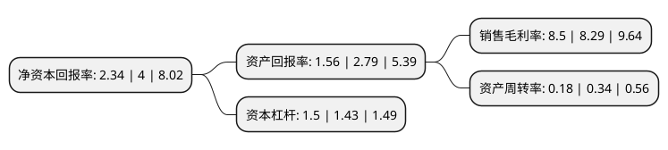

> 本页面由自动化程序生成于 2022年5月20日 01:18
> 内容可能存在错误，如有bug请提交issue至：https://github.com/Eroleice/doc-pi/issues
{.is-warning}

# 上市公司基本情况

## 基本资料

上海古鳌电子科技股份有限公司（以下简称“古鳌科技”）成立于1996年07月08日，上海市。于2016年10月18日在深交所创业板上市。

古鳌科技注册资本34,783.464万元，从事金融设备的研发，生产，销售与服务。目前公司产品包括点验钞机，纸币清分机，扎把机，点扎一体机，捆钞机，自助回单柜等金融设备。其中，A级点验钞机，纸币清分机和扎把机是目前公司的主要产品。以下是详细信息：

- 公司名称: 上海古鳌电子科技股份有限公司
- 股票代码: 300551.SZ
- 所在地: 上海 - 上海市
- 成立日期: 1996年07月08日
- 注册资本: 34,783.464万元
- 法定代表人: 陈崇军
- 主营业务: 从事金融设备的研发，生产，销售与服务目前公司产品包括点验钞机，纸币清分机，扎把机，点扎一体机，捆钞机，自助回单柜等金融设备其中，A级点验钞机，纸币清分机和扎把机是目前公司的主要产品
- 公司官网: www.gooao.cn
- 公司介绍: 公司是从事金融设备的研发、生产、销售与服务为一体的综合性高新技术企业，是我国金融设备产品的专业服务商。已通过ISO9001：2000国际质量体系认证、国家强制性产品CCC认证、欧盟电子类产品CE认证并被授予“上海市高新技术企业”、“全国质量信誉双保障示范单位”。产品涵盖人民币智能点验钞机、纸币清分机、扎把机、点扎一体机、捆钞机、自助回单柜等金融设备。凭着先进优质的产品和上乘的售后服务，公司已成功成为工商银行、农业银行、中国银行、建设银行、交通银行、中国邮政储蓄银行、招商银行、民生银行、中信银行、光大银行、浦发银行等国内各大商业银行的供应商。“古鳌”产品不仅畅销国内金融市场，还深受海外客户的青睐，远销欧美、东南亚等地区。公司已成为国内外知名的集金融设备研发、生产、销售、服务为一体的专业化企业。

## 股东及高管情况

上市公司第一大股东为陈崇军，持股130,113,389股，占比37.41%，为上市公司实际控制人。

截至2022年04月21日，上市公司的前十大股东中，共有9名自然人股东，1名机构股东，其中5%以上大股东共有1名。上市公司前十大股东明细如下：

> 截至2022年04月21日，上市公司前十大股东信息如下：

| 股东名称 | 持股数量（股） | 持股比例 |
| --- | --- | --- |
| 陈崇军 | 130,113,389 | 37.41% |
| 张海斌 | 9,806,700 | 2.82% |
| 房乔平 | 4,968,300 | 1.43% |
| 秦映月 | 3,134,950 | 0.9% |
| 中信里昂资产管理有限公司-客户资金 | 3,112,665 | 0.89% |
| 林泽添 | 2,623,051 | 0.75% |
| 沈美珠 | 2,388,000 | 0.69% |
| 张勇 | 2,336,189 | 0.67% |
| 冯健 | 2,310,970 | 0.66% |
| 顾忠桦 | 1,712,250 | 0.49% |

## 利润表分析

上市公司2021年总收入为1.73亿元，净利润为0.14亿元，实现盈利。

## 杜邦分析

> 数据列示周期：2021年 | 2020年 | 2019年
{.is-info}

上市公司的净资产收益率在近一年有所下降，下降幅度为-41.5%，其变化情况分解如下：
- 上市公司的销售毛利率在近一年上升了2.53%，可能是生产效率的提升、商品原材料价格下跌或商品价格的上涨所致。
- 上市公司的资产周转率在近一年下降了-47.06%，可能是源自于更慢的销售回款或库存管理效果下降。
- 上市公司的财务杠杆比率在近一年上升了4.9%，可能是增加负债扩大生产规模。

