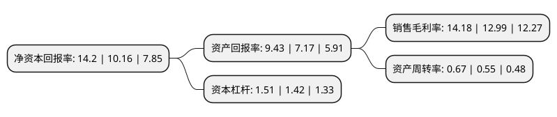

> 本页面由自动化程序生成于 2022年5月20日 01:19
> 内容可能存在错误，如有bug请提交issue至：https://github.com/Eroleice/doc-pi/issues
{.is-warning}

# 上市公司基本情况

## 基本资料

深圳市民德电子科技股份有限公司（以下简称“民德电子”）成立于2004年02月23日，深圳市。于2017年05月19日在深交所创业板上市。

民德电子注册资本13,078.384万元，主营业务:从事条码识别技术及相关产品的研发，生产，销售和技术服务;主要产品:用于一维码，二维码信息识别和读取的手持式条码扫描器，固定式POS扫描器，固定式工业类扫描器等系列识读设备。以下是详细信息：

- 公司名称: 深圳市民德电子科技股份有限公司
- 股票代码: 300656.SZ
- 所在地: 广东 - 深圳市
- 成立日期: 2004年02月23日
- 注册资本: 13,078.384万元
- 法定代表人: 许文焕
- 主营业务: 主营业务:从事条码识别技术及相关产品的研发，生产，销售和技术服务;主要产品:用于一维码，二维码信息识别和读取的手持式条码扫描器，固定式POS扫描器，固定式工业类扫描器等系列识读设备
- 公司官网: www.mindeo.cn
- 公司介绍: 公司成立于2004年，是一家专业从事条码识读设备的设计、研发、生产和品牌营销的科技公司。公司依托强大的技术实力、完善的服务体系及服务本地化的优势，以多样的产品、卓越的性能和快捷的服务一直为广大用户所信赖。经过十多年的发展和完善，销售及售后服务网络已覆盖了全国近三十个省、市、自治区，及欧洲、非洲、南美洲和东南亚各个国家。公司目前已构建从一维码到二维码、从手持式主动扫描设备到被动式扫描平台设备、从微型扫描引擎到各类成品设备的完整产品体系，产品在解码能力、识读景深、扫描速度等技术性能上已达到或接近国际领先企业水平，是唯一一家自主研发基于激光扫描技术和基于影像扫描技术微型扫描引擎的民族企业，并对国际品牌产品逐步实现进口替代。

## 股东及高管情况

上市公司第一大股东为许香灿，持股17,241,619股，占比13.18%，**疑似为**上市公司实际控制人。

截至2022年03月31日，上市公司的前十大股东中，共有7名自然人股东，1名机构股东，2个产品账户，其中5%以上大股东共有5名。上市公司前十大股东明细如下：

> 未能通过持股比例判定出上市公司实际控制人（持股30%以上）
> 可能存在通过间接持股、联合持股、协议控制等方式拥有实际控制权的主体，具体请参考上市公司定期公告！
{.is-warning}

> 截至2022年03月31日，上市公司前十大股东信息如下：

| 股东名称 | 持股数量（股） | 持股比例 |
| --- | --- | --- |
| 许香灿 | 17,241,619 | 13.18% |
| 许文焕 | 16,218,448 | 12.4% |
| 易仰卿 | 12,437,099 | 9.51% |
| 黄效东 | 11,143,793 | 8.52% |
| 新大陆数字技术股份有限公司 | 8,894,407 | 6.8% |
| 黄强 | 6,527,369 | 4.99% |
| 中国工商银行股份有限公司-中欧价值智选回报混合型证券投资基金 | 6,215,739 | 4.75% |
| 罗源熊 | 3,551,646 | 2.72% |
| 谢刚 | 2,908,718 | 2.22% |
| 中国工商银行股份有限公司-前海开源新经济灵活配置混合型证券投资基金 | 2,731,369 | 2.09% |

## 利润表分析

上市公司2021年总收入为5.46亿元，净利润为0.77亿元，实现盈利。

## 杜邦分析

> 数据列示周期：2021年 | 2020年 | 2019年
{.is-info}

上市公司的净资产收益率在近一年有所上升，上升幅度为39.76%，其变化情况分解如下：
- 上市公司的销售毛利率在近一年上升了9.16%，可能是生产效率的提升、商品原材料价格下跌或商品价格的上涨所致。
- 上市公司的资产周转率在近一年上升了21.82%，可能是源自于更快的销售回款或库存管理效果提升。
- 上市公司的财务杠杆比率在近一年上升了6.34%，可能是增加负债扩大生产规模。

