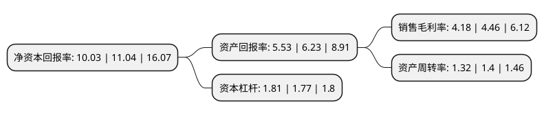

> 本页面由自动化程序生成于 2022年5月20日 01:21
> 内容可能存在错误，如有bug请提交issue至：https://github.com/Eroleice/doc-pi/issues
{.is-warning}

# 上市公司基本情况

## 基本资料

协创数据技术股份有限公司（以下简称“协创数据”）成立于2005年11月18日，深圳市。于2020年07月27日在深交所创业板上市。

协创数据注册资本20,655.778万元，主要产品为物联网智能终端和数据存储设备，主要从事消费电子领域物联网智能终端和数据存储设备等产品的研发，生产和销售，并不断紧跟技术变革与市场的发展趋势，推出新产品。以下是详细信息：

- 公司名称: 协创数据技术股份有限公司
- 股票代码: 300857.SZ
- 所在地: 广东 - 深圳市
- 成立日期: 2005年11月18日
- 注册资本: 20,655.778万元
- 法定代表人: 耿四化
- 主营业务: 主要产品为物联网智能终端和数据存储设备，主要从事消费电子领域物联网智能终端和数据存储设备等产品的研发，生产和销售，并不断紧跟技术变革与市场的发展趋势，推出新产品
- 公司官网: www.sharetronic.com
- 公司介绍: 公司是在消费电子制造领域长期研究经验积累的基础上，通过聚焦消费电子产品智能化及音视频信息编解码技术应用的背景下逐步发展起来的，主要从事消费电子领域物联网智能终端和数据存储设备等产品的研发、生产和销售，并不断紧跟技术变革与市场的发展趋势，推出新产品。目前，公司及子公司安徽协创均为国家高新技术企业，公司荣获2017年度广东省“守合同重信用”企业荣誉称号，是中国虚拟现实产业联盟和中国电子信息产业发展研究院评定的虚拟现实产业联盟会员单位；子公司安徽协创入选“安徽省企业技术中心”，并被安徽省经济和信息化委员会评定为“2017年安徽省软件企业20强”、“2017年度安徽省智能硬件示范企业”等，被合肥市经济和信息化委员会评定为“合肥市工业设计中心”“合肥市智能工厂”等，同时获得合肥市高新技术开发区管委会颁发的“技术品牌奖”、“专利创造奖”、“高成长优质奖”等奖项。

## 股东及高管情况

上市公司第一大股东为协创智慧科技有限公司，持股64,819,000股，占比31.38%，为上市公司实际控制人。

截至2022年03月31日，上市公司的前十大股东中，共有7名机构股东，2个产品账户，1个海外主体，其中5%以上大股东共有3名。上市公司前十大股东明细如下：

> 截至2022年03月31日，上市公司前十大股东信息如下：

| 股东名称 | 持股数量（股） | 持股比例 |
| --- | --- | --- |
| 协创智慧科技有限公司 | 64,819,000 | 31.38% |
| POWER CHANNEL LIMITED | 41,181,000 | 19.94% |
| 石河子市青云股权投资合伙企业(有限合伙) | 14,410,000 | 6.98% |
| 安徽高新金通安益二期创业投资基金(有限合伙) | 8,557,096 | 4.14% |
| 宁波九格股权投资管理合伙企业(有限合伙)-石河子市隆华汇股权投资合伙企业(有限合伙) | 5,613,541 | 2.72% |
| 中信证券股份有限公司 | 4,133,234 | 2% |
| 中国国际金融股份有限公司 | 3,739,900 | 1.81% |
| 合肥兴泰光电智能创业投资有限公司 | 3,371,600 | 1.63% |
| 石河子市金海汇股权投资管理有限公司-石河子市乾霨股权投资合伙企业(有限合伙) | 2,095,421 | 1.01% |
| 浙江臻远投资管理有限公司-臻远茗瑜成长七号私募证券投资基金 | 1,031,900 | 0.5% |

## 利润表分析

上市公司2021年总收入为29.59亿元，净利润为1.23亿元，实现盈利。

## 杜邦分析

> 数据列示周期：2021年 | 2020年 | 2019年
{.is-info}

上市公司的净资产收益率在近一年有所下降，下降幅度为-9.15%，其变化情况分解如下：
- 上市公司的销售毛利率在近一年下降了-6.28%，可能是生产效率的下降、商品原材料价格上涨或商品价格的下跌所致。
- 上市公司的资产周转率在近一年下降了-5.71%，可能是源自于更慢的销售回款或库存管理效果下降。
- 上市公司的财务杠杆比率在近一年上升了2.26%，可能是增加负债扩大生产规模。

