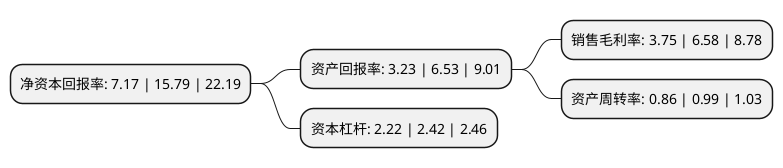

> 本页面由自动化程序生成于 2022年5月20日 01:21
> 内容可能存在错误，如有bug请提交issue至：https://github.com/Eroleice/doc-pi/issues
{.is-warning}

# 上市公司基本情况

## 基本资料

安徽英力电子科技股份有限公司（以下简称“英力股份”）成立于2015年04月14日，六安市。于2021年03月26日在深交所创业板上市。

英力股份注册资本13,200万元，主要从事消费电子产品结构件模组及相关精密模具的研发，设计，生产和销售，致力于为客户提供消费电子产品从设计，模具制造到结构件模组生产的综合服务。主要产品为笔记本电脑结构件模组及相关精密模具。以下是详细信息：

- 公司名称: 安徽英力电子科技股份有限公司
- 股票代码: 300956.SZ
- 所在地: 安徽 - 六安市
- 成立日期: 2015年04月14日
- 注册资本: 13,200万元
- 法定代表人: 戴明
- 主营业务: 主要从事消费电子产品结构件模组及相关精密模具的研发，设计，生产和销售，致力于为客户提供消费电子产品从设计，模具制造到结构件模组生产的综合服务主要产品为笔记本电脑结构件模组及相关精密模具
- 公司官网: www.yinglidianzi.com
- 公司介绍: 公司主要从事消费电子产品结构件模组及相关精密模具的研发、设计、生产和销售，致力于为客户提供消费电子产品从设计、模具制造到结构件模组生产的综合服务。报告期内，公司的主要产品为笔记本电脑结构件模组及相关精密模具。公司深耕笔记本电脑结构件模组领域，通过持续不断的技术创新和不断加深的一体化生产能力，持续打造技术领先、质量过硬、服务周全的优质产品，已成为国内笔记本电脑结构件领域的领先企业之一。通过多年行业经营，公司与联宝、仁宝、纬创等全球知名的笔记本电脑代工厂建立了长期稳定的合作关系，服务的笔记本电脑终端应用品牌包括联想、戴尔、惠普、宏碁等全球主流笔记本电脑品牌。公司凭借其产品的良好品质和专业服务，获得客户的高度认可，2019年联想集团授予公司“Perfect Quality”荣誉，联宝集团授予公司“质量奖”和“完美品质奖”，戴尔集团授予公司“运营卓越奖”。公司2018年被安徽省经济和信息化厅评定为的“安徽省数字化车间”，2019年被六安市经济和信息化局评定为“六安市企业技术中心”。

## 股东及高管情况

上市公司第一大股东为上海英准投资控股有限公司，持股68,723,136股，占比52.06%，为上市公司实际控制人。

截至2022年03月31日，上市公司的前十大股东中，共有4名自然人股东，4名机构股东，2个产品账户，其中5%以上大股东共有1名。上市公司前十大股东明细如下：

> 截至2022年03月31日，上市公司前十大股东信息如下：

| 股东名称 | 持股数量（股） | 持股比例 |
| --- | --- | --- |
| 上海英准投资控股有限公司 | 68,723,136 | 52.06% |
| 黄山高新毅达新安江专精特新创业投资基金(有限合伙) | 5,000,000 | 3.79% |
| 陈立荣 | 3,982,301 | 3.02% |
| 鲍磊 | 3,982,301 | 3.02% |
| 嘉兴九赢股权投资合伙企业(有限合伙) | 3,882,301 | 2.94% |
| 舒城誉之股权管理中心(有限合伙) | 2,166,182 | 1.64% |
| 合肥拾岳投资管理合伙企业(有限合伙)-六安拾岳禾安一期创业投资合伙企业(有限合伙) | 2,000,000 | 1.52% |
| 华富嘉业投资管理有限公司-安徽安华创新风险投资基金有限公司 | 2,000,000 | 1.52% |
| 李禹华 | 1,820,480 | 1.38% |
| 唐世界 | 1,137,800 | 0.86% |

## 利润表分析

上市公司2021年总收入为16.89亿元，净利润为0.63亿元，实现盈利。

## 杜邦分析

> 数据列示周期：2021年 | 2020年 | 2019年
{.is-info}

上市公司的净资产收益率在近一年有所下降，下降幅度为-54.59%，其变化情况分解如下：
- 上市公司的销售毛利率在近一年下降了-43.01%，可能是生产效率的下降、商品原材料价格上涨或商品价格的下跌所致。
- 上市公司的资产周转率在近一年下降了-13.13%，可能是源自于更慢的销售回款或库存管理效果下降。
- 上市公司的财务杠杆比率在近一年下降了-8.26%，可能是减少负债降低财务费用。

