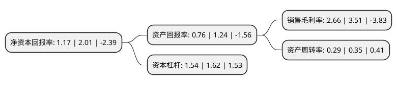

> 本页面由自动化程序生成于 2022年5月20日 01:32
> 内容可能存在错误，如有bug请提交issue至：https://github.com/Eroleice/doc-pi/issues
{.is-warning}

# 上市公司基本情况

## 基本资料

恒银金融科技股份有限公司（以下简称“恒银科技”）成立于2004年05月12日，天津市。于2017年09月20日在上交所主板上市。

恒银科技注册资本52,052万元，主营业务:提供以金融自助设备为核心的智慧银行解决方案。主要产品及服务:提供传统银行向智慧银行转型升级过程中所需的现金类，非现金类，支付安全类等全方位的智能产品，技术和服务。以下是详细信息：

- 公司名称: 恒银金融科技股份有限公司
- 股票代码: 603106.SH
- 所在地: 天津 - 天津市
- 成立日期: 2004年05月12日
- 注册资本: 52,052万元
- 法定代表人: 江浩然
- 主营业务: 主营业务:提供以金融自助设备为核心的智慧银行解决方案主要产品及服务:提供传统银行向智慧银行转型升级过程中所需的现金类，非现金类，支付安全类等全方位的智能产品，技术和服务
- 公司官网: www.cashwaytech.com
- 公司介绍: 公司是国内领先的智慧银行解决方案提供商。公司致力于提供传统银行向智慧银行转型升级过程中所需的现金类、非现金类、支付安全类等全方位的智能产品、技术和服务，通过“智能产品、先进技术、优质服务”相结合的运营模式，满足客户在智慧银行建设和运营过程中的各类个性化需求，协助其实现营业网点的智能化转型，有效降低运营成本，改善用户体验和服务水平，拓展业务渠道，提高经营效益。公司凭借优质的产品和全面及时的售后服务，树立了良好的品牌形象，形成了大型国有商业银行、全国性股份制商业银行、农村信用社、城市商业银行等金融机构，以及电信运营商等共同组成的市场知名度高、信用状况良好的多层次客户群体，并建立了稳定的合作关系，金融自助设备的销售数量逐年增加。

## 股东及高管情况

上市公司第一大股东为恒融投资集团有限公司，持股241,670,000股，占比46.43%，为上市公司实际控制人。

截至2022年03月31日，上市公司的前十大股东中，共有8名自然人股东，1名机构股东，1个海外主体，其中5%以上大股东共有2名。上市公司前十大股东明细如下：

> 截至2022年03月31日，上市公司前十大股东信息如下：

| 股东名称 | 持股数量（股） | 持股比例 |
| --- | --- | --- |
| 恒融投资集团有限公司 | 241,670,000 | 46.43% |
| 王淑琴 | 56,699,500 | 10.89% |
| 周宇光 | 9,194,925 | 1.77% |
| 肖国华 | 6,367,806 | 1.22% |
| 尹桂琴 | 3,549,136 | 0.68% |
| 江浩然 | 3,445,779 | 0.66% |
| 薛晓忠 | 3,378,571 | 0.65% |
| 吴龙云 | 2,352,220 | 0.45% |
| MORGAN STANLEY &CO. INTERNATIONAL PLC | 2,064,750 | 0.4% |
| 李汉永 | 1,940,760 | 0.37% |

## 利润表分析

上市公司2021年总收入为7.14亿元，净利润为0.19亿元，实现盈利。

## 杜邦分析

> 数据列示周期：2021年 | 2020年 | 2019年
{.is-info}

上市公司的净资产收益率在近一年有所下降，下降幅度为-41.79%，其变化情况分解如下：
- 上市公司的销售毛利率在近一年下降了-24.22%，可能是生产效率的下降、商品原材料价格上涨或商品价格的下跌所致。
- 上市公司的资产周转率在近一年下降了-17.14%，可能是源自于更慢的销售回款或库存管理效果下降。
- 上市公司的财务杠杆比率在近一年下降了-4.94%，可能是减少负债降低财务费用。

