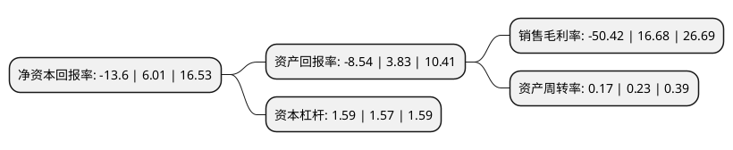

> 本页面由自动化程序生成于 2022年5月20日 01:37
> 内容可能存在错误，如有bug请提交issue至：https://github.com/Eroleice/doc-pi/issues
{.is-warning}

# 上市公司基本情况

## 基本资料

广东紫晶信息存储技术股份有限公司（以下简称“*ST紫晶”）成立于2010年04月15日，梅州市。于2020年02月26日在上交所科创板上市。

*ST紫晶注册资本19,038.15万元，面向大数据时代冷热数据分层存储背景下的光磁电混合存储的应用需求，以及政府，军工等领域对自主可控和数据存储安全提升的需求，开展光存储介质，光存储设备，以及基于光存储技术的数据智能分层存储及信息技术解决方案的研发，设计，开发，生产，销售和服务。以下是详细信息：

- 公司名称: 广东紫晶信息存储技术股份有限公司
- 股票代码: 688086.SH
- 所在地: 广东 - 梅州市
- 成立日期: 2010年04月15日
- 注册资本: 19,038.15万元
- 法定代表人: 郑穆
- 主营业务: 面向大数据时代冷热数据分层存储背景下的光磁电混合存储的应用需求，以及政府，军工等领域对自主可控和数据存储安全提升的需求，开展光存储介质，光存储设备，以及基于光存储技术的数据智能分层存储及信息技术解决方案的研发，设计，开发，生产，销售和服务
- 公司官网: www.amethystum.com
- 公司介绍: 公司是国内领先的光存储科技企业，开展光存储介质、光存储设备，以及基于光存储技术的数据智能分层存储及信息技术解决方案的研发、设计、开发、生产、销售和服务。沿着“介质—设备—解决方案”的技术及产业化发展路径，覆盖了政务、互联网、医疗、军工、金融、档案、教育、能源等领域。主要产品包括面向消费级市场的光存储介质，以及面向企业级市场的光存储设备及解决方案。产品存储密度高、能耗低，存储介质安全性强，具备较强的安全可控性。是唯一入选工信部“2018年工业强基工程存储器一条龙”的光存储上游材料、生产设备制造和光存储制造企业，也是唯一一家BD-R底层编码策略通过国际蓝光联盟认证的大陆地区光存储企业(全球仅九家)。

## 股东及高管情况

上市公司第一大股东为梅州紫辰投资咨询有限公司，持股28,302,623股，占比14.87%，**疑似为**上市公司实际控制人。

截至2022年03月31日，上市公司的前十大股东中，共有9名机构股东，1个产品账户，其中5%以上大股东共有2名。上市公司前十大股东明细如下：

> 未能通过持股比例判定出上市公司实际控制人（持股30%以上）
> 可能存在通过间接持股、联合持股、协议控制等方式拥有实际控制权的主体，具体请参考上市公司定期公告！
{.is-warning}

> 截至2022年03月31日，上市公司前十大股东信息如下：

| 股东名称 | 持股数量（股） | 持股比例 |
| --- | --- | --- |
| 梅州紫辰投资咨询有限公司 | 28,302,623 | 14.87% |
| 梅州紫晖投资咨询有限公司 | 28,004,387 | 14.71% |
| 深圳市达晨财智创业投资管理有限公司-深圳市达晨创通股权投资企业(有限合伙) | 5,173,306 | 2.72% |
| 海宁东证汉德投资合伙企业(有限合伙) | 5,091,550 | 2.67% |
| 宁波梅山保税港区东证夏德投资合伙企业(有限合伙) | 5,091,065 | 2.67% |
| 深圳市达晨创联股权投资基金合伙企业(有限合伙) | 3,455,040 | 1.81% |
| 三一集团有限公司 | 2,069,322 | 1.09% |
| 中信建投投资有限公司 | 1,903,845 | 1% |
| 北京紫晶光电设备有限公司 | 1,357,265 | 0.71% |
| 深圳市远致富海投资管理有限公司-深圳远致富海新兴产业二期投资企业(有限合伙) | 1,204,051 | 0.63% |

## 利润表分析

上市公司2021年总收入为4.57亿元，净利润为-2.31亿元，**未实现盈利**。

## 杜邦分析

> 数据列示周期：2021年 | 2020年 | 2019年
{.is-info}

上市公司的净资产收益率在近一年有所下降，下降幅度为-326.29%，其变化情况分解如下：
- 上市公司的销售毛利率在近一年下降了-402.28%，可能是生产效率的下降、商品原材料价格上涨或商品价格的下跌所致。
- 上市公司的资产周转率在近一年下降了-26.09%，可能是源自于更慢的销售回款或库存管理效果下降。
- 上市公司的财务杠杆比率在近一年上升了1.27%，可能是增加负债扩大生产规模。

