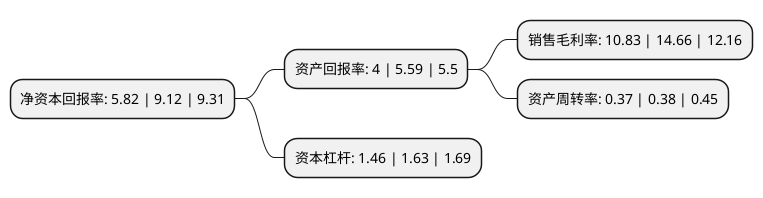

> 本页面由自动化程序生成于 2022年5月20日 01:05
> 内容可能存在错误，如有bug请提交issue至：https://github.com/Eroleice/doc-pi/issues
{.is-warning}

# 上市公司基本情况

## 基本资料

四川省自贡运输机械集团股份有限公司（以下简称“运机集团”）成立于2003年09月28日，自贡市。于2021年11月01日在深交所主板上市。

运机集团注册资本16,000万元，公司主要从事以带式输送机为主的节能环保型输送机械成套设备的研发，设计，生产和销售。公司的主导产品如下:通用带式输送机，管状带式输送机，水平转弯带式输送机。以下是详细信息：

- 公司名称: 四川省自贡运输机械集团股份有限公司
- 股票代码: 001288.SZ
- 所在地: 四川 - 自贡市
- 成立日期: 2003年09月28日
- 注册资本: 16,000万元
- 法定代表人: 吴友华
- 主营业务: 公司主要从事以带式输送机为主的节能环保型输送机械成套设备的研发，设计，生产和销售公司的主导产品如下:通用带式输送机，管状带式输送机，水平转弯带式输送机
- 公司官网: www.zgcmc.com
- 公司介绍: 公司专业以带式输送机为主的节能环保型输送机械成套设备的研发、设计、生产和销售，是物料输送系统解决方案的供应商，主要产品包括通用带式输送机、管状带式输送机、水平转弯带式输送机、逆止装置、驱动装置等。目前，公司构建的物料输送设备制造体系和相关的产品链已较为完备，正在开拓具备科技含量更高、可靠性和稳定性更佳的物料输送解决方案。公司的主导产品中，通用带式输送机是目前应用最为普遍的带式输送机结构形式，以输送带作为物料运送的承载构件，利用托辊支承输送带移动，依靠传动滚筒与输送带之间摩擦力牵引输送带运动将输送带承载的物料从起点运送到终点完成物料输送。通用带式输送机广泛应用于散料、包装物的输送和转运场合。

## 股东及高管情况

上市公司第一大股东为吴友华，持股76,634,000股，占比47.9%，为上市公司实际控制人。

截至2022年03月31日，上市公司的前十大股东中，共有7名自然人股东，2名机构股东，1个海外主体，其中5%以上大股东共有3名。上市公司前十大股东明细如下：

> 截至2022年03月31日，上市公司前十大股东信息如下：

| 股东名称 | 持股数量（股） | 持股比例 |
| --- | --- | --- |
| 吴友华 | 76,634,000 | 47.9% |
| 自贡市博宏丝绸有限公司 | 22,500,000 | 14.06% |
| 自贡市华智投资有限公司 | 10,000,000 | 6.25% |
| SUMMER HARVEST LIMITED | 5,750,000 | 3.59% |
| 冯浩 | 2,300,000 | 1.44% |
| 李剑钊 | 968,560 | 0.61% |
| 许磊 | 900,000 | 0.56% |
| 何玉琴 | 831,200 | 0.52% |
| 郭颖 | 590,700 | 0.37% |
| 许喆 | 310,000 | 0.19% |

## 利润表分析

上市公司2021年总收入为7.87亿元，净利润为0.85亿元，实现盈利。

## 杜邦分析

> 数据列示周期：2021年 | 2020年 | 2019年
{.is-info}

上市公司的净资产收益率在近一年有所下降，下降幅度为-36.18%，其变化情况分解如下：
- 上市公司的销售毛利率在近一年下降了-26.13%，可能是生产效率的下降、商品原材料价格上涨或商品价格的下跌所致。
- 上市公司的资产周转率在近一年下降了-2.63%，可能是源自于更慢的销售回款或库存管理效果下降。
- 上市公司的财务杠杆比率在近一年下降了-10.43%，可能是减少负债降低财务费用。

