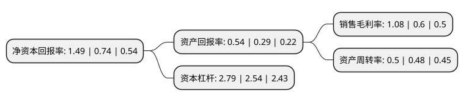

> 本页面由自动化程序生成于 2022年5月20日 01:07
> 内容可能存在错误，如有bug请提交issue至：https://github.com/Eroleice/doc-pi/issues
{.is-warning}

# 上市公司基本情况

## 基本资料

大连华锐重工集团股份有限公司（以下简称“大连重工”）成立于1993年02月18日，大连市。于2008年01月16日在深交所中小板上市。

大连重工注册资本193,137.003万元，主要从事大型高端铸锻件产品的研发，生产，销售和服务。主要产品为火电蒸汽轮机汽缸缸体，阀体，水电水轮机上冠，下环，叶片及轮毂体，风电轮毂，核电铸钢件，船用挂舵臂，球尾，轧机机架等高附加值产品。以下是详细信息：

- 公司名称: 大连华锐重工集团股份有限公司
- 股票代码: 002204.SZ
- 所在地: 辽宁 - 大连市
- 成立日期: 1993年02月18日
- 注册资本: 193,137.003万元
- 法定代表人: 邵长南
- 主营业务: 主要从事大型高端铸锻件产品的研发，生产，销售和服务主要产品为火电蒸汽轮机汽缸缸体，阀体，水电水轮机上冠，下环，叶片及轮毂体，风电轮毂，核电铸钢件，船用挂舵臂，球尾，轧机机架等高附加值产品
- 公司官网: www.dhidcw.com
- 公司介绍: 公司是国家重机行业的大型重点骨干企业和新能源设备制造重点企业。公司主要为冶金、港口、能源、矿山、工程、交通、航空航天、造船、环保等国民经济基础产业提供成套技术装备、高新技术产品和服务，现已形成冶金机械、起重机械、散料装卸机械、港口机械、能源机械、传动与控制系统、船用零部件、工程机械、海工机械等几大产品结构。公司建有国家级技术中心、德国研发中心、博士后工作站和多个研究所、实验室；公司将进一步提升自主创新能力，推动企业平稳持续发展，力争利税总额翻一番，综合竞争能力国内行业领先，致力于打造国际一流重工企业集团。

## 股东及高管情况

上市公司第一大股东为大连重工·起重集团有限公司，持股1,075,898,974股，占比55.71%，为上市公司实际控制人。

截至2022年03月31日，上市公司的前十大股东中，共有5名自然人股东，4名机构股东，1个海外主体，其中5%以上大股东共有2名。上市公司前十大股东明细如下：

> 截至2022年03月31日，上市公司前十大股东信息如下：

| 股东名称 | 持股数量（股） | 持股比例 |
| --- | --- | --- |
| 大连重工·起重集团有限公司 | 1,075,898,974 | 55.71% |
| 大连市国有资产投资经营集团有限公司 | 124,981,784 | 6.47% |
| 中央汇金资产管理有限责任公司 | 37,142,100 | 1.92% |
| 香港中央结算有限公司(陆股通) | 36,353,481 | 1.88% |
| 中国长城资产管理股份有限公司 | 16,205,533 | 0.84% |
| 陈奇 | 13,000,000 | 0.67% |
| 徐开东 | 9,185,900 | 0.48% |
| 陈江 | 7,600,000 | 0.39% |
| 冯丹 | 6,200,000 | 0.32% |
| 李长升 | 5,050,000 | 0.26% |

## 利润表分析

上市公司2021年总收入为91.08亿元，净利润为0.98亿元，实现盈利。

## 杜邦分析

> 数据列示周期：2021年 | 2020年 | 2019年
{.is-info}

上市公司的净资产收益率在近一年有所上升，上升幅度为101.35%，其变化情况分解如下：
- 上市公司的销售毛利率在近一年上升了80%，可能是生产效率的提升、商品原材料价格下跌或商品价格的上涨所致。
- 上市公司的资产周转率在近一年上升了4.17%，可能是源自于更快的销售回款或库存管理效果提升。
- 上市公司的财务杠杆比率在近一年上升了9.84%，可能是增加负债扩大生产规模。

