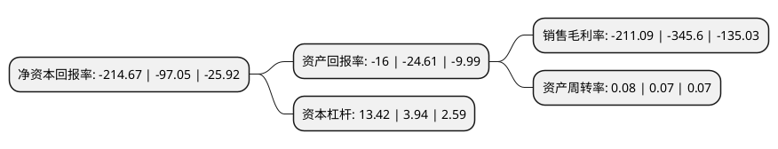

> 本页面由自动化程序生成于 2022年5月20日 01:08
> 内容可能存在错误，如有bug请提交issue至：https://github.com/Eroleice/doc-pi/issues
{.is-warning}

# 上市公司基本情况

## 基本资料

台海玛努尔核电设备股份有限公司（以下简称“*ST海核”）成立于1997年11月18日，眉山市。于2010年03月12日在深交所中小板上市。

*ST海核注册资本86,705.735万元，主要业务:核电专用设备，其他专用设备，石化装备的制造和销售;成套设备的设计，制造，销售及安装售后服务等业务;钴精矿销售业务;核级材料的销售业务以下是详细信息：

- 公司名称: 台海玛努尔核电设备股份有限公司
- 股票代码: 002366.SZ
- 所在地: 四川 - 眉山市
- 成立日期: 1997年11月18日
- 注册资本: 86,705.735万元
- 法定代表人: 王雪欣
- 主营业务: 核电专用设备，其他专用设备，石化装备的制造和销售;成套设备的设计，制造，销售及安装售后服务等业务;钴精矿销售业务;核级材料的销售业务
- 公司官网: www.scdanfu.cn
- 公司介绍: 公司是国内小型制冷压缩机主导生产厂家之一。公司主营业务为核电专用设备、其他专用设备、石化装备的制造和销售；成套设备的设计、制造、销售及安装售后服务等业务；钴精矿销售业务；核级材料的销售业务。目前，公司专业从事高端材料研发与生产，专注于核电装备制造与销售。制冷压缩机行业为资本与技术密集行业，制冷压缩机制造技术属于精密制造技术。公司通过长期的持续投资逐渐形成了完整的高精度加工设备体系，基于实践积累了适合于小型制冷压缩机行业的多种研发、工艺设计、质量控制和生产组织经验和方法，储备了大量的设计加工装配技术，获得了多项专利和发明。公司拥有具备丰富行业实战经验的专业团队，可以及时有效地响应市场变化；拥有快速的产品制造和交付能力，拥有稳定的产品质量，建立了相互信赖的战略客户群，在国内小型制冷压缩机领域具有一定的细分市场优势。

## 股东及高管情况

上市公司第一大股东为烟台市台海集团有限公司，持股262,436,862股，占比30.27%，为上市公司实际控制人。

截至2022年03月31日，上市公司的前十大股东中，共有6名自然人股东，1名机构股东，2个产品账户，1个海外主体，其中5%以上大股东共有1名。上市公司前十大股东明细如下：

> 截至2022年03月31日，上市公司前十大股东信息如下：

| 股东名称 | 持股数量（股） | 持股比例 |
| --- | --- | --- |
| 烟台市台海集团有限公司 | 262,436,862 | 30.27% |
| 王德成 | 8,218,800 | 0.95% |
| 香港中央结算有限公司(陆股通) | 7,078,135 | 0.82% |
| 罗志中 | 6,560,002 | 0.76% |
| 宁波梅山保税港区凌顶投资管理有限公司-凌顶五号私募证券投资基金 | 6,120,438 | 0.71% |
| 支绍环 | 5,230,200 | 0.6% |
| 林志强 | 4,748,100 | 0.55% |
| 徐双全 | 4,391,677 | 0.51% |
| 上海复熙资产管理有限公司-复熙混合12号私募证券投资基金 | 3,953,907 | 0.46% |
| 陈颖 | 2,551,800 | 0.29% |

## 利润表分析

上市公司2021年总收入为4.08亿元，净利润为-8.62亿元，**未实现盈利**。

## 杜邦分析

> 数据列示周期：2021年 | 2020年 | 2019年
{.is-info}

上市公司的净资产收益率在近一年有所上升，上升幅度为121.2%，其变化情况分解如下：
- 上市公司的销售毛利率在近一年下降了-38.92%，可能是生产效率的下降、商品原材料价格上涨或商品价格的下跌所致。
- 上市公司的资产周转率在近一年上升了14.29%，可能是源自于更快的销售回款或库存管理效果提升。
- 上市公司的财务杠杆比率在近一年上升了240.61%，可能是增加负债扩大生产规模。

