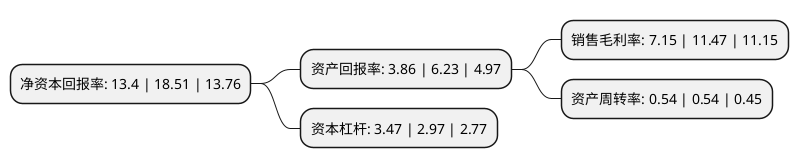

> 本页面由自动化程序生成于 2022年5月20日 01:10
> 内容可能存在错误，如有bug请提交issue至：https://github.com/Eroleice/doc-pi/issues
{.is-warning}

# 上市公司基本情况

## 基本资料

西子清洁能源装备制造股份有限公司（以下简称“西子洁能”）成立于1955年10月01日，杭州市。于2011年01月10日在深交所中小板上市。

西子洁能注册资本73,920.105万元，主营业务为各类余热锅炉，工业锅炉，电站锅炉，核电设备和电站辅机的研发，生产和销售。主要产品为余热锅炉(烧结余热锅炉，干熄焦余热锅炉，水泥窑余热锅炉，燃气轮机余热锅炉)，工业锅炉(垃圾焚烧锅炉，生物质锅炉)，电站锅炉(循环流化床锅炉，煤粉炉，高炉煤气炉)，核电设备和电站辅机(高压加热器，低压加热器，除氧器，冷凝器)。以下是详细信息：

- 公司名称: 西子清洁能源装备制造股份有限公司
- 股票代码: 002534.SZ
- 所在地: 浙江 - 杭州市
- 成立日期: 1955年10月01日
- 注册资本: 73,920.105万元
- 法定代表人: 王水福
- 主营业务: 主营业务为各类余热锅炉，工业锅炉，电站锅炉，核电设备和电站辅机的研发，生产和销售主要产品为余热锅炉(烧结余热锅炉，干熄焦余热锅炉，水泥窑余热锅炉，燃气轮机余热锅炉)，工业锅炉(垃圾焚烧锅炉，生物质锅炉)，电站锅炉(循环流化床锅炉，煤粉炉，高炉煤气炉)，核电设备和电站辅机(高压加热器，低压加热器，除氧器，冷凝器)
- 公司官网: www.chinaboilers.com
- 公司介绍: 公司是一家主要从事锅炉、压力容器、环保设备等产品的咨询、研发、生产、销售、安装及其它工程服务的大型综合性集团企业。公司主要产品为各类余热锅炉、工业锅炉、电站锅炉、核电设备和电站辅机，公司是国内规模最大、品种最全的余热锅炉研究、开发、设计和制造基地。公司根据专业分工，实现设计、制造、安装、调试等多元化、大成套的一条龙服务，并成功地跨出了由单独的锅炉产品提供向锅炉岛总承包、电厂总承包交钥匙工程的发展。公司致力于冶金、化工、建材、石化、联合循环、电站等广泛领域的余热发电的设备开发、设计、制造，产品位居行业前列。

## 股东及高管情况

上市公司第一大股东为西子电梯集团有限公司，持股288,349,956股，占比39.01%，为上市公司实际控制人。

截至2022年03月31日，上市公司的前十大股东中，共有1名自然人股东，3名机构股东，6个产品账户，其中5%以上大股东共有3名。上市公司前十大股东明细如下：

> 截至2022年03月31日，上市公司前十大股东信息如下：

| 股东名称 | 持股数量（股） | 持股比例 |
| --- | --- | --- |
| 西子电梯集团有限公司 | 288,349,956 | 39.01% |
| 金润(香港)有限公司 | 161,784,000 | 21.89% |
| 杭州市实业投资集团有限公司 | 100,476,000 | 13.59% |
| 上海浦东发展银行股份有限公司-广发高端制造股票型发起式证券投资基金 | 15,831,409 | 2.14% |
| 王水福 | 14,884,073 | 2.01% |
| 全国社保基金一一四组合 | 6,900,780 | 0.93% |
| 中国工商银行股份有限公司-广发鑫享灵活配置混合型证券投资基金 | 5,892,341 | 0.8% |
| 中国工商银行股份有限公司-富国天惠精选成长混合型证券投资基金(LOF) | 5,204,190 | 0.7% |
| 中国建设银行股份有限公司-广发诚享混合型证券投资基金 | 4,887,868 | 0.66% |
| 兴业银行股份有限公司-广发兴诚混合型证券投资基金 | 3,616,953 | 0.49% |

## 利润表分析

上市公司2021年总收入为65.78亿元，净利润为4.7亿元，实现盈利。

## 杜邦分析

> 数据列示周期：2021年 | 2020年 | 2019年
{.is-info}

上市公司的净资产收益率在近一年有所下降，下降幅度为-27.61%，其变化情况分解如下：
- 上市公司的销售毛利率在近一年下降了-37.66%，可能是生产效率的下降、商品原材料价格上涨或商品价格的下跌所致。
- 上市公司的资产周转率在近一年下降了0%，可能是源自于更慢的销售回款或库存管理效果下降。
- 上市公司的财务杠杆比率在近一年上升了16.84%，可能是增加负债扩大生产规模。

