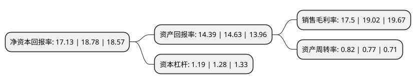

> 本页面由自动化程序生成于 2022年5月20日 01:10
> 内容可能存在错误，如有bug请提交issue至：https://github.com/Eroleice/doc-pi/issues
{.is-warning}

# 上市公司基本情况

## 基本资料

山东豪迈机械科技股份有限公司（以下简称“豪迈科技”）成立于1995年03月31日，潍坊市。于2011年06月28日在深交所中小板上市。

豪迈科技注册资本80,000万元，主营业务为汽车子午线轮胎模具及轮胎制造设备的生产，销售及相关技术开发。公司相继研发了轮胎模具铣花设备，精密分度装置，CNC电极铣床，CNC电火花机床及相关软件。以下是详细信息：

- 公司名称: 山东豪迈机械科技股份有限公司
- 股票代码: 002595.SZ
- 所在地: 山东 - 潍坊市
- 成立日期: 1995年03月31日
- 注册资本: 80,000万元
- 法定代表人: 张恭运
- 主营业务: 主营业务为汽车子午线轮胎模具及轮胎制造设备的生产，销售及相关技术开发公司相继研发了轮胎模具铣花设备，精密分度装置，CNC电极铣床，CNC电火花机床及相关软件
- 公司官网: www.haomaikeji.com
- 公司介绍: 公司是国内轮胎模具生产行业的龙头企业之一，主要从事汽车子午线轮胎模具、轮胎制造设备的生产、销售及相关技术开发。公司现已成为世界轮胎模具研发与生产基地，是世界轮胎三强米其林、普利司通和固特异的优质供应商。公司相继在美国、泰国、匈牙利、印度以及辽宁、天津、贵州、昆山建立分子公司，在巴西、日本设立服务中心，使服务范围延伸至全球。公司奉行“努力把豪迈建设成员工实现自我价值奉献社会的理想平台”的企业宗旨，秉持“合伙、合作”的核心理念；树立“改善就是创新”的创新观，营造“鼓励创新、宽容失败”的创新氛围，建立并完善了全员创新体系；打造利益共同体、事业共同体和精神共同体，充分激发了员工干事创业的活力，更加快捷的为客户提供优质服务。

## 股东及高管情况

上市公司第一大股东为张恭运，持股240,976,678股，占比30.12%，为上市公司实际控制人。

截至2022年03月31日，上市公司的前十大股东中，共有6名自然人股东，3个产品账户，1个海外主体，其中5%以上大股东共有3名。上市公司前十大股东明细如下：

> 截至2022年03月31日，上市公司前十大股东信息如下：

| 股东名称 | 持股数量（股） | 持股比例 |
| --- | --- | --- |
| 张恭运 | 240,976,678 | 30.12% |
| 柳胜军 | 107,845,021 | 13.48% |
| 刘霞 | 53,797,500 | 6.72% |
| 香港中央结算有限公司(陆股通) | 32,404,462 | 4.05% |
| 徐华兵 | 32,311,200 | 4.04% |
| 招商银行股份有限公司-泓德丰润三年持有期混合型证券投资基金 | 22,776,151 | 2.85% |
| 冯民堂 | 12,346,472 | 1.54% |
| 招商银行股份有限公司-泓德臻远回报灵活配置混合型证券投资基金 | 10,669,188 | 1.33% |
| 张光磊 | 9,440,000 | 1.18% |
| 中国工商银行股份有限公司-泓德远见回报混合型证券投资基金 | 8,669,971 | 1.08% |

## 利润表分析

上市公司2021年总收入为60.08亿元，净利润为10.51亿元，实现盈利。

## 杜邦分析

> 数据列示周期：2021年 | 2020年 | 2019年
{.is-info}

上市公司的净资产收益率在近一年有所下降，下降幅度为-8.79%，其变化情况分解如下：
- 上市公司的销售毛利率在近一年下降了-7.99%，可能是生产效率的下降、商品原材料价格上涨或商品价格的下跌所致。
- 上市公司的资产周转率在近一年上升了6.49%，可能是源自于更快的销售回款或库存管理效果提升。
- 上市公司的财务杠杆比率在近一年下降了-7.03%，可能是减少负债降低财务费用。

