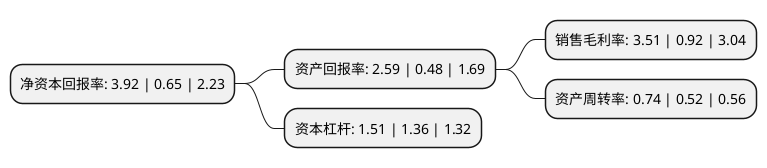

> 本页面由自动化程序生成于 2022年5月20日 01:10
> 内容可能存在错误，如有bug请提交issue至：https://github.com/Eroleice/doc-pi/issues
{.is-warning}

# 上市公司基本情况

## 基本资料

洛阳北方玻璃技术股份有限公司（以下简称“北玻股份”）成立于1995年05月18日，洛阳市。于2011年08月30日在深交所中小板上市。

北玻股份注册资本93,717万元，主营业务为研制，开发玻璃深加工设备和技术;玻璃及产品的加工，销售。主要产品为玻璃钢化设备及其附属设备(以下简称“钢化设备”)，低辐射镀膜玻璃设备及其附属设备，安全玻璃，节能玻璃。以下是详细信息：

- 公司名称: 洛阳北方玻璃技术股份有限公司
- 股票代码: 002613.SZ
- 所在地: 河南 - 洛阳市
- 成立日期: 1995年05月18日
- 注册资本: 93,717万元
- 法定代表人: 高学明
- 主营业务: 主营业务为研制，开发玻璃深加工设备和技术;玻璃及产品的加工，销售主要产品为玻璃钢化设备及其附属设备(以下简称“钢化设备”)，低辐射镀膜玻璃设备及其附属设备，安全玻璃，节能玻璃
- 公司官网: www.northglass.com
- 公司介绍: 公司是从事玻璃深加工设备和玻璃深加工产品的研发、设计、制造的企业。公司凭借强大的技术研发实力和精良的设施装备，自主开发和制造了具有核心竞争力的玻璃钢化设备、Low-E镀膜设备、高端深加工玻璃等核心产品，在此基础上进一步拓展了风机产品及工业节能大风扇、玻璃加工自动化连线设备、玻璃切割设备、仓储系统、汽车玻璃预处理、玻璃丝网印刷设备等产业，目前拥有产品品类300多种型号。公司产品覆盖全国，并成套出口到美国、英国、德国、法国、日本、俄罗斯、中东、东南亚等多个国家和地区，同时拥有一套较为完善“立足全国、辐射全球”销售服务网络体系，实行了设备销售、维修服务、配件供应“三位一体”的销售服务机制，全力打造“玻璃深加工行业服务效率第一品牌”，从根本上保证了销售渠道的畅通与售后服务的日臻完善。公司先后荣获了“河南省百高企业”、“河南省功勋企业”等荣誉称号，北玻商标被认定为全国驰名商标。

## 股东及高管情况

上市公司第一大股东为高学明，持股453,889,825股，占比48.43%，为上市公司实际控制人。

截至2022年03月31日，上市公司的前十大股东中，共有9名自然人股东，1个海外主体，其中5%以上大股东共有2名。上市公司前十大股东明细如下：

> 截至2022年03月31日，上市公司前十大股东信息如下：

| 股东名称 | 持股数量（股） | 持股比例 |
| --- | --- | --- |
| 高学明 | 453,889,825 | 48.43% |
| 高学明 | 453,689,825 | 48.4106% |
| 冯进军 | 45,081,991 | 4.81% |
| 高学林 | 31,642,659 | 3.38% |
| 韩强 | 13,166,670 | 1.4% |
| 史寿庆 | 6,865,317 | 0.73% |
| 裘月娥 | 6,486,800 | 0.69% |
| 高华-汇丰-GOLDMAN, SACHS & CO.LLC | 4,881,200 | 0.52% |
| 郑骏 | 3,647,400 | 0.39% |
| 胡铁峰 | 3,634,900 | 0.39% |

## 利润表分析

上市公司2021年总收入为16.99亿元，净利润为0.59亿元，实现盈利。

## 杜邦分析

> 数据列示周期：2021年 | 2020年 | 2019年
{.is-info}

上市公司的净资产收益率在近一年有所上升，上升幅度为503.08%，其变化情况分解如下：
- 上市公司的销售毛利率在近一年上升了281.52%，可能是生产效率的提升、商品原材料价格下跌或商品价格的上涨所致。
- 上市公司的资产周转率在近一年上升了42.31%，可能是源自于更快的销售回款或库存管理效果提升。
- 上市公司的财务杠杆比率在近一年上升了11.03%，可能是增加负债扩大生产规模。

