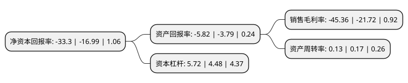

> 本页面由自动化程序生成于 2022年5月20日 01:10
> 内容可能存在错误，如有bug请提交issue至：https://github.com/Eroleice/doc-pi/issues
{.is-warning}

# 上市公司基本情况

## 基本资料

华西能源工业股份有限公司（以下简称“华西能源”）成立于2004年05月18日，自贡市。于2011年11月11日在深交所中小板上市。

华西能源注册资本118,080万元，公司所从事的主要业务:装备制造，工程总包，投资营运三大业务板块。公司主要产品及服务:高效节能锅炉，洁净燃煤锅炉，环保锅炉，新能源综合利用锅炉及其配套产品的设计，制造和销售，以及为节能环保，可再生能源，新能源综合利用电源建设等领域提供设计，采购，供货，施工，安装调试，竣工验收等部分或全过程的工程总承包服务。以下是详细信息：

- 公司名称: 华西能源工业股份有限公司
- 股票代码: 002630.SZ
- 所在地: 四川 - 自贡市
- 成立日期: 2004年05月18日
- 注册资本: 118,080万元
- 法定代表人: 黎仁超
- 主营业务: 公司所从事的装备制造，工程总包，投资营运三大业务板块公司主要产品及服务:高效节能锅炉，洁净燃煤锅炉，环保锅炉，新能源综合利用锅炉及其配套产品的设计，制造和销售，以及为节能环保，可再生能源，新能源综合利用电源建设等领域提供设计，采购，供货，施工，安装调试，竣工验收等部分或全过程的工程总承包服务
- 公司官网: www.cwpc.com.cn
- 公司介绍: 公司是我国大型电站锅炉、大型电站辅机、特种锅炉研发制造商和出口基地之一。主营业务为优化节能型锅炉和新能源综合利用型锅炉及其配套产品的设计、制造和销售。公司一直专注于各类大中型电站锅炉以及世界先进动力技术的研发、设计和制造，开发了具有国内领先水平的以煤粉、煤矸石、水煤浆、油页岩、石油焦、油气、高炉煤气及工业废弃物与生活废弃物等为燃料的高新锅炉技术。在锅炉制造行业第二梯队企业中，公司在高等级200MW~300MW热电联产煤粉锅炉和循环流化床锅炉领域位居前列。公司是第二梯队企业中唯一具有多台200MW等级循环流化床锅炉和300MW煤粉锅炉设计制造经验的企业。特种锅炉方面，多项产品上都位居行业前列或处于行业第一。

## 股东及高管情况

上市公司第一大股东为黎仁超，持股272,211,184股，占比23.05%，**疑似为**上市公司实际控制人。

截至2022年03月31日，上市公司的前十大股东中，共有8名自然人股东，1名机构股东，1个产品账户，其中5%以上大股东共有1名。上市公司前十大股东明细如下：

> 未能通过持股比例判定出上市公司实际控制人（持股30%以上）
> 可能存在通过间接持股、联合持股、协议控制等方式拥有实际控制权的主体，具体请参考上市公司定期公告！
{.is-warning}

> 截至2022年03月31日，上市公司前十大股东信息如下：

| 股东名称 | 持股数量（股） | 持股比例 |
| --- | --- | --- |
| 黎仁超 | 272,211,184 | 23.05% |
| 张素芬 | 16,100,000 | 1.36% |
| 陕西省国际信托股份有限公司-陕国投·持盈27号证券投资集合资金信托计划 | 13,750,780 | 1.16% |
| 丁煜康 | 9,000,223 | 0.76% |
| 张秀 | 7,808,200 | 0.66% |
| 王莹 | 7,586,000 | 0.64% |
| 张士英 | 6,687,200 | 0.57% |
| 上海瀚阳国际货运代理有限公司 | 6,381,200 | 0.54% |
| 温辉昌 | 6,047,200 | 0.51% |
| 曾训楷 | 6,000,020 | 0.51% |

## 利润表分析

上市公司2021年总收入为15.17亿元，净利润为-6.89亿元，**未实现盈利**。

## 杜邦分析

> 数据列示周期：2021年 | 2020年 | 2019年
{.is-info}

上市公司的净资产收益率在近一年有所上升，上升幅度为96%，其变化情况分解如下：
- 上市公司的销售毛利率在近一年上升了108.84%，可能是生产效率的提升、商品原材料价格下跌或商品价格的上涨所致。
- 上市公司的资产周转率在近一年下降了-23.53%，可能是源自于更慢的销售回款或库存管理效果下降。
- 上市公司的财务杠杆比率在近一年上升了27.68%，可能是增加负债扩大生产规模。

