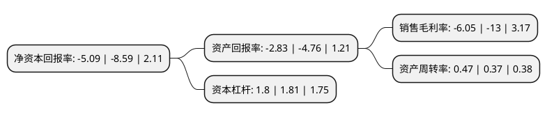

> 本页面由自动化程序生成于 2022年5月20日 01:10
> 内容可能存在错误，如有bug请提交issue至：https://github.com/Eroleice/doc-pi/issues
{.is-warning}

# 上市公司基本情况

## 基本资料

福建雪人股份有限公司（以下简称“雪人股份”）成立于2000年03月09日，福州市。于2011年12月05日在深交所中小板上市。

雪人股份注册资本77,260.218万元，主营业务包括制冰，储冰，送冰设备及系统的研发，生产及销售，以及冷水设备，冷冻，冷藏，空调，环保等相关制冷产品的设计，生产及销售。主要产品为制冰系统，片冰机，冷水机;管冰机，板冰机，块冰机，冰蓄能设备等其他制冰设备;自动储冰库，送冰系统，PU保温冰库，螺旋空冷器等制冰系统辅助设备。以下是详细信息：

- 公司名称: 福建雪人股份有限公司
- 股票代码: 002639.SZ
- 所在地: 福建 - 福州市
- 成立日期: 2000年03月09日
- 注册资本: 77,260.218万元
- 法定代表人: 林汝捷(小)
- 主营业务: 主营业务包括制冰，储冰，送冰设备及系统的研发，生产及销售，以及冷水设备，冷冻，冷藏，空调，环保等相关制冷产品的设计，生产及销售主要产品为制冰系统，片冰机，冷水机;管冰机，板冰机，块冰机，冰蓄能设备等其他制冰设备;自动储冰库，送冰系统，PU保温冰库，螺旋空冷器等制冰系统辅助设备
- 公司官网: www.snowkey.com
- 公司介绍: 公司是中国最大的制冰设备及制冰系统生产商和供应商之一。主营业务包括制冰、储冰、送冰设备及系统的研发、生产及销售，以及冷水设备、冷冻、冷藏、空调、环保等相关制冷产品的设计、生产及销售。公司“SNOWKEY”品牌被评为“福建省名牌产品”、“福建省著名商标”、“福建省国际知名品牌”、“福建省外经贸厅重点培育和发展的出口品牌”。公司获得循环内刮式片冰机、板冰机制冷控制装置、管冰机制冷控制装置、立式海水流态冰机、直接接触式生成二元冰的方法等若干项专利技术。公司先后被评为“片冰机国家火炬计划项目企业”、“福建省高新技术企业”、“国家火炬计划重点高新技术企业”等称号。

## 股东及高管情况

上市公司第一大股东为林汝捷(小)，持股155,452,029股，占比20.12%，**疑似为**上市公司实际控制人。

截至2022年03月31日，上市公司的前十大股东中，共有8名自然人股东，1个海外主体，1名其他股东，其中5%以上大股东共有1名。上市公司前十大股东明细如下：

> 未能通过持股比例判定出上市公司实际控制人（持股30%以上）
> 可能存在通过间接持股、联合持股、协议控制等方式拥有实际控制权的主体，具体请参考上市公司定期公告！
{.is-warning}

> 截至2022年03月31日，上市公司前十大股东信息如下：

| 股东名称 | 持股数量（股） | 持股比例 |
| --- | --- | --- |
| 林汝捷(小) | 155,452,029 | 20.12% |
| 吕强 | 26,470,588 | 3.43% |
| 王爱瑞 | 14,733,382 | 1.91% |
| 陈胜 | 11,518,446 | 1.49% |
| 陈存忠 | 10,980,000 | 1.42% |
| 郑志树 | 7,732,664 | 1% |
| 刘炜 | 7,352,941 | 0.95% |
| JPMORGAN CHASE BANK,NATIONAL ASSOCIATION | 6,545,981 | 0.85% |
| 郑志杰 | 5,461,764 | 0.71% |
| 林伟 | 5,147,058 | 0.67% |

## 利润表分析

上市公司2021年总收入为20.08亿元，净利润为-1.22亿元，**未实现盈利**。

## 杜邦分析

> 数据列示周期：2021年 | 2020年 | 2019年
{.is-info}

上市公司的净资产收益率在近一年有所下降，下降幅度为-40.75%，其变化情况分解如下：
- 上市公司的销售毛利率在近一年下降了-53.46%，可能是生产效率的下降、商品原材料价格上涨或商品价格的下跌所致。
- 上市公司的资产周转率在近一年上升了27.03%，可能是源自于更快的销售回款或库存管理效果提升。
- 上市公司的财务杠杆比率在近一年下降了-0.55%，可能是减少负债降低财务费用。

