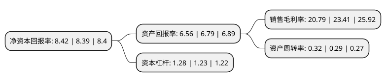

> 本页面由自动化程序生成于 2022年5月20日 01:11
> 内容可能存在错误，如有bug请提交issue至：https://github.com/Eroleice/doc-pi/issues
{.is-warning}

# 上市公司基本情况

## 基本资料

成都利君实业股份有限公司（以下简称“利君股份”）成立于1999年11月23日，成都市。于2012年01月06日在深交所中小板上市。

利君股份注册资本103,346万元，主营业务:辊压机(高压辊磨机)及其配套设备业务和航空零件及工装设计制造业务以下是详细信息：

- 公司名称: 成都利君实业股份有限公司
- 股票代码: 002651.SZ
- 所在地: 四川 - 成都市
- 成立日期: 1999年11月23日
- 注册资本: 103,346万元
- 法定代表人: 何亚民
- 主营业务: 主营业务:辊压机(高压辊磨机)及其配套设备业务和航空零件及工装设计制造业务
- 公司官网: www.cdleejun.com
- 公司介绍: 公司是以专业从事水泥、矿山行业粉磨工艺及核心设备研发、制造、销售和服务的高新技术企业。主营业务是以粉磨系统的关键设备辊压机为核心，面向水泥生产、原矿开采后的矿物加工等多个应用领域，为客户提供高效节能的粉磨系统装备及配套的技术服务。公司的主导产品辊压机作为水泥与矿山等行业粉磨系统的核心设备，公司技术中心通过了四川省省级认定，现公司拥有矿山粉磨、水泥生料等发明专利。公司不断加大对技术中心的投入，汇聚行业锋锐技术团队不断创新，在水泥、矿山粉磨辊压机的研发、制造及系统工艺设计方面不断超越，技术处于国内领先、国际先进水平。公司先后获得了“四川省质量管理先进企业”、“四川省建设创新型企业”、“中国建材机械工业企业信用评价AAA级”、“四川省质量信用AAA用户”等多项荣誉和资质证书。

## 股东及高管情况

上市公司第一大股东为何亚民，持股334,219,997股，占比32.34%，为上市公司实际控制人。

截至2022年03月31日，上市公司的前十大股东中，共有3名自然人股东，6个产品账户，1个海外主体，其中5%以上大股东共有3名。上市公司前十大股东明细如下：

> 截至2022年03月31日，上市公司前十大股东信息如下：

| 股东名称 | 持股数量（股） | 持股比例 |
| --- | --- | --- |
| 何亚民 | 334,219,997 | 32.34% |
| 何佳 | 289,775,148 | 28.04% |
| 魏勇 | 132,262,575 | 12.8% |
| 中国对外经济贸易信托有限公司-外贸信托-高毅晓峰鸿远集合资金信托计划 | 15,724,600 | 1.52% |
| 上海高毅资产管理合伙企业(有限合伙)-高毅晓峰2号致信基金 | 15,479,100 | 1.5% |
| 全国社保基金一一五组合 | 13,800,000 | 1.34% |
| 香港中央结算有限公司(陆股通) | 11,402,876 | 1.1% |
| 基本养老保险基金八零五组合 | 7,200,000 | 0.7% |
| 上海高毅资产管理合伙企业(有限合伙)-高毅-晓峰1号睿远证券投资基金 | 5,344,700 | 0.52% |
| 广发基金管理有限公司-社保基金四二零组合 | 4,999,200 | 0.48% |

## 利润表分析

上市公司2021年总收入为9.58亿元，净利润为1.99亿元，实现盈利。

## 杜邦分析

> 数据列示周期：2021年 | 2020年 | 2019年
{.is-info}

上市公司的净资产收益率在近一年有所上升，上升幅度为0.36%，其变化情况分解如下：
- 上市公司的销售毛利率在近一年下降了-11.19%，可能是生产效率的下降、商品原材料价格上涨或商品价格的下跌所致。
- 上市公司的资产周转率在近一年上升了10.34%，可能是源自于更快的销售回款或库存管理效果提升。
- 上市公司的财务杠杆比率在近一年上升了4.07%，可能是增加负债扩大生产规模。

