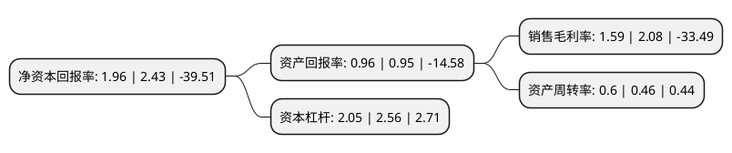

> 本页面由自动化程序生成于 2022年5月20日 01:11
> 内容可能存在错误，如有bug请提交issue至：https://github.com/Eroleice/doc-pi/issues
{.is-warning}

# 上市公司基本情况

## 基本资料

浙江亿利达风机股份有限公司（以下简称“亿利达”）成立于1995年07月03日，台州市。于2012年07月03日在深交所中小板上市。

亿利达注册资本56,623.913万元，主营业务包括:中央空调风机，建筑通风机及中央空调其他配件的设计，制造与销售。以下是详细信息：

- 公司名称: 浙江亿利达风机股份有限公司
- 股票代码: 002686.SZ
- 所在地: 浙江 - 台州市
- 成立日期: 1995年07月03日
- 注册资本: 56,623.913万元
- 法定代表人: 吴晓明
- 主营业务: 主营业务包括:中央空调风机，建筑通风机及中央空调其他配件的设计，制造与销售
- 公司官网: www.yilida.com
- 公司介绍: 公司是中央空调风机开发生产的龙头企业和知名的建筑通风机(工程风机)制造商。主营业务为中央空调风机、建筑通风机及中央空调其他配件的设计、制造与销售。国家级高新技术企业，中国科技名牌500强企业，浙江省专利示范企业，中国驰名商标。公司SYP160/200J空调风机、SYQ560后向风机、AXA500轴流风机、YG管道风机被列入国家级火炬计划项目，5个系列69种风机通过AMCA产品认证。产品广泛应用于机场、地铁、各类高档酒店、高级写字楼、大型商场、体育场馆等场合。公司核心客户涵盖了约克、麦克维尔、特灵、顿汉布什等世界空调行业的龙头品牌以及国内大部分主流空调企业。2017年，公司收购杭州铁城信息科技有限公司100%股权，正式踏入新能源汽车行业，铁城信息主要从事高频开关电源及相关电子产品的研发、生产和销售。

## 股东及高管情况

上市公司第一大股东为浙江省浙商资产管理有限公司，持股210,131,981股，占比37.11%，为上市公司实际控制人。

截至2022年03月31日，上市公司的前十大股东中，共有4名自然人股东，1名机构股东，5个产品账户，其中5%以上大股东共有3名。上市公司前十大股东明细如下：

> 截至2022年03月31日，上市公司前十大股东信息如下：

| 股东名称 | 持股数量（股） | 持股比例 |
| --- | --- | --- |
| 浙江省浙商资产管理有限公司 | 210,131,981 | 37.11% |
| 陈心泉 | 52,154,400 | 9.21% |
| 上海牧鑫资产管理有限公司-牧鑫兴进3号私募证券投资基金 | 30,263,000 | 5.34% |
| 上海迎水投资管理有限公司-迎水荣耀6号私募证券投资基金 | 13,624,264 | 2.41% |
| 吴警卫 | 13,383,400 | 2.36% |
| 上海一村投资管理有限公司-一村和光三期私募证券投资基金 | 12,405,135 | 2.19% |
| 中铖润智资产管理(上海)有限公司-中铖润智安鑫稳健1号私募混合投资基金 | 11,324,700 | 2% |
| 上海牧鑫资产管理有限公司-牧鑫天泽汇1号私募证券投资基金 | 11,312,381 | 2% |
| 章启忠 | 5,662,300 | 1% |
| 陈卫兵 | 4,500,000 | 0.79% |

## 利润表分析

上市公司2021年总收入为19.06亿元，净利润为0.3亿元，实现盈利。

## 杜邦分析

> 数据列示周期：2021年 | 2020年 | 2019年
{.is-info}

上市公司的净资产收益率在近一年有所下降，下降幅度为-19.34%，其变化情况分解如下：
- 上市公司的销售毛利率在近一年下降了-23.56%，可能是生产效率的下降、商品原材料价格上涨或商品价格的下跌所致。
- 上市公司的资产周转率在近一年上升了30.43%，可能是源自于更快的销售回款或库存管理效果提升。
- 上市公司的财务杠杆比率在近一年下降了-19.92%，可能是减少负债降低财务费用。

