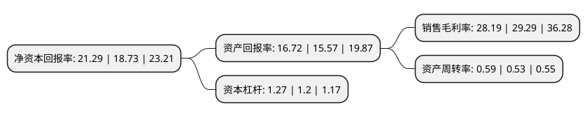

> 本页面由自动化程序生成于 2022年5月20日 01:11
> 内容可能存在错误，如有bug请提交issue至：https://github.com/Eroleice/doc-pi/issues
{.is-warning}

# 上市公司基本情况

## 基本资料

合肥美亚光电技术股份有限公司（以下简称“美亚光电”）成立于2000年03月03日，合肥市。于2012年07月31日在深交所中小板上市。

美亚光电注册资本67,826.8万元，主要产品:按产品应用领域划分，发行人产品可以分为食品检测与分级专用设备，工业检测与分级专用设备两大类;按产品技术原理划分，发行人产品可分为可见光检测与分级专用设备，X射线检测与分级专用设备两大类。可见光检测与分级专用设备主要包括各类色选机，X射线检测与分级专用设备则包括食品X射线检测机，工业X射线检测机和X射线轮胎检测设备。主营业务:光电检测与分级专用设备及其应用软件的研发，生产和销售。以下是详细信息：

- 公司名称: 合肥美亚光电技术股份有限公司
- 股票代码: 002690.SZ
- 所在地: 安徽 - 合肥市
- 成立日期: 2000年03月03日
- 注册资本: 67,826.8万元
- 法定代表人: 田明
- 主营业务: 主要产品:按产品应用领域划分，发行人产品可以分为食品检测与分级专用设备，工业检测与分级专用设备两大类;按产品技术原理划分，发行人产品可分为可见光检测与分级专用设备，X射线检测与分级专用设备两大类可见光检测与分级专用设备主要包括各类色选机，X射线检测与分级专用设备则包括食品X射线检测机，工业X射线检测机和X射线轮胎检测设备主营业务:光电检测与分级专用设备及其应用软件的研发，生产和销售
- 公司官网: www.chinameyer.com
- 公司介绍: 公司是一家专注于光电识别核心技术与产品研发的高新技术企业。公司产品人工智能色选机、X射线检测设备和高端医疗设备等产品，广泛应用于全球农产品加工、工业检测及医疗卫生等领域，市场占有率多年保持世界领先。公司已经建成了覆盖全球的营销网络，产品和服务覆盖全国所有省市和地区，并在东南亚、中亚、中东、北美、南美、西欧、东欧、非洲等地区为多个国家提供高品质的光电识别解决方案。公司以科技创新为发展源动力，集聚了全国一批优秀的光电识别科研团队，建有国家认定企业技术中心、国家农产品智能分选装备工程技术研究中心、国家博士后科研工作站等国家级创新平台，多次承担国家重大科学仪器设备开发专项、国家863计划、国家火炬计划等重大科研项目，主持制定多项国家、行业标准。公司荣获国家创新型企业、国家技术创新示范企业、国家规划布局内重点软件企业、国家火炬计划重点高新技术企业、全国工业品牌培育示范企业等称号。

## 股东及高管情况

上市公司第一大股东为田明，持股413,433,000股，占比60.95%，为上市公司实际控制人。

截至2022年03月31日，上市公司的前十大股东中，共有5名自然人股东，3个产品账户，1个海外主体，1名其他股东，其中5%以上大股东共有2名。上市公司前十大股东明细如下：

> 截至2022年03月31日，上市公司前十大股东信息如下：

| 股东名称 | 持股数量（股） | 持股比例 |
| --- | --- | --- |
| 田明 | 413,433,000 | 60.95% |
| 香港中央结算有限公司(陆股通) | 94,109,162 | 13.87% |
| 郝先进 | 23,606,180 | 3.48% |
| 沈海斌 | 19,829,000 | 2.92% |
| 全国社保基金四零六组合 | 12,743,693 | 1.88% |
| 岑文德 | 7,510,000 | 1.11% |
| 法国巴黎银行-自有资金 | 6,346,708 | 0.94% |
| 上海弘尚资产管理中心(有限合伙)-弘尚资产弘利2号私募证券投资基金 | 5,859,937 | 0.86% |
| 国泰君安证券资管-光大银行-国泰君安君得明混合型集合资产管理计划 | 3,364,300 | 0.5% |
| 张桂兰 | 2,660,000 | 0.39% |

## 利润表分析

上市公司2021年总收入为18.12亿元，净利润为5.11亿元，实现盈利。

## 杜邦分析

> 数据列示周期：2021年 | 2020年 | 2019年
{.is-info}

上市公司的净资产收益率在近一年有所上升，上升幅度为13.67%，其变化情况分解如下：
- 上市公司的销售毛利率在近一年下降了-3.76%，可能是生产效率的下降、商品原材料价格上涨或商品价格的下跌所致。
- 上市公司的资产周转率在近一年上升了11.32%，可能是源自于更快的销售回款或库存管理效果提升。
- 上市公司的财务杠杆比率在近一年上升了5.83%，可能是增加负债扩大生产规模。

