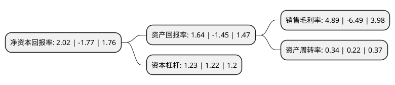

> 本页面由自动化程序生成于 2022年5月20日 01:11
> 内容可能存在错误，如有bug请提交issue至：https://github.com/Eroleice/doc-pi/issues
{.is-warning}

# 上市公司基本情况

## 基本资料

冀凯装备制造股份有限公司（以下简称“冀凯股份”）成立于2003年05月16日，石家庄市。于2012年07月31日在深交所中小板上市。

冀凯股份注册资本34,000万元，主营支护机具，安全钻机，掘进设备和运输机械等煤炭机械装备，是国内煤炭装备制造业的专业供应商与服务商之一。支护机具是公司的主导产品。以下是详细信息：

- 公司名称: 冀凯装备制造股份有限公司
- 股票代码: 002691.SZ
- 所在地: 河北 - 石家庄市
- 成立日期: 2003年05月16日
- 注册资本: 34,000万元
- 法定代表人: 冯帆
- 主营业务: 主营支护机具，安全钻机，掘进设备和运输机械等煤炭机械装备，是国内煤炭装备制造业的专业供应商与服务商之一支护机具是公司的主导产品
- 公司官网: www.jikaigf.com
- 公司介绍: 公司是我国煤炭装备制造业的专业供应商与服务商之一，主要从事煤炭业支护机具、安全钻机、掘进设备和运输机械等煤炭机械的研发、制造、销售及服务。自主研发的整体铸造中部槽经专家鉴定为国际首创，使刮板输送机的使用寿命大幅度提高。产品被认定为国家级重点新产品，并填补了国内空白。多项科技成果达到国际先进水平并获政府部门奖励。公司高度重视知识产权工作，专利拥有量具省内同行业前列，并参与制定了多项煤炭行业标准。公司是中国煤炭工业协会煤矿支护专业委员会副主任单位，煤炭工业煤矿专用设备标准化技术委员会井巷设备分会委员单位，中国岩石力学与工程学会软岩工程与深部灾害控制分会常务理事单位，河北省煤炭工业行业协会副会长单位，是多家金融机构的优质客户，先后两年获得“渣打银行中国最具成长性新锐企业奖”。

## 股东及高管情况

上市公司第一大股东为冯春保，持股113,462,855股，占比33.37%，为上市公司实际控制人。

截至2022年03月31日，上市公司的前十大股东中，共有6名自然人股东，4名机构股东，其中5%以上大股东共有2名。上市公司前十大股东明细如下：

> 截至2022年03月31日，上市公司前十大股东信息如下：

| 股东名称 | 持股数量（股） | 持股比例 |
| --- | --- | --- |
| 冯春保 | 113,462,855 | 33.37% |
| 深圳卓众达富投资合伙企业(有限合伙) | 98,600,000 | 29% |
| 杭州焱热实业有限公司 | 7,745,300 | 2.28% |
| 乔贵彩 | 4,865,792 | 1.43% |
| 周燕 | 3,050,000 | 0.9% |
| 华泰证券股份有限公司 | 1,224,993 | 0.36% |
| 中国国际金融香港资产管理有限公司-客户资金2 | 1,128,104 | 0.33% |
| 仲建体 | 1,050,800 | 0.31% |
| 卢斌 | 1,020,002 | 0.3% |
| 黄斌 | 762,500 | 0.22% |

## 杜邦分析

> 数据列示周期：2021年 | 2020年 | 2019年
{.is-info}

上市公司的净资产收益率在近一年有所下降，下降幅度为-214.12%，其变化情况分解如下：
- 上市公司的销售毛利率在近一年下降了-175.35%，可能是生产效率的下降、商品原材料价格上涨或商品价格的下跌所致。
- 上市公司的资产周转率在近一年上升了54.55%，可能是源自于更快的销售回款或库存管理效果提升。
- 上市公司的财务杠杆比率在近一年上升了0.82%，可能是增加负债扩大生产规模。

