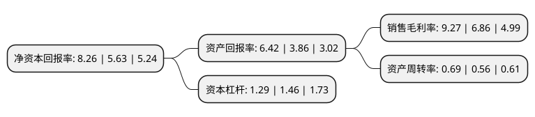

> 本页面由自动化程序生成于 2022年5月20日 01:11
> 内容可能存在错误，如有bug请提交issue至：https://github.com/Eroleice/doc-pi/issues
{.is-warning}

# 上市公司基本情况

## 基本资料

电光防爆科技股份有限公司（以下简称“电光科技”）成立于1998年09月02日，温州市。于2014年10月09日在深交所中小板上市。

电光科技注册资本36,207.988万元，公司的主营业务为矿用防爆电器研发，设计，生产及销售。以下是详细信息：

- 公司名称: 电光防爆科技股份有限公司
- 股票代码: 002730.SZ
- 所在地: 浙江 - 温州市
- 成立日期: 1998年09月02日
- 注册资本: 36,207.988万元
- 法定代表人: 石晓霞
- 主营业务: 公司的主营业务为矿用防爆电器研发，设计，生产及销售
- 公司官网: www.dianguang.com
- 公司介绍: 公司的一家专业从事矿用防爆电器研发、设计、生产及销售的公司，产业涵盖矿用防爆、厂用防爆、电力设备、应急救援、监测监控、互联网+3D打印和教育等领域。基本覆盖煤矿井下电力系统中的供电、配电、受电设备的各个领域，适用于煤矿井下和周围介质中含瓦斯、煤尘等有爆炸危险的环境。公司在同行业中率先通过了ISO9001质量体系、ISO14001环境体系和OHSAS18001职业健康安全体系认证。公司始终坚持以持续创新与追求卓越为用户不断创造价值，利用先进的自动化制造设备、精益生产管理和二维码质量信息可追溯系统打造高品质的产品。公司客户主要为大中型煤炭企业集团。公司通过自主研发、产品升级等方式，获得多项专利权，产品先后列入国家科技部星火计划、国家科技部火炬计划项目。公司也是中国电器工业协会防爆电器分会第5届、第6届理事会副理事长单位，中国电器工业协会常务理事单位。

## 股东及高管情况

上市公司第一大股东为电光科技有限公司，持股165,000,000股，占比45.57%，为上市公司实际控制人。

截至2022年03月31日，上市公司的前十大股东中，共有5名自然人股东，2名机构股东，2个产品账户，1个海外主体，其中5%以上大股东共有2名。上市公司前十大股东明细如下：

> 截至2022年03月31日，上市公司前十大股东信息如下：

| 股东名称 | 持股数量（股） | 持股比例 |
| --- | --- | --- |
| 电光科技有限公司 | 165,000,000 | 45.57% |
| 石向才 | 18,150,000 | 5.01% |
| 石碎标 | 15,400,000 | 4.25% |
| 上海铭大实业(集团)有限公司 | 4,206,098 | 1.16% |
| 石晓霞 | 3,250,000 | 0.9% |
| 华夏基金-邮储银行-华夏基金秋实混合策略1号集合资产管理计划 | 2,628,811 | 0.73% |
| 财通基金-华泰证券股份有限公司-财通基金君享永熙单一资产管理计划 | 2,523,659 | 0.7% |
| UBS AG | 2,316,930 | 0.64% |
| 王洪涛 | 2,103,049 | 0.58% |
| 黄文平 | 2,103,049 | 0.58% |

## 利润表分析

上市公司2021年总收入为9.19亿元，净利润为0.85亿元，实现盈利。

## 杜邦分析

> 数据列示周期：2021年 | 2020年 | 2019年
{.is-info}

上市公司的净资产收益率在近一年有所上升，上升幅度为46.71%，其变化情况分解如下：
- 上市公司的销售毛利率在近一年上升了35.13%，可能是生产效率的提升、商品原材料价格下跌或商品价格的上涨所致。
- 上市公司的资产周转率在近一年上升了23.21%，可能是源自于更快的销售回款或库存管理效果提升。
- 上市公司的财务杠杆比率在近一年下降了-11.64%，可能是减少负债降低财务费用。

