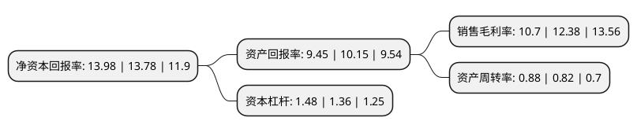

> 本页面由自动化程序生成于 2022年5月20日 01:11
> 内容可能存在错误，如有bug请提交issue至：https://github.com/Eroleice/doc-pi/issues
{.is-warning}

# 上市公司基本情况

## 基本资料

南兴装备股份有限公司（以下简称“南兴股份”）成立于1996年05月03日，东莞市。于2015年05月27日在深交所中小板上市。

南兴股份注册资本29,545.591万元，公司主要从事板式家具生产线成套设备的研发，设计，生产和销售。公司产品广泛应用于板式家具行业以及其他涉及人造板加工或使用的领域，上述其他领域主要包括定制家具，组合橱柜，木门，地板的生产以及建筑装饰，会展展示，车船生产中所用人造板材的加工等。公司生产的产品主要涵盖自动封边机，数控裁板锯，多排多轴钻，精密推台锯四大系列及其他板式家具机械。以下是详细信息：

- 公司名称: 南兴装备股份有限公司
- 股票代码: 002757.SZ
- 所在地: 广东 - 东莞市
- 成立日期: 1996年05月03日
- 注册资本: 29,545.591万元
- 法定代表人: 詹谏醒
- 主营业务: 公司主要从事板式家具生产线成套设备的研发，设计，生产和销售公司产品广泛应用于板式家具行业以及其他涉及人造板加工或使用的领域，上述其他领域主要包括定制家具，组合橱柜，木门，地板的生产以及建筑装饰，会展展示，车船生产中所用人造板材的加工等公司生产的产品主要涵盖自动封边机，数控裁板锯，多排多轴钻，精密推台锯四大系列及其他板式家具机械
- 公司官网: www.nanxing.com.cn
- 公司介绍: 公司是一家集研发、设计、生产和销售于一体的板式家具生产线成套设备专业供应商，产品广泛应用于板式家具行业以及其他涉及人造板加工或使用的领域，其他领域主要包括木门、地板、定制家具、组合橱柜的生产以及建筑装饰、会展展示、车船生产中所用人造板材的加工等。公司生产的产品主要涵盖自动封边机、数控裁板锯、多排多轴钻、精密推台锯等系列及其他板式家具机械，不同规格型号的板式家具机械多种，是国内板式家具机械装备领域产品线较长的企业之一，能够根据客户的需求提供板式家具机械生产线的一揽子解决方案。公司通过了ISO9001:2008国际质量管理体系认证，公司生产的自动封边机系列、数控裁板锯系列及精密推台锯系列的主要规格产品均已获得欧盟CE认证。产品销往国内各大家具产业区，并远销俄罗斯、欧盟、中东、东南亚、加拿大、印度、澳大利亚、南非、拉美等多个国家和地区。公司通过重大资产重组收购唯一网络100.00%的股权，公司主营业务拓展至IDC服务等新业务领域，丰富上市公司的业务领域。

## 股东及高管情况

上市公司第一大股东为东莞市南兴实业投资有限公司，持股111,129,993股，占比37.61%，为上市公司实际控制人。

截至2022年03月31日，上市公司的前十大股东中，共有7名自然人股东，3名机构股东，其中5%以上大股东共有1名。上市公司前十大股东明细如下：

> 截至2022年03月31日，上市公司前十大股东信息如下：

| 股东名称 | 持股数量（股） | 持股比例 |
| --- | --- | --- |
| 东莞市南兴实业投资有限公司 | 111,129,993 | 37.61% |
| 詹任宁 | 11,245,473 | 3.81% |
| 厦门星思惠企业管理合伙企业(有限合伙) | 9,662,590 | 3.27% |
| 林旺南 | 9,421,270 | 3.19% |
| 詹谏醒 | 6,173,814 | 2.09% |
| 郑佑斌 | 5,909,100 | 2% |
| 陈彩红 | 4,710,233 | 1.59% |
| 林近少 | 1,774,996 | 0.6% |
| 刘丽莉 | 1,201,800 | 0.41% |
| 广东俊特投资管理有限公司 | 1,171,762 | 0.4% |

## 杜邦分析

> 数据列示周期：2021年 | 2020年 | 2019年
{.is-info}

上市公司的净资产收益率在近一年有所上升，上升幅度为1.45%，其变化情况分解如下：
- 上市公司的销售毛利率在近一年下降了-13.57%，可能是生产效率的下降、商品原材料价格上涨或商品价格的下跌所致。
- 上市公司的资产周转率在近一年上升了7.32%，可能是源自于更快的销售回款或库存管理效果提升。
- 上市公司的财务杠杆比率在近一年上升了8.82%，可能是增加负债扩大生产规模。

