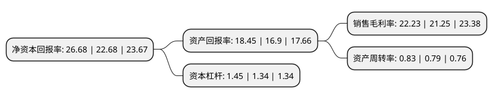

> 本页面由自动化程序生成于 2022年5月20日 01:12
> 内容可能存在错误，如有bug请提交issue至：https://github.com/Eroleice/doc-pi/issues
{.is-warning}

# 上市公司基本情况

## 基本资料

广州弘亚数控机械股份有限公司（以下简称“弘亚数控”）成立于2006年11月17日，广州市。于2016年12月28日在深交所中小板上市。

弘亚数控注册资本30,302.003万元，主营业务为数控板式家具机械设备的研发，生产和销售。其中自动封边机，数控裁板锯，自动多排钻和木材加工中心等产品是公司的核心产品。以下是详细信息：

- 公司名称: 广州弘亚数控机械股份有限公司
- 股票代码: 002833.SZ
- 所在地: 广东 - 广州市
- 成立日期: 2006年11月17日
- 注册资本: 30,302.003万元
- 法定代表人: 李茂洪
- 主营业务: 主营业务为数控板式家具机械设备的研发，生产和销售其中自动封边机，数控裁板锯，自动多排钻和木材加工中心等产品是公司的核心产品
- 公司官网: www.kdtmac.com
- 公司介绍: 公司自设立以来专注于板式家具机械设备的研发、生产和销售，通过对木工机械这一传统行业中的产品技术创新和经营模式创新得到快速发展，在技术研发能力、产品质量控制、品牌影响力、成本控制等方面形成了较强的竞争优势，公司连续多年在行业内综合竞争力评估中名列前茅。公司所在行业正处于国内产业集中度低、优势企业快速成长的阶段，行业未来发展面临着良好的政策环境和广阔的市场前景，公司将继续提升核心竞争优势，推进公司持续稳健发展。

## 股东及高管情况

上市公司第一大股东为李茂洪，持股116,479,860股，占比38.44%，为上市公司实际控制人。

截至2022年03月31日，上市公司的前十大股东中，共有5名自然人股东，4个产品账户，1个海外主体，其中5%以上大股东共有2名。上市公司前十大股东明细如下：

> 截至2022年03月31日，上市公司前十大股东信息如下：

| 股东名称 | 持股数量（股） | 持股比例 |
| --- | --- | --- |
| 李茂洪 | 116,479,860 | 38.44% |
| 刘雨华 | 29,153,600 | 9.62% |
| 陈大江 | 8,594,880 | 2.84% |
| 珠海阿巴马资产管理有限公司-阿巴马元享红利8号私募证券投资基金 | 6,028,000 | 1.99% |
| 香港中央结算有限公司(陆股通) | 5,715,851 | 1.89% |
| 珠海阿巴马资产管理有限公司-阿巴马元享红利80号私募证券投资基金 | 4,794,000 | 1.58% |
| 李明智 | 3,923,640 | 1.29% |
| 刘风华 | 3,900,000 | 1.29% |
| 中国工商银行股份有限公司-中欧价值智选回报混合型证券投资基金 | 3,784,044 | 1.25% |
| 全国社保基金四一三组合 | 3,278,632 | 1.08% |

## 杜邦分析

> 数据列示周期：2021年 | 2020年 | 2019年
{.is-info}

上市公司的净资产收益率在近一年有所上升，上升幅度为17.64%，其变化情况分解如下：
- 上市公司的销售毛利率在近一年上升了4.61%，可能是生产效率的提升、商品原材料价格下跌或商品价格的上涨所致。
- 上市公司的资产周转率在近一年上升了5.06%，可能是源自于更快的销售回款或库存管理效果提升。
- 上市公司的财务杠杆比率在近一年上升了8.21%，可能是增加负债扩大生产规模。

