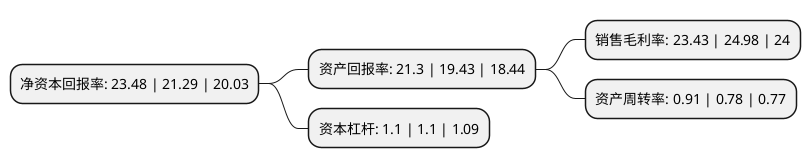

> 本页面由自动化程序生成于 2022年5月20日 01:12
> 内容可能存在错误，如有bug请提交issue至：https://github.com/Eroleice/doc-pi/issues
{.is-warning}

# 上市公司基本情况

## 基本资料

广东凌霄泵业股份有限公司（以下简称“凌霄泵业”）成立于1993年05月15日，阳江市。于2017年07月11日在深交所中小板上市。

凌霄泵业注册资本35,559.774万元，主要从事民用离心泵的研发，设计，生产及销售。民用离心泵产品分为塑料卫浴泵，不锈钢泵和通用泵三个系列。以下是详细信息：

- 公司名称: 广东凌霄泵业股份有限公司
- 股票代码: 002884.SZ
- 所在地: 广东 - 阳江市
- 成立日期: 1993年05月15日
- 注册资本: 35,559.774万元
- 法定代表人: 王海波
- 主营业务: 主要从事民用离心泵的研发，设计，生产及销售民用离心泵产品分为塑料卫浴泵，不锈钢泵和通用泵三个系列
- 公司官网: www.lingxiao.com.cn
- 公司介绍: 公司主要生产不锈钢泵、康体娱乐泵、清水泵、潜水泵、管道泵、电机等系列产品，是国内小型民用电泵和工业配套电泵规模最大的制造商之一。公司目前已建成有广东省电泵技术工程开发中心、能效试验中心、德国TUV目击试验室、美国UL目击试验室等领先的研发中心。配备了同行业最先进的技术开发、生产工艺模块，质量检验、测试设备、产品技术性能处于国内同行业的前沿。广东“凌霄牌”水泵是广东省名牌产品，公司被认定为国家高新技术企业。企业通过ISO9001：2008质量管理体系认证，获得挪威船级社(DNV)颁发的欧盟环保体系RoHS认证，整泵通过美国UL、美国ETL、德国TUV、欧洲CE、澳洲SAA、中国3C等安全认证，潜水电泵、潜污泵、微型泵获得国家生产许可证。

## 股东及高管情况

上市公司第一大股东为王海波，持股105,781,089股，占比29.58%，**疑似为**上市公司实际控制人。

截至2022年03月31日，上市公司的前十大股东中，共有3名自然人股东，7个产品账户，其中5%以上大股东共有2名。上市公司前十大股东明细如下：

> 未能通过持股比例判定出上市公司实际控制人（持股30%以上）
> 可能存在通过间接持股、联合持股、协议控制等方式拥有实际控制权的主体，具体请参考上市公司定期公告！
{.is-warning}

> 截至2022年03月31日，上市公司前十大股东信息如下：

| 股东名称 | 持股数量（股） | 持股比例 |
| --- | --- | --- |
| 王海波 | 105,781,089 | 29.58% |
| 施宗梅 | 60,710,090 | 16.97% |
| 中国农业银行股份有限公司-大成高新技术产业股票型证券投资基金 | 17,141,959 | 4.79% |
| 中国工商银行股份有限公司-中欧价值智选回报混合型证券投资基金 | 11,447,730 | 3.2% |
| 大成基金管理有限公司-社保基金1101组合 | 10,248,985 | 2.87% |
| 张肃宁 | 8,392,010 | 2.35% |
| 基本养老保险基金一零零一组合 | 7,000,000 | 1.96% |
| 大成基金-农业银行-大成基金蓝筹精选1号集合资产管理计划 | 4,554,617 | 1.27% |
| 中国农业银行-大成创新成长混合型证券投资基金(LOF) | 4,012,366 | 1.12% |
| 中国工商银行股份有限公司-大成核心价值甄选混合型证券投资基金 | 3,628,827 | 1.01% |

## 利润表分析

上市公司2021年总收入为20.62亿元，净利润为4.83亿元，实现盈利。

## 杜邦分析

> 数据列示周期：2021年 | 2020年 | 2019年
{.is-info}

上市公司的净资产收益率在近一年有所上升，上升幅度为10.29%，其变化情况分解如下：
- 上市公司的销售毛利率在近一年下降了-6.2%，可能是生产效率的下降、商品原材料价格上涨或商品价格的下跌所致。
- 上市公司的资产周转率在近一年上升了16.67%，可能是源自于更快的销售回款或库存管理效果提升。
- 上市公司的财务杠杆比率在近一年下降了0%，可能是减少负债降低财务费用。

