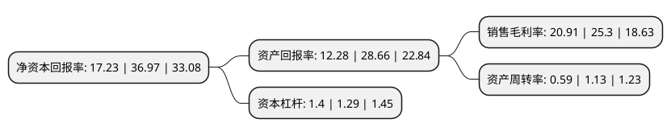

> 本页面由自动化程序生成于 2022年5月20日 01:13
> 内容可能存在错误，如有bug请提交issue至：https://github.com/Eroleice/doc-pi/issues
{.is-warning}

# 上市公司基本情况

## 基本资料

珠海博杰电子股份有限公司（以下简称“博杰股份”）成立于2005年05月30日，珠海市。于2020年02月05日在深交所中小板上市。

博杰股份注册资本13,968.8万元，公司专注于工业自动化设备与配件的研发，生产，销售及相关技术服务。产品主要包括工业自动化设备与配件，并基于公司产品为客户提供相应的技术服务。以下是详细信息：

- 公司名称: 珠海博杰电子股份有限公司
- 股票代码: 002975.SZ
- 所在地: 广东 - 珠海市
- 成立日期: 2005年05月30日
- 注册资本: 13,968.8万元
- 法定代表人: 王兆春
- 主营业务: 公司专注于工业自动化设备与配件的研发，生产，销售及相关技术服务产品主要包括工业自动化设备与配件，并基于公司产品为客户提供相应的技术服务
- 公司官网: www.zhbojay.com
- 公司介绍: 公司是一家专注于工业自动化设备与配件的研发、生产、销售及相关技术服务的高新技术企业，致力于为客户提供自动化测试和自动化组装一站式解决方案。公司产品主要应用于消费电子、汽车电子、医疗电子和工业电子等行业的电子产品性能测试及产品组装，帮助客户实现生产线的半自动化和全自动化，提高生产效率和产品良品率。公司主要客户为世界500强企业，包括苹果、微软、思科、Fitbit Inc.和Juniper Networks Inc.等全球著名高科技公司，以及鸿海集团、广达集团、仁宝集团、和硕集团和纬创资通等全球著名电子产品智能制造商。自动化测试为公司传统优势领域，产品系列全面丰富，产品覆盖了射频、声学、电学、光学等诸多领域，其中ICT测试设备处于世界领先水平。公司自主研发了ICT测试设备的设计和开发平台，有效降低设备设计难度、提高设计效率，可及时为客户提供复杂的软硬件定制化方案，满足客户前沿产品的测试需求；公司与业界测试平台供应商(如Keysight Technologies、Teradyne)建立了良好的合作开发关系，深度优化并提高产品的测试覆盖率和精确度。同时公司是全球知名服务器品牌商戴尔、思科和惠普ICT测试设备的主要供应商，合作时间均超过十年，合作关系持续、稳定。

## 股东及高管情况

上市公司第一大股东为王兆春，持股32,400,000股，占比23.19%，**疑似为**上市公司实际控制人。

截至2022年03月31日，上市公司的前十大股东中，共有6名自然人股东，4名机构股东，其中5%以上大股东共有4名。上市公司前十大股东明细如下：

> 未能通过持股比例判定出上市公司实际控制人（持股30%以上）
> 可能存在通过间接持股、联合持股、协议控制等方式拥有实际控制权的主体，具体请参考上市公司定期公告！
{.is-warning}

> 截至2022年03月31日，上市公司前十大股东信息如下：

| 股东名称 | 持股数量（股） | 持股比例 |
| --- | --- | --- |
| 王兆春 | 32,400,000 | 23.19% |
| 付林 | 24,300,000 | 17.4% |
| 成君 | 16,200,000 | 11.6% |
| 陈均 | 8,100,000 | 5.8% |
| 王凯 | 4,500,000 | 3.22% |
| 曾宪之 | 4,500,000 | 3.22% |
| 浙江衢州利佰嘉慧金股权投资管理合伙企业(有限合伙) | 4,097,499 | 2.93% |
| 珠海横琴博航投资咨询企业(有限合伙) | 4,000,000 | 2.86% |
| 珠海横琴博望投资咨询企业(有限合伙) | 3,000,000 | 2.15% |
| 珠海横琴博展投资咨询企业(有限合伙) | 3,000,000 | 2.15% |

## 利润表分析

上市公司2021年总收入为12.14亿元，净利润为2.53亿元，实现盈利。

## 杜邦分析

> 数据列示周期：2021年 | 2020年 | 2019年
{.is-info}

上市公司的净资产收益率在近一年有所下降，下降幅度为-53.39%，其变化情况分解如下：
- 上市公司的销售毛利率在近一年下降了-17.35%，可能是生产效率的下降、商品原材料价格上涨或商品价格的下跌所致。
- 上市公司的资产周转率在近一年下降了-47.79%，可能是源自于更慢的销售回款或库存管理效果下降。
- 上市公司的财务杠杆比率在近一年上升了8.53%，可能是增加负债扩大生产规模。

