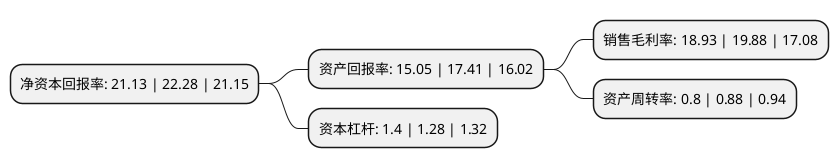

> 本页面由自动化程序生成于 2022年5月20日 01:13
> 内容可能存在错误，如有bug请提交issue至：https://github.com/Eroleice/doc-pi/issues
{.is-warning}

# 上市公司基本情况

## 基本资料

深圳市雷赛智能控制股份有限公司（以下简称“雷赛智能”）成立于2007年01月09日，深圳市。于2020年04月08日在深交所中小板上市。

雷赛智能注册资本30,160万元，主要从事运动控制核心部件控制器，驱动器，电机的研发，生产和销售，以及相关行业应用系统的研究与开发，为客户提供完整的运动控制系列产品及解决方案。以下是详细信息：

- 公司名称: 深圳市雷赛智能控制股份有限公司
- 股票代码: 002979.SZ
- 所在地: 广东 - 深圳市
- 成立日期: 2007年01月09日
- 注册资本: 30,160万元
- 法定代表人: 李卫平
- 主营业务: 主要从事运动控制核心部件控制器，驱动器，电机的研发，生产和销售，以及相关行业应用系统的研究与开发，为客户提供完整的运动控制系列产品及解决方案
- 公司官网: www.leisai.com
- 公司介绍: 公司是一家专注于为智能制造装备业提供运动控制核心部件及行业运动控制解决方案的高新技术企业。公司主要从事运动控制核心部件控制器、驱动器、电机的研发、生产和销售，以及相关行业应用系统的研究与开发，为客户提供完整的运动控制系列产品及解决方案，是国内少有的同时拥有控制器、驱动器、电机综合研发平台的企业，产品覆盖了运动控制主要领域。经过持续不断的技术研发和市场拓展，公司已申报取得包括发明专利在内的71项专利技术，107项软件著作权，部分核心技术已达到国际先进水平；公司的运动控制系列产品已在电子制造装备、特种机床、工业机器人、喷绘印刷装备、医疗健康设备、纺织服装装备、物流装备等设备制造行业中树立了良好的品牌形象，公司已成长为国内领先的针对多细分领域拥有完整产品体系的全方位运动控制系统生产企业。

## 股东及高管情况

上市公司第一大股东为李卫平，持股86,130,000股，占比28.56%，**疑似为**上市公司实际控制人。

截至2022年03月31日，上市公司的前十大股东中，共有5名自然人股东，5名机构股东，其中5%以上大股东共有4名。上市公司前十大股东明细如下：

> 未能通过持股比例判定出上市公司实际控制人（持股30%以上）
> 可能存在通过间接持股、联合持股、协议控制等方式拥有实际控制权的主体，具体请参考上市公司定期公告！
{.is-warning}

> 截至2022年03月31日，上市公司前十大股东信息如下：

| 股东名称 | 持股数量（股） | 持股比例 |
| --- | --- | --- |
| 李卫平 | 86,130,000 | 28.56% |
| 施慧敏 | 24,360,000 | 8.08% |
| 深圳市雷赛实业发展有限公司 | 21,750,000 | 7.21% |
| 宿迁和赛企业管理有限公司 | 18,346,030 | 6.08% |
| 诸暨富华睿银投资管理有限公司-浙江华睿弘源智能产业创业投资有限公司 | 11,703,488 | 3.88% |
| 厦门雷赛智诚企业管理合伙企业(有限合伙) | 4,577,491 | 1.52% |
| 杨立望 | 3,800,590 | 1.26% |
| 杭华 | 3,089,281 | 1.02% |
| 厦门雷赛团队企业管理合伙企业(有限合伙) | 2,771,310 | 0.92% |
| 李卫星 | 2,740,500 | 0.91% |

## 利润表分析

上市公司2021年总收入为12.03亿元，净利润为2.27亿元，实现盈利。

## 杜邦分析

> 数据列示周期：2021年 | 2020年 | 2019年
{.is-info}

上市公司的净资产收益率在近一年有所下降，下降幅度为-5.16%，其变化情况分解如下：
- 上市公司的销售毛利率在近一年下降了-4.78%，可能是生产效率的下降、商品原材料价格上涨或商品价格的下跌所致。
- 上市公司的资产周转率在近一年下降了-9.09%，可能是源自于更慢的销售回款或库存管理效果下降。
- 上市公司的财务杠杆比率在近一年上升了9.38%，可能是增加负债扩大生产规模。

