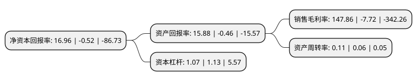

> 本页面由自动化程序生成于 2022年5月20日 01:14
> 内容可能存在错误，如有bug请提交issue至：https://github.com/Eroleice/doc-pi/issues
{.is-warning}

# 上市公司基本情况

## 基本资料

西安宝德自动化股份有限公司（以下简称“*ST宝德”）成立于2001年04月12日，西安市。于2009年10月30日在深交所创业板上市。

*ST宝德注册资本31,610.678万元，主营业务:自动化，融资租赁以下是详细信息：

- 公司名称: 西安宝德自动化股份有限公司
- 股票代码: 300023.SZ
- 所在地: 陕西 - 西安市
- 成立日期: 2001年04月12日
- 注册资本: 31,610.678万元
- 法定代表人: 王伟
- 主营业务: 主营业务:自动化，融资租赁
- 公司官网: www.bode-e.com
- 公司介绍: 公司致力于技术创新、业务模式创新及管理创新，通过以技术为核心、工程与运营并举、产业经营与资本运作并重、产业一体化协同发展的路径，由单一的电气集成商成功转型为集装备提供商、项目运营商和金融服务商为一体的企业集团，为客户提供最具竞争力的产品、工程技术解决方案及服务，持续为客户创造最大价值。目前，公司主要从事自动化及融资租赁业务。2009年公司在创业板上市后，公司的自动化业务在较长一段时间内专注于石油钻采电控系统。融资租赁业务为公司控股子公司庆汇租赁主营业务。庆汇租赁通过项目立项、尽职调查及项目审查、项目评审、合同签订、资金投放、租后管理(租息及资产管理)的一整套流程管理来实现对项目的风险控制、并取得项目收益。公司拥有一支高素质的专业研发团队，是高新技术企业，拥有省级企业技术中心，产品多次荣获国家重点新产品奖。

## 股东及高管情况

上市公司第一大股东为赵敏，持股75,976,648股，占比24.04%，**疑似为**上市公司实际控制人。

截至2022年03月31日，上市公司的前十大股东中，共有8名自然人股东，2名机构股东，其中5%以上大股东共有3名。上市公司前十大股东明细如下：

> 未能通过持股比例判定出上市公司实际控制人（持股30%以上）
> 可能存在通过间接持股、联合持股、协议控制等方式拥有实际控制权的主体，具体请参考上市公司定期公告！
{.is-warning}

> 截至2022年03月31日，上市公司前十大股东信息如下：

| 股东名称 | 持股数量（股） | 持股比例 |
| --- | --- | --- |
| 赵敏 | 75,976,648 | 24.04% |
| 重庆中新融创投资有限公司 | 57,429,525 | 18.17% |
| 北京首拓融汇投资有限公司 | 31,610,676 | 10% |
| 钱雪 | 15,805,338 | 5% |
| 罗惠忠 | 15,805,338 | 5% |
| 邢连鲜 | 13,247,875 | 4.19% |
| 芦艳丽 | 2,925,100 | 0.93% |
| 王玉琴 | 1,476,100 | 0.47% |
| 林丽 | 1,246,909 | 0.39% |
| 林捷 | 1,086,100 | 0.34% |

## 利润表分析

上市公司2021年总收入为0.6亿元，净利润为0.89亿元，实现盈利。

## 杜邦分析

> 数据列示周期：2021年 | 2020年 | 2019年
{.is-info}

上市公司的净资产收益率在近一年有所下降，下降幅度为-3361.54%，其变化情况分解如下：
- 上市公司的销售毛利率在近一年下降了-2015.28%，可能是生产效率的下降、商品原材料价格上涨或商品价格的下跌所致。
- 上市公司的资产周转率在近一年上升了83.33%，可能是源自于更快的销售回款或库存管理效果提升。
- 上市公司的财务杠杆比率在近一年下降了-5.31%，可能是减少负债降低财务费用。

