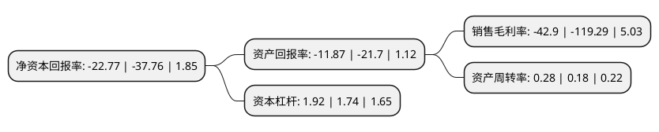

> 本页面由自动化程序生成于 2022年5月20日 01:14
> 内容可能存在错误，如有bug请提交issue至：https://github.com/Eroleice/doc-pi/issues
{.is-warning}

# 上市公司基本情况

## 基本资料

海默科技(集团)股份有限公司（以下简称“海默科技”）成立于2000年12月18日，兰州市。于2010年05月20日在深交所创业板上市。

海默科技注册资本38,476.574万元，多相流量计的研发，生产，销售和售后技术服务，利用移动式多相流量计为油田客户提供油井生产计量，评价测试和勘探测试等服务，以及与勘探测试相配套的钻井服务。本公司的主要产品为多相流量计系列产品，具体包括:油井多相流量计，总量计量多相流量计，湿气多相流量计，低产井测量装置，高性能油井测量装置。以下是详细信息：

- 公司名称: 海默科技(集团)股份有限公司
- 股票代码: 300084.SZ
- 所在地: 甘肃 - 兰州市
- 成立日期: 2000年12月18日
- 注册资本: 38,476.574万元
- 法定代表人: 窦剑文
- 主营业务: 多相流量计的研发，生产，销售和售后技术服务，利用移动式多相流量计为油田客户提供油井生产计量，评价测试和勘探测试等服务，以及与勘探测试相配套的钻井服务本公司的主要产品为多相流量计系列产品，具体包括:油井多相流量计，总量计量多相流量计，湿气多相流量计，低产井测量装置，高性能油井测量装置
- 公司官网: www.haimo.com.cn
- 公司介绍: 公司是国际多相计量领域的技术领导者，是亚洲市场上领先的油田多相计量整体解决方案提供商。公司自主创新的多相计量技术被英国石油(BP)等国际能源巨头列举为“决定未来油气工业成功的五大关键技术”之一。公司是目前国际市场上主要的提供多相计量产品和服务的四家厂商之一，已获准成为国内外主流的石油公司的合格供应商，产品和服务远销中东、北非、东南亚、中亚和欧洲等地区。公司在多相计量领域拥有完整的、自主的知识产权，已在中国、美国、英国和欧洲等地取得多项发明专利。公司的技术和产品经英国国家工程实验室和挪威王国电气认证实验室等国际权威机构的测试和认证，主要性能指标超过国外同类产品，技术上达到国际领先水平。

## 股东及高管情况

上市公司第一大股东为窦剑文，持股68,736,810股，占比17.86%，**疑似为**上市公司实际控制人。

截至2022年03月31日，上市公司的前十大股东中，共有9名自然人股东，1个产品账户，其中5%以上大股东共有1名。上市公司前十大股东明细如下：

> 未能通过持股比例判定出上市公司实际控制人（持股30%以上）
> 可能存在通过间接持股、联合持股、协议控制等方式拥有实际控制权的主体，具体请参考上市公司定期公告！
{.is-warning}

> 截至2022年03月31日，上市公司前十大股东信息如下：

| 股东名称 | 持股数量（股） | 持股比例 |
| --- | --- | --- |
| 窦剑文 | 68,736,810 | 17.86% |
| 李建国 | 4,585,900 | 1.19% |
| 金正谦 | 3,529,936 | 0.92% |
| 钱菊芬 | 3,368,000 | 0.88% |
| 张立刚 | 2,948,396 | 0.77% |
| 中国工商银行股份有限公司-交银施罗德趋势优先混合型证券投资基金 | 2,480,200 | 0.64% |
| 马骏 | 2,479,000 | 0.64% |
| 肖钦羡 | 1,873,720 | 0.49% |
| 徐立群 | 1,800,000 | 0.47% |
| 张立强 | 1,614,800 | 0.42% |

## 利润表分析

上市公司2021年总收入为6.08亿元，净利润为-2.62亿元，**未实现盈利**。

## 杜邦分析

> 数据列示周期：2021年 | 2020年 | 2019年
{.is-info}

上市公司的净资产收益率在近一年有所下降，下降幅度为-39.7%，其变化情况分解如下：
- 上市公司的销售毛利率在近一年下降了-64.04%，可能是生产效率的下降、商品原材料价格上涨或商品价格的下跌所致。
- 上市公司的资产周转率在近一年上升了55.56%，可能是源自于更快的销售回款或库存管理效果提升。
- 上市公司的财务杠杆比率在近一年上升了10.34%，可能是增加负债扩大生产规模。

