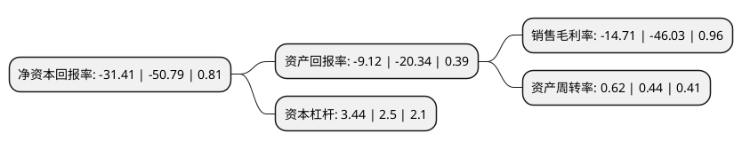

> 本页面由自动化程序生成于 2022年5月20日 01:15
> 内容可能存在错误，如有bug请提交issue至：https://github.com/Eroleice/doc-pi/issues
{.is-warning}

# 上市公司基本情况

## 基本资料

南方中金环境股份有限公司（以下简称“中金环境”）成立于1991年08月31日，杭州市。于2010年12月09日在深交所创业板上市。

中金环境注册资本192,343.824万元，主要产品:CDL系列立式多级离心泵，CHL，CHLF系列卧式多级离心泵，CHLK系列空调专用泵，CDLK系列浸入式多级离心泵，SJ系列深井泵。主营业务:不锈钢冲压焊接离心泵及无负压变频供水设备等的研发，制造和销售。以下是详细信息：

- 公司名称: 南方中金环境股份有限公司
- 股票代码: 300145.SZ
- 所在地: 浙江 - 杭州市
- 成立日期: 1991年08月31日
- 注册资本: 192,343.824万元
- 法定代表人: 杭军
- 主营业务: 主要产品:CDL系列立式多级离心泵，CHL，CHLF系列卧式多级离心泵，CHLK系列空调专用泵，CDLK系列浸入式多级离心泵，SJ系列深井泵主营业务:不锈钢冲压焊接离心泵及无负压变频供水设备等的研发，制造和销售
- 公司官网: www.nfzje.com
- 公司介绍: 公司系全国最早研发并规模化生产不锈钢冲压焊接离心泵企业、是国内不锈钢冲压焊接离心泵领域产销量最大的专业生产厂家，产品的系列范围、销售总量、产品质量均排在国内同行业首位。主导产品有：CDL、CDLF系列不锈钢轻型多级离心泵，CHL,CHLF,CHLFT系列不锈钢轻型多级离心泵；NFWG无负压变频供水设备、DRL恒压变频供水设备等，性能指标均处于国内领先水平。公司持续探索和实践环保治理业务与PPP模式结合的道路，致力于污水处理、污泥处置业务，并将适时进军固废、危废处置及土壤修复等领域，结合公司在资金融通、运营管理等方面的优势，同时发挥好与各环保子公司的协同性，打通环保上下游产业链，在环保领域取得更好地发展。

## 股东及高管情况

上市公司第一大股东为无锡市市政公用产业集团有限公司，持股414,639,391股，占比21.5572%，**疑似为**上市公司实际控制人。

截至2022年04月11日，上市公司的前十大股东中，共有5名自然人股东，3名机构股东，2个产品账户，其中5%以上大股东共有4名。上市公司前十大股东明细如下：

> 未能通过持股比例判定出上市公司实际控制人（持股30%以上）
> 可能存在通过间接持股、联合持股、协议控制等方式拥有实际控制权的主体，具体请参考上市公司定期公告！
{.is-warning}

> 截至2022年04月11日，上市公司前十大股东信息如下：

| 股东名称 | 持股数量（股） | 持股比例 |
| --- | --- | --- |
| 无锡市市政公用产业集团有限公司 | 414,639,391 | 21.5572% |
| 无锡市市政公用产业集团有限公司 | 413,639,291 | 21.51% |
| 沈金浩 | 151,368,931 | 7.87% |
| 沈金浩 | 151,368,931 | 7.87% |
| 沈洁泳 | 40,974,912 | 2.13% |
| 戴云虎 | 31,109,067 | 1.62% |
| 上海少薮派投资管理有限公司-少数派万象更新9号私募证券投资基金 | 22,640,000 | 1.18% |
| 上海少薮派投资管理有限公司-少数派万象更新8号私募证券投资基金 | 22,356,000 | 1.16% |
| 沈凤祥 | 16,100,000 | 0.84% |
| 国泰君安证券股份有限公司 | 14,148,056 | 0.74% |

## 利润表分析

上市公司2021年总收入为51.86亿元，净利润为-7.63亿元，**未实现盈利**。

## 杜邦分析

> 数据列示周期：2021年 | 2020年 | 2019年
{.is-info}

上市公司的净资产收益率在近一年有所下降，下降幅度为-38.16%，其变化情况分解如下：
- 上市公司的销售毛利率在近一年下降了-68.04%，可能是生产效率的下降、商品原材料价格上涨或商品价格的下跌所致。
- 上市公司的资产周转率在近一年上升了40.91%，可能是源自于更快的销售回款或库存管理效果提升。
- 上市公司的财务杠杆比率在近一年上升了37.6%，可能是增加负债扩大生产规模。

