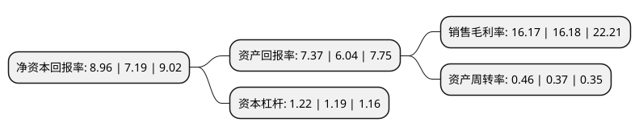

> 本页面由自动化程序生成于 2022年5月20日 01:15
> 内容可能存在错误，如有bug请提交issue至：https://github.com/Eroleice/doc-pi/issues
{.is-warning}

# 上市公司基本情况

## 基本资料

深圳市佳士科技股份有限公司（以下简称“佳士科技”）成立于2005年09月12日，深圳市。于2011年03月22日在深交所创业板上市。

佳士科技注册资本48,291.954万元，公司主营业务为焊割设备的研发，生产和销售，主要产品为逆变焊机，内燃发电焊机和焊割成套设备。以下是详细信息：

- 公司名称: 深圳市佳士科技股份有限公司
- 股票代码: 300193.SZ
- 所在地: 广东 - 深圳市
- 成立日期: 2005年09月12日
- 注册资本: 48,291.954万元
- 法定代表人: 潘磊
- 主营业务: 公司主营业务为焊割设备的研发，生产和销售，主要产品为逆变焊机，内燃发电焊机和焊割成套设备
- 公司官网: www.jasic.com.cn
- 公司介绍: 公司是集逆变焊机、内燃发电焊机、焊割成套设备、机器人自动化设备的研发、生产、销售、服务于一体的国家高新技术企业。公司焊割产品品种齐全，涵盖数字化手工电弧焊机、数字化全功能脉冲氩弧焊机、数字化脉冲交直流方波氩弧焊机、数字化MIG/CO2焊机、数字化脉冲MIG焊机、逆变埋弧焊机以及各类内燃弧焊机、自动化焊接和切割设备、机器人自动化设备。公司先后获得“广东省著名商标”、“广东省著名品牌”、“广东省名优产品”、“消费者放心信誉品牌”、“中国焊接行业用户满意十佳品牌”、“深圳市高新技术企业”等多项荣誉称号，并通过了ISO9001国际质量管理体系认证。

## 股东及高管情况

上市公司第一大股东为潘磊，持股69,378,339股，占比14.37%，**疑似为**上市公司实际控制人。

截至2022年03月31日，上市公司的前十大股东中，共有2名自然人股东，2名机构股东，6个产品账户，其中5%以上大股东共有3名。上市公司前十大股东明细如下：

> 未能通过持股比例判定出上市公司实际控制人（持股30%以上）
> 可能存在通过间接持股、联合持股、协议控制等方式拥有实际控制权的主体，具体请参考上市公司定期公告！
{.is-warning}

> 截至2022年03月31日，上市公司前十大股东信息如下：

| 股东名称 | 持股数量（股） | 持股比例 |
| --- | --- | --- |
| 潘磊 | 69,378,339 | 14.37% |
| 深圳市千鑫恒投资发展有限公司 | 50,088,026 | 10.37% |
| 徐爱平 | 47,058,006 | 9.74% |
| 招商银行股份有限公司-交银施罗德新成长混合型证券投资基金 | 13,513,391 | 2.8% |
| 中国银行股份有限公司-嘉实价值驱动一年持有期混合型证券投资基金 | 12,309,179 | 2.55% |
| 基本养老保险基金一零零三组合 | 11,367,697 | 2.35% |
| 中国工商银行股份有限公司-交银施罗德趋势优先混合型证券投资基金 | 10,705,961 | 2.22% |
| 中国农业银行股份有限公司-交银施罗德精选混合型证券投资基金 | 10,265,506 | 2.13% |
| 中国银行股份有限公司-嘉实价值精选股票型证券投资基金 | 9,486,270 | 1.96% |
| 华夏人寿保险股份有限公司-自有资金 | 8,703,834 | 1.8% |

## 利润表分析

上市公司2021年总收入为12.49亿元，净利润为2.02亿元，实现盈利。

## 杜邦分析

> 数据列示周期：2021年 | 2020年 | 2019年
{.is-info}

上市公司的净资产收益率在近一年有所上升，上升幅度为24.62%，其变化情况分解如下：
- 上市公司的销售毛利率在近一年下降了-0.06%，可能是生产效率的下降、商品原材料价格上涨或商品价格的下跌所致。
- 上市公司的资产周转率在近一年上升了24.32%，可能是源自于更快的销售回款或库存管理效果提升。
- 上市公司的财务杠杆比率在近一年上升了2.52%，可能是增加负债扩大生产规模。

