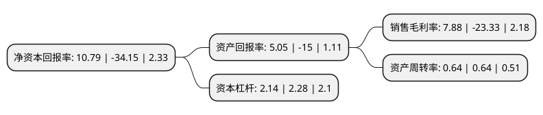

> 本页面由自动化程序生成于 2022年5月20日 01:15
> 内容可能存在错误，如有bug请提交issue至：https://github.com/Eroleice/doc-pi/issues
{.is-warning}

# 上市公司基本情况

## 基本资料

徐州海伦哲专用车辆股份有限公司（以下简称“*ST海伦”）成立于2005年03月21日，徐州市。于2011年04月07日在深交所创业板上市。

*ST海伦注册资本104,092.152万元，致力于为电力，市政，园林，石化，通信等行业领域客户提供包括高空作业方案设计，产品开发，生产制造，技术支持及维修服务在内的全面的高空作业车产品及服务解决方案。公司主营产品包括高空作业车，电源车，工程抢修车，军用抢修车等专用车辆。以下是详细信息：

- 公司名称: 徐州海伦哲专用车辆股份有限公司
- 股票代码: 300201.SZ
- 所在地: 江苏 - 徐州市
- 成立日期: 2005年03月21日
- 注册资本: 104,092.152万元
- 法定代表人: 金诗玮
- 主营业务: 致力于为电力，市政，园林，石化，通信等行业领域客户提供包括高空作业方案设计，产品开发，生产制造，技术支持及维修服务在内的全面的高空作业车产品及服务解决方案公司主营产品包括高空作业车，电源车，工程抢修车，军用抢修车等专用车辆
- 公司官网: www.xzhlz.com
- 公司介绍: 公司是国家高新技术企业，专注于高空作业车和电力保障车辆的研发、生产和销售。近年来通过资本市场成功并购上海格拉曼国际消防装备有限公司、深圳市巨能伟业技术有限公司、深圳连硕自动化科技有限公司，公司已经成为专用车辆、LED智能电源及控制系统、智能制造并举的产业集团。公司是以城市主战消防车、举高类消防车及登高平台、消防机器人为拳头产品的全系列民用消防装备提供商。巨能伟业是目前国内LED超薄电源和均流电源的行业引领者，产品远销俄罗斯、印度、土耳其等海外市场。深圳连硕自动化科技有限公司是国家高新技术企业，专注于消费类产品的智能装备制造及服务，为客户提供世界级智能制造方案和服务。

## 股东及高管情况

上市公司第一大股东为江苏省机电研究所有限公司，持股152,413,539股，占比14.6422%，**疑似为**上市公司实际控制人。

截至2022年03月07日，上市公司的前十大股东中，共有6名机构股东，4个海外主体，其中5%以上大股东共有10名。上市公司前十大股东明细如下：

> 未能通过持股比例判定出上市公司实际控制人（持股30%以上）
> 可能存在通过间接持股、联合持股、协议控制等方式拥有实际控制权的主体，具体请参考上市公司定期公告！
{.is-warning}

> 截至2022年03月07日，上市公司前十大股东信息如下：

| 股东名称 | 持股数量（股） | 持股比例 |
| --- | --- | --- |
| 江苏省机电研究所有限公司 | 152,413,539 | 14.6422% |
| 江苏省机电研究所有限公司 | 149,213,239 | 14.3347% |
| 江苏省机电研究所有限公司 | 149,213,239 | 14.3347% |
| MEI TUNG(CHINA)LIMITED | 105,529,314 | 10.1381% |
| MEI TUNG(CHINA)LIMITED | 105,529,314 | 10.1381% |
| MEI TUNG(CHINA)LIMITED | 100,768,107 | 9.6807% |
| MEI TUNG(CHINA)LIMITED | 96,835,507 | 9.3029% |
| 中天泽控股集团有限公司 | 71,340,149 | 6.8536% |
| 中天泽控股集团有限公司 | 71,340,149 | 6.8536% |
| 中天泽控股集团有限公司 | 71,340,149 | 6.8536% |

## 利润表分析

上市公司2021年总收入为16.65亿元，净利润为1.31亿元，实现盈利。

## 杜邦分析

> 数据列示周期：2021年 | 2020年 | 2019年
{.is-info}

上市公司的净资产收益率在近一年有所下降，下降幅度为-131.6%，其变化情况分解如下：
- 上市公司的销售毛利率在近一年下降了-133.78%，可能是生产效率的下降、商品原材料价格上涨或商品价格的下跌所致。
- 上市公司的资产周转率在近一年下降了0%，可能是源自于更慢的销售回款或库存管理效果下降。
- 上市公司的财务杠杆比率在近一年下降了-6.14%，可能是减少负债降低财务费用。

