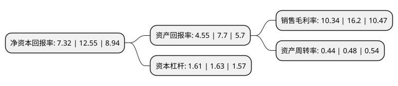

> 本页面由自动化程序生成于 2022年5月20日 01:16
> 内容可能存在错误，如有bug请提交issue至：https://github.com/Eroleice/doc-pi/issues
{.is-warning}

# 上市公司基本情况

## 基本资料

深圳光韵达光电科技股份有限公司（以下简称“光韵达”）成立于2005年10月25日，深圳市。于2011年06月08日在深交所创业板上市。

光韵达注册资本49,932.623万元，主要产品:增材制造(3D打印)，激光三维电路(3D-LDS)，精密激光模板，柔性电路板激光成型，精密激光钻孔，硬脆性材料激光加工，金属与非金属精密部件个性化设计与制造，测试治具，自动化测试设备，激光光源及关键零部件制造等。以下是详细信息：

- 公司名称: 深圳光韵达光电科技股份有限公司
- 股票代码: 300227.SZ
- 所在地: 广东 - 深圳市
- 成立日期: 2005年10月25日
- 注册资本: 49,932.623万元
- 法定代表人: 侯若洪
- 主营业务: 主要产品:增材制造(3D打印)，激光三维电路(3D-LDS)，精密激光模板，柔性电路板激光成型，精密激光钻孔，硬脆性材料激光加工，金属与非金属精密部件个性化设计与制造，测试治具，自动化测试设备，激光光源及关键零部件制造等
- 公司官网: www.sunshine-laser.com
- 公司介绍: 公司是一家激光智能制造解决方案与服务提供商，利用“精密激光技术”+“智能控制技术”实现取代和突破传统的生产方式，实现产品的高集成度、小型化、个性化，为全球制造业和加工业提供全种类的精密激光应用服务和全面创新解决方案。公司的主要产品和服务包括：增材制造(3D打印)、激光三维电路(3D-LDS)、精密激光模板、柔性电路板激光成型、精密激光钻孔、硬脆性材料激光加工、金属与非金属精密部件个性化设计与制造、测试治具、自动化测试设备、激光光源及关键零部件制造等，产品和服务主要提供给电子信息制造业的厂商。公司目前已具备激光减成法、等成法、加成法三大类工艺手段，通过产品设计、工艺改进、过程控制、效率提升等措施，生产出高质量、符合行业要求的产品，提供行业所需要的服务，并能够持续不断的改进和发展。通过多年努力，公司被评为“最具创造力企业”、“自主创新标杆企业”、“深圳工匠培育示范单位”，连续多年被广东省电子学会SMT委员会授予“中国SMT最佳用户服务奖”，多次荣获“中国SMT创新成果奖”、“中国最佳用户服务奖”，公司两项纪录荣获“深圳市企业新纪录”，并摘得“自主创新企业金奖”等。

## 股东及高管情况

上市公司第一大股东为侯若洪，持股59,319,626股，占比11.875%，**疑似为**上市公司实际控制人。

截至2022年04月27日，上市公司的前十大股东中，共有10名自然人股东，其中5%以上大股东共有4名。上市公司前十大股东明细如下：

> 未能通过持股比例判定出上市公司实际控制人（持股30%以上）
> 可能存在通过间接持股、联合持股、协议控制等方式拥有实际控制权的主体，具体请参考上市公司定期公告！
{.is-warning}

> 截至2022年04月27日，上市公司前十大股东信息如下：

| 股东名称 | 持股数量（股） | 持股比例 |
| --- | --- | --- |
| 侯若洪 | 59,319,626 | 11.875% |
| 侯若洪 | 59,319,626 | 11.88% |
| 王荣 | 33,903,841 | 6.79% |
| 王荣 | 30,903,841 | 6.19% |
| 陈征宇 | 12,214,493 | 2.45% |
| 袁夫敏 | 7,971,572 | 1.6% |
| 李永光 | 5,622,000 | 1.13% |
| 俞向明 | 5,230,276 | 1.05% |
| 沈建明 | 1,985,974 | 0.4% |
| 敖成刚 | 1,844,850 | 0.37% |

## 利润表分析

上市公司2021年总收入为9.3亿元，净利润为0.96亿元，实现盈利。

## 杜邦分析

> 数据列示周期：2021年 | 2020年 | 2019年
{.is-info}

上市公司的净资产收益率在近一年有所下降，下降幅度为-41.67%，其变化情况分解如下：
- 上市公司的销售毛利率在近一年下降了-36.17%，可能是生产效率的下降、商品原材料价格上涨或商品价格的下跌所致。
- 上市公司的资产周转率在近一年下降了-8.33%，可能是源自于更慢的销售回款或库存管理效果下降。
- 上市公司的财务杠杆比率在近一年下降了-1.23%，可能是减少负债降低财务费用。

