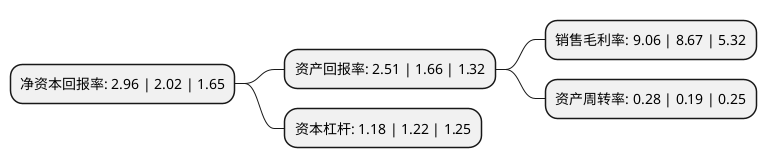

> 本页面由自动化程序生成于 2022年5月20日 01:16
> 内容可能存在错误，如有bug请提交issue至：https://github.com/Eroleice/doc-pi/issues
{.is-warning}

# 上市公司基本情况

## 基本资料

广东金明精机股份有限公司（以下简称“金明精机”）成立于1987年12月01日，汕头市。于2011年12月29日在深交所创业板上市。

金明精机注册资本41,892.358万元，公司是一家集研发，设计，生产和销售于一体的专业塑料机械装备供应商。公司的产品主要包括薄膜吹塑设备和中空成型设备，其他设备及配件主要包括流延设备，设备部件和零配件。以下是详细信息：

- 公司名称: 广东金明精机股份有限公司
- 股票代码: 300281.SZ
- 所在地: 广东 - 汕头市
- 成立日期: 1987年12月01日
- 注册资本: 41,892.358万元
- 法定代表人: 汪帆
- 主营业务: 公司是一家集研发，设计，生产和销售于一体的专业塑料机械装备供应商公司的产品主要包括薄膜吹塑设备和中空成型设备，其他设备及配件主要包括流延设备，设备部件和零配件
- 公司官网: www.jmjj.com
- 公司介绍: 公司是一家集研发、设计、生产和销售于一体的全球知名的薄膜装备供应商，也是行业内少数具备实力提供全系列薄膜装备及方案的领导品牌，金明产品涵盖薄膜吹塑机组、薄膜流延机组和薄膜拉伸机组。公司先后通过ISO9001国际质量体系认证、欧盟CE安全体系认证、ISO14001国际环境管理体系认证、两化融合管理体系认证、知识产权管理体系认证；是中国塑料机械工业协会副会长单位、中国塑料加工工业协会副理事长单位、中国包装联合会理事单位。

## 股东及高管情况

上市公司第一大股东为马镇鑫，持股70,576,227股，占比16.85%，**疑似为**上市公司实际控制人。

截至2022年03月31日，上市公司的前十大股东中，共有6名自然人股东，3名机构股东，1个产品账户，其中5%以上大股东共有3名。上市公司前十大股东明细如下：

> 未能通过持股比例判定出上市公司实际控制人（持股30%以上）
> 可能存在通过间接持股、联合持股、协议控制等方式拥有实际控制权的主体，具体请参考上市公司定期公告！
{.is-warning}

> 截至2022年03月31日，上市公司前十大股东信息如下：

| 股东名称 | 持股数量（股） | 持股比例 |
| --- | --- | --- |
| 马镇鑫 | 70,576,227 | 16.85% |
| 广州万宝长睿投资有限公司 | 57,702,344 | 13.77% |
| 广州万宝集团有限公司 | 56,867,977 | 13.57% |
| 马佳圳 | 18,446,131 | 4.4% |
| 余素琴 | 10,170,844 | 2.43% |
| 海南海药投资有限公司 | 9,114,426 | 2.18% |
| 上海方圆达创投资合伙企业(有限合伙)-方圆-东方22号私募投资基金 | 4,556,200 | 1.09% |
| 浦忠琴 | 2,161,700 | 0.52% |
| 高艳星 | 2,058,900 | 0.49% |
| 来一飞 | 2,000,000 | 0.48% |

## 利润表分析

上市公司2021年总收入为5.23亿元，净利润为0.39亿元，实现盈利。

## 杜邦分析

> 数据列示周期：2020年 | 2019年 | 2018年
{.is-info}

上市公司的净资产收益率在近一年有所上升，上升幅度为46.53%，其变化情况分解如下：
- 上市公司的销售毛利率在近一年上升了4.5%，可能是生产效率的提升、商品原材料价格下跌或商品价格的上涨所致。
- 上市公司的资产周转率在近一年上升了47.37%，可能是源自于更快的销售回款或库存管理效果提升。
- 上市公司的财务杠杆比率在近一年下降了-3.28%，可能是减少负债降低财务费用。

