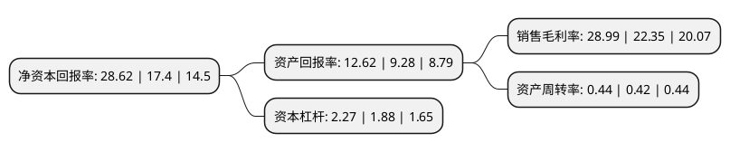

> 本页面由自动化程序生成于 2022年5月20日 01:16
> 内容可能存在错误，如有bug请提交issue至：https://github.com/Eroleice/doc-pi/issues
{.is-warning}

# 上市公司基本情况

## 基本资料

浙江晶盛机电股份有限公司（以下简称“晶盛机电”）成立于2006年12月14日，绍兴市。于2012年05月11日在深交所创业板上市。

晶盛机电注册资本128,647.471万元，专注于拥有自主品牌的晶体硅生长设备及其控制系统的研发，制造和销售。本公司的主要产品包括全自动单晶硅生长炉，多晶硅铸锭炉及单晶硅生长炉控制系统。以下是详细信息：

- 公司名称: 浙江晶盛机电股份有限公司
- 股票代码: 300316.SZ
- 所在地: 浙江 - 绍兴市
- 成立日期: 2006年12月14日
- 注册资本: 128,647.471万元
- 法定代表人: 曹建伟
- 主营业务: 专注于拥有自主品牌的晶体硅生长设备及其控制系统的研发，制造和销售本公司的主要产品包括全自动单晶硅生长炉，多晶硅铸锭炉及单晶硅生长炉控制系统
- 公司官网: www.jsjd.cc
- 公司介绍: 公司是一家以“发展绿色智能高科技制造产业”为使命的高端半导体装备和LED衬底材料制造的高新技术企业。公司主营产品为全自动单晶生长炉、多晶硅铸锭炉、区熔硅单晶炉、单晶硅滚圆机、单晶硅截断机、全自动硅片抛光机、双面研磨机、单晶硅棒切磨复合加工一体机、多晶硅块研磨一体机、叠片机、蓝宝石晶锭、蓝宝石晶片、LED灯具自动化生产线等。公司产品主要应用于太阳能光伏、集成电路、LED、工业4.0等具有较好市场前景的新兴产业。公司拥有多家子公司和研发中心，其中一个海外研发中心，拥有工业4.0方向的省级重点研究院、省级晶体装备研究院等研究平台、博士后工作站。

## 股东及高管情况

上市公司第一大股东为绍兴上虞晶盛投资管理咨询有限公司，持股620,635,522股，占比48.24%，为上市公司实际控制人。

截至2022年04月28日，上市公司的前十大股东中，共有3名自然人股东，2名机构股东，4个产品账户，1个海外主体，其中5%以上大股东共有2名。上市公司前十大股东明细如下：

> 截至2022年04月28日，上市公司前十大股东信息如下：

| 股东名称 | 持股数量（股） | 持股比例 |
| --- | --- | --- |
| 绍兴上虞晶盛投资管理咨询有限公司 | 620,635,522 | 48.24% |
| 香港中央结算有限公司(陆股通) | 71,058,432 | 5.52% |
| 邱敏秀 | 38,172,420 | 2.97% |
| 曹建伟 | 35,587,266 | 2.77% |
| 全国社保基金一零一组合 | 12,497,610 | 0.97% |
| 浙江大晶创业投资有限公司 | 12,105,600 | 0.94% |
| 中国建设银行股份有限公司-华夏国证半导体芯片交易型开放式指数证券投资基金 | 10,987,270 | 0.85% |
| 毛全林 | 10,636,476 | 0.83% |
| 中国建设银行股份有限公司-易方达产业升级一年封闭运作混合型证券投资基金 | 9,345,345 | 0.73% |
| 中国建设银行股份有限公司-易方达环保主题灵活配置混合型证券投资基金 | 9,319,092 | 0.72% |

## 利润表分析

上市公司2021年总收入为59.61亿元，净利润为17.28亿元，实现盈利。

## 杜邦分析

> 数据列示周期：2021年 | 2020年 | 2019年
{.is-info}

上市公司的净资产收益率在近一年有所上升，上升幅度为64.48%，其变化情况分解如下：
- 上市公司的销售毛利率在近一年上升了29.71%，可能是生产效率的提升、商品原材料价格下跌或商品价格的上涨所致。
- 上市公司的资产周转率在近一年上升了4.76%，可能是源自于更快的销售回款或库存管理效果提升。
- 上市公司的财务杠杆比率在近一年上升了20.74%，可能是增加负债扩大生产规模。

