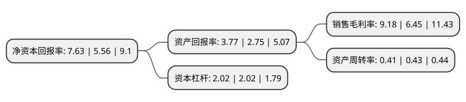

> 本页面由自动化程序生成于 2022年5月20日 01:17
> 内容可能存在错误，如有bug请提交issue至：https://github.com/Eroleice/doc-pi/issues
{.is-warning}

# 上市公司基本情况

## 基本资料

苏州斯莱克精密设备股份有限公司（以下简称“斯莱克”）成立于2004年01月06日，苏州市。于2014年01月29日在深交所创业板上市。

斯莱克注册资本58,038.134万元，主营业务:高速易拉盖生产设备的研发，设计，生产，装配调试及相关精密模具，零备件的研发，加工制造。。主要产品包括易拉盖高速生产成套设备，易拉盖生产设备系统改造，相关精密模具，零备件等。以下是详细信息：

- 公司名称: 苏州斯莱克精密设备股份有限公司
- 股票代码: 300382.SZ
- 所在地: 江苏 - 苏州市
- 成立日期: 2004年01月06日
- 注册资本: 58,038.134万元
- 法定代表人: 安旭
- 主营业务: 主营业务:高速易拉盖生产设备的研发，设计，生产，装配调试及相关精密模具，零备件的研发，加工制造主要产品包括易拉盖高速生产成套设备，易拉盖生产设备系统改造，相关精密模具，零备件等
- 公司官网: www.slac.com.cn
- 公司介绍: 公司是行业内可提供易拉盖高速生产技术全面解决方案和最完整易拉盖生产线的设备制造商。主要从事高速易拉盖生产设备的研发、设计、生产、装配调试及相关精密模具、零备件的研发、加工制造，主要产品包括易拉盖高速生产成套设备、易拉盖生产设备系统改造、相关精密模具、零备件等。同时，公司可以为客户提供定制化的易拉盖高速生产系统设计及系统改造服务，能很好地满足客户的各项需求。

## 股东及高管情况

上市公司第一大股东为科莱思有限公司，持股292,894,080股，占比50.46%，为上市公司实际控制人。

截至2022年03月31日，上市公司的前十大股东中，共有2名自然人股东，2名机构股东，4个产品账户，2个海外主体，其中5%以上大股东共有1名。上市公司前十大股东明细如下：

> 截至2022年03月31日，上市公司前十大股东信息如下：

| 股东名称 | 持股数量（股） | 持股比例 |
| --- | --- | --- |
| 科莱思有限公司 | 292,894,080 | 50.46% |
| 香港中央结算有限公司(陆股通) | 18,116,222 | 3.12% |
| 全国社保基金一一四组合 | 7,000,000 | 1.21% |
| 李钰 | 4,395,573 | 0.76% |
| UBS   AG | 4,304,569 | 0.74% |
| 中国工商银行股份有限公司-汇添富智能制造股票型证券投资基金 | 4,076,272 | 0.7% |
| 李焕云 | 3,733,800 | 0.64% |
| 招商银行股份有限公司-东方红远见价值混合型证券投资基金 | 3,437,700 | 0.59% |
| 中国建设银行股份有限公司-广发科技创新混合型证券投资基金 | 3,310,583 | 0.57% |
| 苏州索香兰企业管理咨询有限公司 | 2,969,127 | 0.51% |

## 利润表分析

上市公司2021年总收入为10.03亿元，净利润为0.92亿元，实现盈利。

## 杜邦分析

> 数据列示周期：2021年 | 2020年 | 2019年
{.is-info}

上市公司的净资产收益率在近一年有所上升，上升幅度为37.23%，其变化情况分解如下：
- 上市公司的销售毛利率在近一年上升了42.33%，可能是生产效率的提升、商品原材料价格下跌或商品价格的上涨所致。
- 上市公司的资产周转率在近一年下降了-4.65%，可能是源自于更慢的销售回款或库存管理效果下降。
- 上市公司的财务杠杆比率在近一年下降了0%，可能是减少负债降低财务费用。

